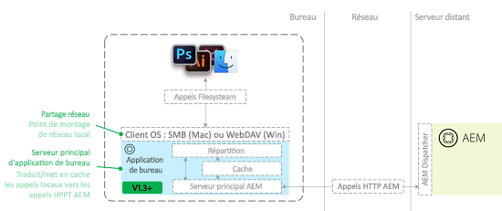

# Bonnes pratiques relatives à l’appli de bureau AEM v1.x {#aem-desktop-app-best-practices}

## Présentation {#overview}

L’appli de bureau Adobe Experience Manager (AEM) associe votre solution de gestion des ressources numériques (DAM) à votre bureau afin que vous puissiez ouvrir les fichiers disponibles dans l’interface utilisateur web d’AEM directement sur le bureau Si vous enregistrez une ressource du bureau, celle-ci est chargée dans AEM à l’emplacement approprié.

L’appli de bureau AEM élimine les risques de mettre à jour des copies locales incorrectes ou de mettre à jour une ressource inappropriée dans AEM. Le processus convivial de l’appli de bureau est activé à l’aide de la technologie de partage réseau fournie par les systèmes d’exploitation de bureau.

L’appli de bureau monte le référentiel d’AEM Assets sous la forme d’un partage réseau sur le bureau Par conséquent, les dossiers et les fichiers s’affichent comme s’ils étaient en local. Cependant, il n’est pas recommandé d’effectuer des opérations de gestion des actifs numériques (DAM) directement sur le bureau dans le partage réseau monté du Finder ou de l’Explorateur. À la place, Adobe recommande d’utiliser l’interface utilisateur web d’AEM Assets pour effectuer des opérations, telles que la copie ou le déplacement d’un grand nombre de ressources.

>[!NOTE]
>
>Avant de lire ce document, vous pouvez consulter les [meilleures pratiques générales d’intégration d’AEM et de Creative Cloud](https://docs.adobe.com/content/help/en/experience-manager-64/assets/administer/aem-cc-integration-best-practices.html) pour un aperçu général du sujet.

## Architecture de l’appli de bureau AEM {#aem-desktop-app-architecture}

L’appli de bureau AEM utilise des partages réseau WebDAV (Windows) ou SMB (Mac) pour monter des partages réseau. Le partage réseau monté est uniquement local. L’appli de bureau AEM intercepte les appels (ouverture, lecture, écriture) et fournit une mise en cache locale supplémentaire. Elle convertit les appels distants au serveur AEM Assets en requêtes HTTP AEM optimisées. Le diagramme suivant illustre l’architecture de l’appli de bureau AEM.

La mise en cache supplémentaire à l’écriture lors de l’enregistrement d’un fichier entraîne tout d’abord l’enregistrement local du fichier (de sorte que l’utilisateur n’attend pas le transfert réseau). Ensuite, après un délai prédéfini (30 s), le fichier est chargé vers AEM en arrière-plan, puis la ressource est chargée dans AEM. L’appli de bureau AEM fournit une interface utilisateur permettant de surveiller le statut des chargements de fichiers en arrière-plan.

## Utilisation recommandée de l’appli de bureau AEM {#recommended-use-of-aem-desktop-app}

Les fonctionnalités principales de l’appli de bureau AEM incluent :

* Ouverture de fichiers à partir de l’interface utilisateur web d’AEM Assets sur le bureau : à partir de l’interface utilisateur web, vous pouvez afficher des ressources sur le bureau (dans le Finder, l’Explorateur) ou ouvrir une ressource à l’aide d’une appli de bureau.
* Extraction et archivage : les ressources peuvent être extraites pour modification et sont marquées comme verrouillées pour l’utilisateur dans AEM Assets. Après la modification, la ressource peut être archivée pour la déverrouiller.
* Enregistrement des modifications apportées aux fichiers : toute modification que vous enregistrez dans le fichier du partage réseau est automatiquement chargée dans AEM et une nouvelle version est créée.
* Importation des ressources liées dans d’autres documents : dans les applications telles que Creative Cloud (PS, ID, AI, etc.), vous pouvez importer un fichier externe sous la forme d’un lien (par exemple, vous pouvez placer une image dans un document InDesign). Dans ce cas, le montage du partage réseau vous permet de parcourir et de sélectionner des ressources d’AEM pour les placer. L’importation de fichiers liés fonctionne également dans certaines applications autres qu’Adobe telles que MS Office.
* Résolution des références dans AEM : si le ou les fichiers placés et le fichier principal comportant un ou plusieurs liens sont stockés dans AEM, AEM peut automatiquement fournir des informations côté serveur sur les références des ressources.
* Accès à la ressource à partir du bureau : dans le partage réseau monté, un menu contextuel fournit une boîte de dialogue More Info (Plus d’infos) (aperçu plus large, métadonnées principales) et permet d’ouvrir une ressource dans l’interface utilisateur d’AEM.
* Chargement en masse de dossiers hiérarchiques volumineux : si vous utilisez l’option Create &gt; Folder Upload (Créer &gt; Chargement de dossiers) de l’interface utilisateur d’AEM pour charger des ressources, l’appli de bureau AEM charge en arrière-plan la hiérarchie de dossiers sélectionnée dans AEM. La progression du chargement peut être surveillée par une interface utilisateur dédiée dans l’appli de bureau.

## Utilisation inappropriée de l’appli de bureau AEM {#inappropriate-use-of-aem-desktop-app}

* N’utilisez pas l’appli de bureau AEM pour gérer les ressources à partir du bureau. L’appli de bureau AEM n’a pas été conçue pour remplacer les lecteurs réseau. Utilisez à la place les fonctionnalités suivantes :
   * L’interface utilisateur web d’AEM Assets pour la gestion des ressources numériques (DAM) (recherche/partage de ressources, métadonnées, copie/déplacement, etc.)
   * L’option Folder Upload (Chargement de dossiers) d’AEM Desktop App pour charger des dossiers hiérarchiques volumineux

* N’utilisez pas l’appli de bureau AEM comme un client de « synchronisation du bureau » pour AEM Assets. Le principal avantage de l’appli de bureau AEM est qu’elle fournit un accès « virtuel » à l’ensemble du référentiel, et les applications de synchronisation du bureau ne synchronisent généralement que les ressources appartenant à un utilisateur. L’appli de bureau AEM fournit un certain niveau de mise en cache et de chargement en arrière-plan. Toutefois, elle fonctionne très différemment des applications de « synchronisation » typiques, telles que Adobe Creative Cloud Desktop App ou Microsoft OneDrive.
* N’utilisez pas les lecteurs réseau de l’appli de bureau AEM pour enregistrer fréquemment les ressources. Toutes les opérations d’enregistrement sont transmises à AEM Assets. Par conséquent, il n’est pas pratique d’effectuer des opérations de modification intensives directement dans le référentiel d’AEM Assets monté. La modification d’une ressource directement dans le référentiel monté écrase la chronologie de la ressource avec des versions non pertinentes et impose des surcharges supplémentaires sur le serveur.
* N’utilisez pas l’appli de bureau AEM pour faire migrer de grandes quantités de données d’une instance AEM vers une autre. Reportez-vous au [Guide de migration](https://helpx.adobe.com/experience-manager/6-4/assets/using/assets-migration-guide.html) pour planifier et exécuter des migrations de ressources. En revanche, l’appli de bureau [prend en charge le chargement en masse](use-app-v1.md#bulkupload) d’un grand nombre de ressources pour la première fois dans AEM.

## Recommandations pour des cas d’utilisation spécifiques {#recommendations-for-selected-use-cases}

### Accès aux ressources pour les utilisateurs créatifs {#access-to-assets-for-creative-users}

L’appli de bureau AEM fournit un accès virtuel à l’ensemble du référentiel DAM, mais il peut être compliqué pour les utilisateurs créatifs de trouver et d’accéder aux ressources appropriées sur leur bureau. Utilisez les meilleures pratiques de ce document pour simplifier ce processus.

* Utilisez les fonctionnalités de collaboration de l’interface utilisateur web d’AEM Assets pour fournir aux utilisateurs créatifs un accès plus direct aux ressources appropriées. Le partage de dossiers ou de collections, la diffusion de collections dynamiques (recherches enregistrées) ou l’envoi de notifications avec des pointeurs vers les ressources appropriées sont quelques exemples de fonctionnalités de collaboration. Les utilisateurs créatifs peuvent ensuite utiliser des actions du bureau dans l’interface utilisateur web pour accéder rapidement à ces ressources sur leur bureau.
* Tenez compte des autorisations appropriées relatives aux ressources (contrôle d’accès) afin de simplifier l’affichage dans le référentiel DAM pour les utilisateurs créatifs, en limitant essentiellement leur accès aux seules ressources dont ils ont besoin :

   * Certaines zones non pertinentes pour les utilisateurs créatifs peuvent ne pas être autorisées pour leur(s) groupe(s) d’utilisateurs, et supprimées de l’affichage, également sur le bureau
   * La plupart des ressources de la gestion des actifs numériques sont définitives et ne sont pas destinées à être modifiées. Elles doivent être en lecture seule pour les utilisateurs créatifs.
   * Seules les ressources nécessitant des modifications/retouches doivent être activées pour l’écriture pour les utilisateurs créatifs. Certaines organisations utilisent les projets AEM et les dossiers qu’ils créent pour héberger les ressources susceptibles d’être modifiées.

### Recherche de ressources    {#searching-assets}

Pour rechercher un fichier que vous souhaitez ouvrir sur le bureau :

* Utilisez l’interface utilisateur web d’AEM Assets pour localiser la ressource. Dans AEM Assets, non seulement la fonctionnalité de recherche est puissante (facettes de recherche, recherches enregistrées), mais elle fournit également des fonctionnalités supplémentaires permettant de trouver la ressource appropriée. Il s’agit de filtres supplémentaires, comme la possibilité de rechercher des ressources en fonction de l’état (approbation, expiration), des collections, des tâches, des notifications, et de partager des dossiers/collections avec d’autres utilisateurs/groupes.
* Une fois la ressource localisée, utilisez l’option Actions sur le Bureau de l’interface utilisateur d’AEM pour accéder à la ressource sur le        bureau.

### Mise à jour des ressources ouvertes à l’aide de l’appli de bureau AEM {#updating-assets-opened-using-aem-desktop-app}

Si vous modifiez une ressource directement à l’emplacement mappé à partir d’AEM Assets sur un partage réseau local, la ressource est transférée vers AEM chaque fois que vous l’enregistrez sur le bureau. En outre, AEM crée une version et génère des rendus.

Si une ressource stockée dans AEM nécessite une mise à jour :

* Pour les **mises à jour mineures**, telles que les demandes de retouche mineures du processus d’approbation :

   * Extrayez le fichier et ouvrez-le sur le bureau.
   * Mettez-le à jour.
   * Enregistrez la version mise à jour. La ressource est mise à jour et la chronologie affiche la version d’origine à des fins de comparaison.

* Pour les **mises à jour majeures**, telles qu’une demande de modification nécessitant un petit cycle créatif de travaux en cours :

   * Utilisez l’option Reveal (Afficher) pour ouvrir le dossier approprié sur le bureau.
   * Copiez le fichier dans un dossier de travaux en cours en dehors du partage AEM Assets mappé (par exemple, copiez le fichier dans un dossier synchronisé avec Adobe Creative Cloud Desktop App).
   * Travaillez sur le fichier et enregistrez-le par intermittence. Les modifications ne sont pas enregistrées dans AEM Assets.
   * Une fois les modifications terminées, déplacez, copiez ou enregistrez le fichier mappé à partir d’AEM pour le charger en tant que nouvelle version.

## Performances du réseau    {#network-performance}

L’expérience des utilisateurs de l’appli de bureau AEM dépend grandement d’une connectivité réseau stable et de bonne qualité entre leur bureau et le serveur AEM, ainsi que d’un serveur optimisé pour des performances élevées, en particulier lors du chargement et de la mise à jour des ressources. Ces recommandations s’appliquent aux équipes réseau/informatiques des organisations.

### Remarques relatives au réseau     {#network-considerations}

Pour connaître les meilleures pratiques concernant la configuration réseau d’AEM Assets, reportez-vous au document [Remarques relatives au réseau pour AEM Assets](https://helpx.adobe.com/experience-manager/6-4/assets/using/assets-network-considerations.html). Voici certains aspects importants permettant d’optimiser l’expérience de l’appli de bureau AEM pour les utilisateurs :

* **Utilisez un Dispatcher correctement configuré :** Utilisez un Dispatcher AEM pour plus de sécurité et assurez-vous qu’il est configuré pour une [connexion de l’appli de bureau AEM à AEM par l’intermédiaire d’un Dispatcher](https://helpx.adobe.com/experience-manager/desktop-app/aem-desktop-app.html#ConnectingtoAEMBehindaDispatcher).

* **Économisez la bande passante :** envisagez de désactiver l’aperçu des icônes dans le Finder sous Mac lorsque vous parcourez le référentiel monté à l’aide du Finder. Le Finder demande à chaque fichier de générer un aperçu et entraîne l’appli de bureau à télécharger et à mettre en cache la ressource au niveau local. Veuillez noter que, tout en économisant de la bande passante, cette opération appauvrit également l’expérience des utilisateurs travaillant sur le bureau. Elle ne doit donc être effectuée que lorsque vous travaillez avec des référentiels comportant des ressources volumineuses et/ou une bande passante limitée.

>[!NOTE]
>
>Pour désactiver les aperçus d’icônes, dans le Finder, sélectionnez View (Afficher), puis View Options (Options d’affichage) et décochez la case Show icon preview (Afficher l’aperçu des icônes). Cette opération ne fonctionne que pour le dossier actuel. Pour en faire une option par défaut, cliquez sur le bouton « Utiliser par défaut » dans la même fenêtre.

### Optimisation des performances du serveur     {#optimizing-server-performance}

Pour savoir comment le serveur AEM Assets doit être optimisé en termes de performances, reportez-vous au [Guide d’optimisation des performances d’AEM Assets](https://helpx.adobe.com/fr/experience-manager/6-4/assets/using/performance-tuning-guidelines.html). Certains aspects importants relatifs aux performances du serveur pour l’appli de bureau AEM concernent l’optimisation de la configuration des processus afin d’assurer un bon fonctionnement en vue du chargement des ressources :

* **Chargement des ressources plus performant :** configurez le [modèle de processus de mise à jour des ressources AEM pour qu’il soit transitoire](https://helpx.adobe.com/experience-manager/6-4/assets/using/performance-tuning-guidelines.html#Workflows).

* **Limitez le processeur du serveur pour les chargements** : assurez-vous que le nombre maximal de tâches de processus parallèles est défini correctement, de sorte que les chargements ne consomment pas toutes les capacités du processeur.