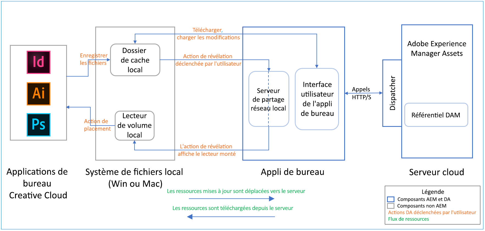

# Notes de mise à jour de l’appli de bureau AEM {#release-notes-v2}

| Produits | Appli de bureau Adobe Experience Manager (AEM) |
|---------------|--------------------------------------------------------------------|
| Version de l’application (révision) | 2.0 (2.0.0.4) |
| Versions d’AEM prises en charge | AEM 6.5, AEM 6.4, AEM 6.3 (avec package de compatibilité) |
| Type | Version majeure |
| Date de publication | 30 août 2019 (Mac), 9 septembre 2019 (Windows) |
| URL de téléchargement | [MacOS 64 bits](https://download.macromedia.com/aem-assets-companion-app/aem-desktop-osx-2.0.0.4.dmg) ; [Windows 64 bits](https://download.macromedia.com/aem-assets-companion-app/aem-desktop-win64-2.0.0.4.exe) ; [Windows 32 bits](https://download.macromedia.com/aem-assets-companion-app/aem-desktop-win32-2.0.0.4.exe) |

## Configuration requise et conditions préalables {#system-requirements-and-prerequisites-v2}

L’appli de bureau AEM est compatible avec les systèmes d’exploitation suivants :

* Mac OS X 10.10 ou version ultérieure, avec les correctifs de bogues les plus récents.
* Windows 7 et Windows 10 avec les Service Packs et les correctifs de bogues les plus récents.

L’application fonctionne avec les versions d’AEM suivantes, qu’elles soient déployées sur site ou sur Adobe Managed Services (AMS) :

* [AEM 6.5.0 ](https://helpx.adobe.com/experience-manager/6-5/release-notes.html) ou version ultérieure
* [AEM 6.4.4 ](https://helpx.adobe.com/experience-manager/6-4/release-notes/sp-release-notes.html) ou version ultérieure
* AEM 6.4.0 - 6.4.3 avec [package de compatibilité](https://www.adobeaemcloud.com/content/marketplace/marketplaceProxy.html?packagePath=/content/companies/public/adobe/packages/cq640/featurepack/adobe-asset-link-support)
* AEM 6.3.3.1 et versions ultérieures avec [package de compatibilité](https://www.adobeaemcloud.com/content/marketplace/marketplaceProxy.html?packagePath=/content/companies/public/adobe/packages/cq640/featurepack/adobe-asset-link-support)
* Pour AEM 6.3, [aucun Service Pack n’est prévu](https://helpx.adobe.com/experience-manager/maintenance-releases-roadmap.html). Adobe recommande d’effectuer la mise à niveau vers une version ultérieure d’AEM.

La version que vous prévoyez d’installer sur votre ordinateur local nécessite une version spécifique du serveur Adobe Experience Manager/des composants supplémentaires côté serveur (Service Packs, correctifs logiciels ou Feature Packs). Contactez votre administrateur AEM pour obtenir de l’aide.

### Prise en charge de différents types de ressources et de fichiers {#support-for-file-types}

L’application prend en charge les ressources stockées dans AEM qui représentent un fichier binaire pour ses opérations de base. L’ouverture de fichiers dans l’application de bureau native dépend de l’association du système d’exploitation des types de fichiers spécifiques (par exemple, PNG ou JPG) à des applications spécifiques (par exemple, Mac Preview ou Adobe Photoshop).

Certains types de fichiers prennent en charge le placement de ressources liées dans le fichier binaire. L’application pré-télécharge les ressources liées si la ressource est présente dans le référentiel AEM lorsque ces fichiers binaires sont ouverts à l’aide de l’appli de bureau. Les types de fichiers actuellement pris en charge sont les suivants :

* Fichiers Adobe InDesign (format INDD)
* Fichiers Adobe Illustrator (format AI)
* Fichiers Adobe Photoshop (format PS)

Cette fonctionnalité est prise en charge avec Adobe Creative Cloud 2018 et les versions Creative Cloud 2019 de l’application ci-dessus. L’application utilise une approche heuristique et de la meilleure correspondance pour mapper les chemins d’accès de bureau locaux des ressources liées aux URL sur le serveur AEM. Elle se base sur quelques hypothèses :

* Les chemins d’accès aux fichiers placés dans l’application native utilisent un chemin d’accès de bureau global (placé à partir du partage réseau local illustré par l’option Afficher).
* Les chemins sont stockés dans l’enregistrement XMP du fichier par l’application native.
* AEM a extrait l’enregistrement XMP avec les chemins d’accès dans l’enregistrement de métadonnées de la ressource.
* Les chemins d’accès peuvent être associés aux ressources dans AEM (ce qui signifie que les fichiers placés se trouvent également dans AEM sous un chemin d’accès correspondant).

## Nouvelles fonctionnalités et améliorations {#whats-new-added}

Pour en savoir plus, voir [Nouveautés de l’application](introduction.md#whats-new-v2).

## Instructions d’installation {#installation-instructions-v2}

Pour savoir comment installer et configurer l’appli, voir [Installation de l’appli de bureau AEM](install-upgrade.md).

Si vous effectuez une mise à niveau à partir d’une version précédente de l’appli de bureau AEM, vous devez observer les bonnes pratiques de transition répertoriées dans [Mise à niveau à partir d’une version précédente](install-upgrade.md#upgrade-from-previous-version).

## Remarques importantes sur le fonctionnement de l’application {#how-app-works}

Il est important de comprendre ce qui suit à propos de l’application et de son fonctionnement.

* L’application offre un contrôle total sur les opérations qui nécessitent le transfert complet des fichiers binaires depuis et vers AEM (ouverture, modification, chargement des modifications et chargement des ressources).
   * Si vous souhaitez utiliser la ressource figurant sur le bureau, vous devez explicitement ouvrir, modifier ou télécharger sur votre bureau, que ce soit individuellement, dans un dossier ou par sélection multiple.
   * Si vous souhaitez que les modifications locales apportées aux ressources soient chargées dans AEM, vous devez sélectionner [!UICONTROL Upload Changes], individuellement ou par sélection multiple.
   * L’application n’est pas un client de synchronisation qui synchronise les ressources sur le bureau et AEM.
   * L’application ne fournit pas de partage réseau qui mappe le référentiel AEM en tant que structure de dossiers virtuelle.
* La liste des ressources affichées par l’application est basée sur le statut du référentiel AEM Assets. Les fichiers téléchargés localement puis renommés dans les fichiers locaux ou le dossier de cache ne sont ni affichés ni gérés par l’application.
* Si l’application n’affiche pas les résultats attendus, cliquez sur l’icône d’actualisation dans la barre supérieure.
* Le partage réseau local, qui apparaît lorsque vous utilisez l’action [!UICONTROL Reveal File], n’affiche que les fichiers (et les dossiers) disponibles localement. Les actions [!UICONTROL Reveal File] et [!UICONTROL Reveal Folder] pré-téléchargent les ressources pour afficher les ressources appropriées dans le partage réseau local.
* Le partage réseau local SMB (Mac)/WebDAV (Win) est utilisé lorsqu’une application Adobe Creative Cloud lit les fichiers de ressources liés/placés dans un fichier natif de l’application Creative Cloud.

Le diagramme suivant illustre le flux de ressources et de fichiers allant du cloud au système de fichiers local et vice versa, tel qu’il est initié par les actions de l’utilisateur.

## Problèmes connus {#known-issues-v2}

**Problèmes liés à l’interface utilisateur :**
* Parfois, l’interface de l’application de bureau peut devenir vide. Right-click and click [!UICONTROL Refresh] to re-load the application. Après une telle actualisation, vous démarrez à la racine du référentiel DAM. Les mises à jour ou les états de vos ressources sont conservés. <!-- CQ-4270267 -->
* Difficile de naviguer dans les dossiers/résultats de recherche sans un pavé de suivi ou un pointeur de la souris. The scroll-bar might not appear with mouse devices without mouse wheel. <!-- CQ-4269947 -->
* Rarement, la barre de progression ne s’affiche pas correctement lorsque la ressource de téléchargement change.
* Après avoir appliqué et supprimé le filtre pour rechercher toutes les ressources modifiées localement, l’application n’amène pas l’utilisateur à ses résultats de recherche ou à la vue de dossiers par laquelle il a commencé. L’application affiche le dossier racine du référentiel DAM.
* Parfois, lorsque vous vous connectez à une URL pour laquelle le serveur AEM n’est pas en cours d’exécution, l’écran de connexion ne répond plus. Quittez l’application et redémarrez-la.

**Problèmes CRUD (Create, Read, Update, and Delete) :**
* L’application tente de télécharger des fichiers même avec des caractères non valides, ce qui peut entraîner l’échec du chargement côté serveur. <!-- CQ-4273652 -->
* Lors du téléchargement de modifications dans un fichier avec des commentaires, les commentaires sont stockés avec le fichier dans AEM, mais ne sont pas visibles en tant que commentaires de contrôle de version. Ce problème est résolu dans AEM 6.4.5 et AEM 6.5.1. Adobe recommande vivement d’installer les derniers Service Packs. <!-- CQ-4268990 -->
* Les transferts de ressources ne peuvent pas être annulés par l’utilisateur. Si vous avez déclenché involontairement un transfert volumineux, quittez l’application et redémarrez-la. <!-- CQ-4278940 -->

**Problèmes de plateforme :**
* Parfois, sous Windows, le statut d’une ressource peut passer immédiatement à [!UICONTROL Edited Locally] après son ouverture, même si vous ne l’avez pas modifié. Cliquez sur [!UICONTROL Refresh] pour mettre le statut à jour.

>[!MORELIKETHIS]
>
>* [Documentation d’AEM 6.5](https://helpx.adobe.com/support/experience-manager/6-5.html)
>* [Documentation d’AEM Assets 6.5](https://docs.adobe.com/content/help/en/experience-manager-64/assets/home.html)
>* [Utilisation de l’appli de bureau AEM](using.md)
>* [Installation et mise à niveau d’une appli de bureau](install-upgrade.md)
>* [Bonnes pratiques et résolution des problèmes](troubleshoot.md)

