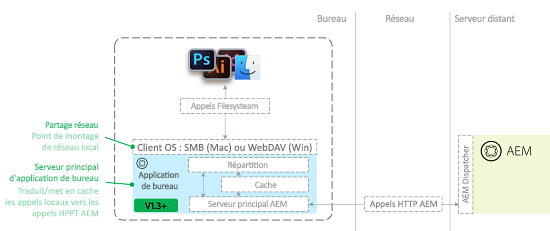

# Résolution des problèmes liés à l’appli de bureau AEM v1.x {#troubleshoot-aem-desktop-app}

Cette section vous explique comment résoudre les problèmes occasionnels pouvant affecter, notamment, l’installation, la mise à niveau et la configuration de l’appli de bureau AEM.

L’appli de bureau Adobe Experience Manager (AEM) s’accompagne d’utilitaires qui vous aident à mapper le référentiel AEM Assets en tant que partage réseau sur le poste de travail (partage SMB sous Mac OS). Le partage réseau est une technologie du système d’exploitation qui permet aux sources distantes d’être traitées comme si elles faisaient partie du système de fichiers local d’un ordinateur. Dans le cas de l’appli de bureau AEM, la structure du référentiel de gestion des ressources numériques (DAM) d’une instance AEM distante est ciblée comme source de fichier distante. Le schéma suivant décrit la topologie de l’appli de bureau AEM :



Avec cette architecture, l’application intercepte les appels du système de fichiers (ouvrir, fermer, lire, écrire, etc.) vers le partage réseau monté et les convertit en appels HTTP AEM natifs vers le serveur AEM. Les fichiers sont mis en cache localement. Pour plus d’informations, voir [Utilisation de l’appli de bureau AEM v1.x](use-app-v1.md).

## AEM desktop app component overview {#desktop-app-component-overview}

L’appli de bureau AEM comprend les composants suivants :

* **L’application** de bureau : L’application monte ou démonte DAM en tant que système de fichiers distant et traduit les appels du système de fichiers entre le partage réseau monté localement et l’instance AEM distante à laquelle elle se connecte.
* **Client WebDAV/SMB du système d’exploitation** : gère les communications entre l’Explorateur Windows/le Finder et l’appli de bureau AEM. Si un fichier est récupéré, créé, modifié, supprimé, déplacé ou copié, le client WebDAV/SMB du système d’exploitation communique cette opération à l’appli de bureau AEM. Après réception de la communication, l’appli de bureau AEM la convertit en appels d’API distants AEM natifs. Par exemple, si un utilisateur crée un fichier dans le répertoire monté, le client WebDAV/SMB lance une requête que l’appli de bureau AEM convertit en requête HTTP qui crée le fichier dans DAM. Le client WebDAV/SMB est un composant intégré du système d’exploitation. Il n’est affilié, en aucune manière, à l’appli de bureau AEM, à AEM ou à Adobe.
* **Instance Adobe Experience Manager** : permet d’accéder aux ressources stockées dans le référentiel DAM d’AEM Assets. Elle exécute, en outre, les actions demandées par l’appli de bureau AEM pour le compte des applications de bureau locales qui interagissent avec le partage réseau monté. L’instance AEM cible doit exécuter AEM version 6.1 ou ultérieure. Dans le cas des instances AEM qui exécutent des versions antérieures d’AEM, l’installation de Feature Packs ou de correctifs supplémentaires est nécessaire pour qu’elles soient entièrement opérationnelles.

## Cas d’utilisation prévus pour l’appli de bureau AEM {#intended-use-cases-for-aem-desktop-app}

L’appli de bureau AEM utilise la technologie de partage réseau pour mapper un référentiel AEM distant sur un ordinateur local. Cependant, elle n’est pas conçue pour remplacer un partage réseau contenant des ressources, sur lequel des utilisateurs effectuent des opérations de gestion des actifs numériques à partir de leur ordinateur local. Ces opérations sont notamment le déplacement ou la copie de plusieurs fichiers, ou encore le déplacement de structures de dossiers volumineuses vers le partage réseau d’AEM Assets directement dans le Finder/l’Explorateur.

L’appli de bureau AEM fournit une méthode pratique pour accéder à des ressources DAM (ouverture) et les modifier (enregistrement) entre l’interface utilisateur tactile d’AEM Assets et le poste de travail local. L’application lie les ressources stockées sur le serveur AEM Assets à vos workflows de bureau.

Le scénario suivant illustre l’utilisation de l’appli de bureau AEM :

* Un utilisateur se connecte à AEM et utilise l’interface utilisateur web pour rechercher une ressource.
* À l’aide des fonctionnalités d’action de bureau de l’interface utilisateur web AEM, il ouvre, affiche ou modifie la ressource sur l’ordinateur de bureau, suivant ses besoins.
* L’appli de bureau AEM ouvre la ressource dans l’éditeur par défaut en fonction du type de fichier.
* L’utilisateur apporte les modifications souhaitées à la ressource.
* Une fois qu’un fichier a été modifié, l’utilisateur peut afficher son état de synchronisation à l’aide de la fenêtre d’état de synchronisation en arrière-plan de l’appli de bureau AEM.
* Il peut utiliser le menu contextuel de l’appli de bureau AEM pour archiver/extraire la ressource ou revenir à l’interface utilisateur de la gestion des actifs numériques (DAM).
* Après avoir apporté les modifications au fichier, l’utilisateur revient à l’interface utilisateur web AEM.

Il ne s’agit pas du seul cas d’utilisation. Toutefois, il illustre à quel point l’appli de bureau AEM constitue un mécanisme pratique pour modifier des ressources et y accéder en local. Dans la mesure du possible, vous êtes invité à utiliser l’interface utilisateur de la gestion des actifs numériques (DAM), car elle garantit une meilleure expérience. Elle confère à Adobe une souplesse accrue pour répondre aux besoins des clients.

## Restrictions {#limitations}

Le partage réseau WebDAV/SMB1 offre la possibilité de traiter des fichiers dans une fenêtre de l’Explorateur ou du Finder. Cependant, l’Explorateur/le Finder et AEM communiquent sur une connexion réseau qui présente certaines limites. Par exemple, le temps nécessaire pour copier un fichier de 1 Go sur le répertoire WebDAV/SMB monté est approximativement le même que celui qui est nécessaire pour transférer un fichier de 1 Go vers un site web à l’aide d’un navigateur web. En fait, dans le premier cas, cette opération peut s’avérer plus longue en raison du manque d’efficacité du protocole WebDAV/SMB et des clients WebDAV/SMB du système d’exploitation (en particulier sous Mac OS X).

Il existe certaines restrictions quant aux types de tâches qui peuvent être effectuées à partir d’un répertoire monté. En règle générale, utiliser des fichiers volumineux, en particulier sur une connexion réseau de mauvaise qualité/à latence élevée/à faible bande passante, peut se révéler difficile, surtout si vous effectuez des opérations de modification.

Adobe vous conseille d’effectuer quelques tests avant de confirmer au client que certains types de fichiers peuvent être modifiés efficacement de manière statique à partir du répertoire monté.

L’appli de bureau AEM n’est pas adaptée aux manipulations intensives sur le système de fichiers, notamment :

* Déplacement ou copie de fichiers et de répertoires
* Ajout d’un grand nombre de ressources à AEM
* Recherche et ouverture de fichiers par le biais du système de fichiers, sauf l’exploration de dossiers
* Compression ou décompression d’archives de fichier

En raison de restrictions au niveau du système d’exploitation, la taille de fichier est limitée à 4 294 967 295 octets (environ 4,29 Go) sous Windows. Cela est dû à un paramètre du Registre qui définit la taille maximale d’un fichier sur un partage réseau. La valeur du paramètre de Registre est un DWORD avec une taille maximale équivalant au nombre référencé.

## Mise en cache et communication avec AEM {#caching-and-communication-with-aem}

L’appli de bureau AEM fournit des fonctions de chargement en arrière-plan et de mise en cache interne afin d’améliorer l’expérience de l’utilisateur final. Lorsque vous enregistrez un fichier volumineux, il est d’abord enregistré en local pour que vous puissiez continuer à travailler. Après un moment (30 secondes actuellement), le fichier est envoyé au serveur AEM en arrière-plan.

Contrairement à Creative Cloud Desktop ou à d’autres solutions de synchronisation de fichiers, telles que Microsoft One Drive, l’appli de bureau AEM n’est pas un client de synchronisation de bureau complet. En effet, cette application permet d’accéder au référentiel AEM Assets dans son intégralité, lequel peut être extrêmement volumineux (de l’ordre de plusieurs centaines de gigaoctets ou de téraoctets) pour une synchronisation complète.

La mise en cache offre la possibilité de limiter la surcharge de stockage/réseau à un sous-ensemble de ressources pertinentes pour l’utilisateur.

Pour effectuer la mise en cache, l’appli de bureau AEM procède comme suit :

* Lorsque vous ouvrez un dossier dans le Finder et que des vignettes/aperçus de fichiers sont affichés, ou lorsque vous ouvrez un fichier dans une application, l’appli de bureau AEM met en cache le binaire du fichier.
* Lorsque vous stockez des fichiers via le Finder ou d’autres applications de bureau, ils sont d’abord stockés en local (mis en cache) et le système d’exploitation en est informé. Ils sont ensuite mis en file d’attente pour être transférés vers le serveur en arrière-plan et finalement envoyés sur le réseau. En cas d’erreur réseau, l’appli de bureau AEM effectue, au maximum, trois nouvelles tentatives de chargement de l’intégralité du fichier. Si le chargement s’avère toujours impossible après ces trois tentatives, le fichier est marqué comme étant en conflit et le statut est affiché dans la fenêtre Background Upload Queue Status (Statut de la file d’attente de chargement en arrière-plan). L’appli de bureau AEM n’essaie plus de mettre à jour le fichier. L’utilisateur doit mettre à jour le fichier et le transférer à nouveau une fois la connexion rétablie.

Toutes les opérations ne sont pas mises en cache localement. Les éléments suivants sont immédiatement transmis au serveur AEM sans mise en cache locale :

* Toutes les opérations réalisées sur des dossiers, comme une création, une suppression, etc.
* La fonctionnalité de transfert de dossiers introduite dans la version 1.4 télécharge une hiérarchie de dossiers locale sans mettre en cache les fichiers localement

## Opérations distinctes  {#individual-operations}

When troubleshooting sub-optimized performance for individual users, first review [Limitations](https://helpx.adobe.com/experience-manager/desktop-app/troubleshooting-desktop-app.html#limitations). Les sections suivantes contiennent des suggestions visant à améliorer les performances pour les utilisateurs.

## Recommandations en termes de bande passante   {#bandwidth-recommendations}

La bande passante dont dispose un utilisateur joue un rôle essentiel dans les performances du client WebDAV/SMB.

Adobe recommande une vitesse de transfert proche de 10 Mbit/s pour un seul utilisateur. Dans le cas des connexions sans fil, la bande passante est souvent partagée entre plusieurs utilisateurs. Si plusieurs utilisateurs effectuent simultanément des tâches qui utilisent la bande passante du réseau, les performances peuvent se dégrader encore plus. Pour éviter ce type de problème, utilisez une connexion câblée.

## Configurations spécifiques à Windows  {#windows-specific-configurations}

Si vous exécutez AEM sous Windows, vous pouvez configurer le système d’exploitation de manière à améliorer les performances du client WebDAV. Pour plus d’informations, aller à [https://support.microsoft.com/fr-fr/kb/2445570](https://support.microsoft.com/en-us/kb/2445570).

Sous Windows 7, la modification des paramètres d’Internet Explorer peut améliorer les performances de WebDAV. Pour plus d’informations, consulter [http://oddballupdate.com/2009/12/fix-slow-webdav-performance-in-windows-7/](http://oddballupdate.com/2009/12/fix-slow-webdav-performance-in-windows-7/).

## Opérations simultanées  {#concurrent-operations}

Lorsque vous interagissez avec un fichier en local, l’appli de bureau AEM vérifie si une version plus récente du fichier est disponible dans AEM. Si tel est le cas, l’application télécharge une nouvelle copie du fichier dans le cache local. Toutefois, l’appli de bureau AEM n’écrase pas un fichier mis en cache localement s’il a été modifié. Cette fonctionnalité empêche tout écrasement accidentel de votre travail. 

Lorsqu’un même fichier est modifié en local et dans AEM, la version modifiée en local écrase celle qui est stockée dans AEM. Dans ce cas, la version précédente est disponible dans la chronologie de la ressource. Vous pouvez vérifier les deux versions et résoudre les éventuels conflits.

Si un fichier local est en conflit avec la version disponible sur le serveur, la boîte de dialogue d’état du transfert en arrière-plan vous en informe. Pour résoudre ce problème, ouvrez le fichier à l’origine du conflit et enregistrez-le. L’enregistrement du fichier force l’appli de bureau AEM à synchroniser vos dernières modifications locales avec AEM. Vous pouvez afficher les versions précédentes de la ressource dans la chronologie et résoudre les éventuels conflits.

Vous devez tenir compte d’autres facteurs lorsque plusieurs utilisateurs essaient de travailler dans des répertoires montés distincts ciblant la même instance AEM. Les facteurs suivants sont particulièrement importants :

* Quantité de bande passante disponible sur le réseau d’origine des utilisateurs
* Configuration, telle que les pare-feu ou les serveurs proxy, du réseau d’origine
* Quantité de bande passante disponible sur le réseau de l’instance AEM cible
* Présence ou non d’un Dispatcher avant l’instance AEM cible
* Charge actuelle sur l’instance AEM cible

## Configurations AEM supplémentaires  {#additional-aem-configurations}

En cas de dégradation significative des performances WebDAV/SMB lorsque plusieurs utilisateurs travaillent simultanément, vous pouvez configurer quelques éléments dans AEM, ce qui permet d’optimiser les performances.

## Mise à jour des processus transitoires de ressources  {#update-asset-transient-workflows}

Vous pouvez améliorer les performances du côté AEM en activant les processus transitoires pour le processus Ressources de mise à jour de gestion des actifs numériques. L’activation de processus transitoires réduit la puissance de traitement requise pour mettre à jour des ressources lors de leur création ou de leur modification dans AEM.

1. Accédez à `/miscadmin` dans l’instance AEM à configurer (par exemple, `http://[Server]:[Port]/miscadmin`).
1. L’arborescence de navigation, développez **Outils** &gt; **Processus** &gt; **Modèles** &gt; **Gestion des actifs numériques**.
1. Double-cliquez sur **Ressources de mise à jour de gestion des actifs numériques**.
1. Depuis le panneau d’outils flottant, basculez vers l’onglet **Page**, puis cliquez sur **Propriétés de la page**.
1. Cochez la case **Processus transitoire**, puis cliquez sur **OK**.

### Ajuster la file d’attente temporaire du processus Granite {#adjust-granite-transient-workflow-queue}

Pour améliorer les performances, une autre méthode consiste à configurer le nombre maximum de tâches en parallèle pour la file d’attente des processus transitoires Granite. La valeur recommandée est environ la moitié du nombre de processeurs disponibles avec le serveur. Pour régler la valeur, procédez comme suit :

1. Accédez à */system/console/configMgr* dans l’instance AEM à configurer (par exemple, <http://&lt;Server&gt;:&lt;Port&gt;/system/console/configMgr>).
1. Recherchez **QueueConfiguration**, puis cliquez pour ouvrir chaque tâche jusqu’à ce que vous ayez trouvé la tâche **Granite Transient Workflow Queue** (File d’attente des processus transitoires Granite). Cliquez sur l’icône Edit (Modifier) en regard de cette tâche.
1. Modifiez la valeur **Maximum Parallel Jobs** (Nombre maximum de tâches en parallèle), puis cliquez sur **Enregistrer**.

## Configuration AWS   {#aws-configuration}

En raison des limites de bande passante du réseau de WebDAV/SMB, une dégradation des performances est possible lorsque plusieurs utilisateurs travaillent simultanément. Adobe recommande d’augmenter la taille de l’instance AWS pour une instance AEM cible qui s’exécute sur AWS afin d’améliorer les performances de WebDAV/SMB.

Cette mesure augmente en particulier la quantité de bande passante réseau disponible pour le serveur. Voici quelques informations détaillées :

* La quantité de bande passante réseau dédiée à une instance AWS augmente à mesure que la taille de l’instance augmente. Pour obtenir des informations sur la quantité de bande passante disponible pour chaque taille d’instance, voir la [documentation d’AWS](https://aws.amazon.com/ec2/instance-types/).
* Lors de la résolution des problèmes affectant un client de grande taille, Adobe a configuré la taille de son instance AEM sur c4.8xlarge, principalement pour les 4 000 Mbit/s de bande passante dédiée qu’elle fournit.
* Si un Dispatcher est présent devant l’instance AEM, assurez-vous que sa taille est appropriée. Si l’instance AEM fournit une bande passante de 4 000 Mbit/s, mais que le Dispatcher ne fournit que 500 Mbit/s, la bande passante effective n’est que de 500 Mbit/s. Cela est dû au fait que le Dispatcher crée un goulot d’étranglement réseau.

## Restrictions liées aux fichiers extraits   {#checked-out-file-limitations}

Il existe quelques restrictions connues quant à la façon dont vous pouvez interagir avec les fichiers extraits par le biais de l’Explorateur ou du Finder. Si un fichier est extrait, il doit être en lecture seule pour tous les utilisateurs, à l’exception de celui qui l’a extrait. La mise en œuvre du protocole WebDAV/SMB1 dans AEM applique cette règle. Cependant, dans le cas des clients WebDAV/SMB du système d’exploitation, il apparaît que l’interaction avec les fichiers extraits est rarement appropriée. Certaines anomalies sont décrites ci-dessous.

### Général {#general}

Lors de l’écriture dans un fichier extrait, le verrouillage est appliqué uniquement dans l’implémentation d’AEM WebDAV. Par conséquent, le verrouillage n’est appliqué que par les clients qui utilisent WebDAV, comme l’appli de bureau. Le verrouillage n’est pas appliqué par le biais de l’interface Web d’AEM. L’interface AEM affiche simplement une icône de verrou dans le mode Carte pour les ressources qui sont extraites. Cette icône est purement décorative et n’a aucun effet sur le comportement d’AEM.

En règle générale, les clients WebDAV ne se comportent pas toujours comme prévu. Il peut y avoir d’autres problèmes. Cependant, l’actualisation ou la vérification de la ressource dans AEM est un bon moyen de s’assurer qu’elle est en cours de modification. Ce comportement est typique des clients WebDAV du système d’exploitation, ce qui échappe au contrôle d’Adobe.

### Windows {#windows}

La suppression d’un fichier semble réussir, dans la mesure où il n’apparaît plus dans l’Explorateur de fichiers de Windows. Cependant, l’actualisation du répertoire et la vérification des ressources AEM indiquent que le fichier est toujours présent. En outre, la modification des fichiers semble réussir (aucune boîte de dialogue d’avertissement ni message d’erreur n’est affiché). Toutefois, la réouverture du fichier ou la vérification des ressources AEM fait apparaître que le fichier n’a pas été modifié.

#### Mac OS X   {#mac-os-x}

Aucun message d’erreur ni d’avertissement ne s’affiche lors du remplacement d’un fichier, mais la vérification de la ressource dans AEM fait apparaître qu’elle n’a pas été modifiée. Actualisez ou vérifiez la ressource dans AEM pour vous assurer qu’elle n’est pas en cours de modification.

## Résolution des problèmes d’icône de l’appli de bureau AEM (Mac OS X) {#troubleshooting-desktop-app-icon-issues-mac-os-x}

Une fois que vous avez installé l’appli de bureau AEM, l’icône de menu de l’application s’affiche dans la barre de menus. Si cette icône n’apparaît pas, procédez comme suit pour remédier au problème :

1. Ouvrez la fenêtre de terminal du système d’exploitation.
1. Saisissez la commande suivante à l’invite de commande et appuyez ensuite sur la touche Entrée :

   ```shell
    cd ../Library/Caches.
   ```

1. Saisissez la commande suivante et appuyez ensuite sur la touche Entrée :

   ```shell
   rm -r com.adobe.aem.assetscompanion 
   ```

1. Saisissez la commande suivante et appuyez ensuite sur la touche Entrée :

   ```shell
   cd ~/Library/Preferences
   ```

1. Saisissez la commande suivante et appuyez ensuite sur la touche Entrée :

   ```shell
   rm com.adobe.aem.assetscompanion.plist
   ```

1. Saisissez la commande suivante et appuyez ensuite sur la touche Entrée :

   ```shell
   rm ~/Library/Group\ Containers/group.com.adobe.aem.desktop/*
   ```

1. Redémarrez le système.

L’appli de bureau AEM tente de synchroniser un fichier donné à trois reprises. Si la troisième tentative de synchronisation du fichier échoue, l’appli de bureau AEM considère que le fichier est en conflit et vous en informe par le biais de la fenêtre de statut des transferts en arrière-plan. Un statut de conflit indique que vos dernières modifications sont toujours disponibles en local, mais qu’elles ne sont plus resynchronisées avec AEM. L’appli de bureau AEM ne tente plus de se synchroniser.

Pour remédier à ce problème, la méthode la plus simple consiste à ouvrir le fichier à l’origine du conflit et à le réenregistrer. De cette manière, l’appli de bureau AEM est forcée d’effectuer trois tentatives de synchronisation supplémentaires. Si la synchronisation du fichier échoue encore, consultez les sections ci-dessous pour obtenir une aide supplémentaire.

## Effacement du cache de l’appli de bureau AEM {#clearing-aem-desktop-cache}

L’effacement du cache de l’appli de bureau AEM est une tâche de dépannage préliminaire qui permet de résoudre plusieurs problèmes liés à l’application.

Vous pouvez effacer le cache en supprimant le répertoire de cache de l’application aux emplacements suivants : Windows : %LocalAppData%\Adobe\AssetsCompanion\Cache\

Mac : ~/Library/Group/Containers/group.com.adobe.aem.desktop/cache/

Toutefois, l’emplacement peut varier en fonction du point de terminaison AEM configuré de l’appli de bureau AEM. La valeur est une version codée de l’URL ciblée. Par exemple, si l’application cible est `http://localhost:4502`, le nom du répertoire est `http%3A%2F%2Flocalhost%3A4502%2F`.

Pour effacer le cache, supprimez le répertoire &lt;Point de terminaison AEM codé&gt;.

>[!NOTE]
>
>Si vous effacez le cache de l’appli de bureau AEM, les modifications de fichier locales qui ne sont pas synchronisées avec AEM seront perdues.

>[!NOTE]
>
>À compter de la version 1.5 de l’appli de bureau AEM, une option disponible dans l’interface utilisateur de l’application permet d’effacer le cache.

## Recherche de la version de l’appli de bureau AEM {#finding-the-aem-desktop-version}

La procédure de vérification de la version de l’appli de bureau AEM est la même sous Windows et macOS.

Cliquez sur l’icône de l’appli de bureau AEM, puis sélectionnez **About** (À propos). Le numéro de version est affiché à l’écran.

## Mise à niveau de l’appli de bureau AEM sous macOS {#upgrading-aem-desktop-app-on-macos}

Des problèmes peuvent parfois survenir lors de la mise à niveau de l’appli de bureau AEM sous macOS. Cela est dû au dossier système hérité de l’appli de bureau AEM qui empêche le chargement correct des nouvelles versions de l’application. Pour y remédier, les dossiers et fichiers suivants peuvent être supprimés manuellement.

Avant d’exécuter les étapes ci-dessous, faites glisser « Appli de bureau Adobe Experience Manager » du dossier Applications de macOS vers la Corbeille. Ouvrez ensuite le terminal, puis exécutez la commande suivante, en indiquant votre mot de passe lorsque vous y êtes invité.

```shell
sudo rm -rf ~/Library/Application\ Support/com.adobe.aem.desktop
sudo rm -rf ~/Library/Preferences/com.adobe.aem.desktop.plist
sudo rm -rf ~/Library/Logs/Adobe\ Experience\ Manager\ Desktop

sudo find /var/folders -type d -name "com.adobe.aem.desktop" | xargs rm -rf
sudo find /var/folders -type d -name "com.adobe.aem.desktop.finderintegration-plugin" | xargs rm -rf
```

## Enregistrement d’un fichier extrait par d’autres utilisateurs   {#saving-a-file-checked-out-by-others}

En raison des limites techniques du système d’exploitation, les utilisateurs ne peuvent pas bénéficier d’une expérience cohérente lorsqu’ils tentent de remplacer un fichier extrait par d’autres utilisateurs. Cela varie, en effet, suivant l’application utilisée pour modifier le fichier extrait. Dans certains cas, l’application affiche soit un message d’erreur indiquant un échec d’écriture sur le disque, soit une erreur générique ou sans lien apparent avec le problème. Dans d’autres, aucun message d’erreur n’est affiché et l’opération semble réussir.

Dans ce cas, la fermeture et la réouverture du fichier peut indiquer que le contenu n’a pas été modifié. Toutefois, certaines applications peuvent stocker une sauvegarde du fichier, de sorte que vos modifications puissent être appliquées.

Quel que soit le comportement, le fichier reste inchangé lorsque vous l’archivez. Même si une version différente du fichier est affichée, les modifications ne sont pas synchronisées avec AEM.

## Résolution des problèmes liés au déplacement de fichiers   {#troubleshooting-problems-around-moving-files}

Dans le cas de l’API serveur, la transmission d’en-têtes supplémentaires, X-Destination, X-Depth et X-Overwrite, est nécessaire pour garantir le fonctionnement des opérations de déplacement et de copie. Le Dispatcher ne transmet pas ces en-têtes par défaut, ce qui entraîne l’échec de ces opérations. Pour plus d’informations, voir [Connexion à AEM derrière un Dispatcher](install-configure-app-v1.md#connect-to-an-aem-instance-behind-a-dispatcher).

## Résolution des problèmes de connexion de l’appli de bureau AEM  {#troubleshooting-aem-desktop-connection-issues}

### Problème de redirection SAML {#saml-redirect-issue}

Dans la majorité des cas, les problèmes de connexion de l’appli de bureau AEM à votre instance AEM compatible SSO (SAML) sont dus au fait que le processus SAML n’effectue pas de redirection vers le chemin demandé initialement. Sinon, la connexion peut être redirigée vers un hôte qui n’est pas configuré dans l’appli de bureau AEM. Procédez comme suit pour vérifier le processus de connexion :

1. Ouvrez un navigateur web.
1. Dans la barre d’adresse, indiquez l’URL `/content/dam.json`.
1. Remplacez l’URL par l’instance AEM cible ; par exemple, `http://localhost:4502/content/dam.json`.
1. Connectez-vous à AEM.
1. Après vous être connecté, vérifiez l’adresse actuelle du navigateur dans la barre d’adresse. Elle doit correspondre à l’URL que vous avez saisie initialement.
1. Vérifiez que tous les éléments qui précèdent `/content/dam.json` correspondent à la valeur AEM configurée dans l’appli de bureau AEM.

### Problème de configuration SSL {#ssl-configuration-issue}

Les bibliothèques utilisées par l’appli de bureau AEM pour les communications HTTP appliquent le protocole SSL de manière stricte. Parfois, une connexion peut réussir en utilisant un navigateur, mais échouer avec l’appli de bureau AEM. Pour configurer SSL convenablement, installez le certificat intermédiaire manquant dans Apache. Voir [Comment installer un certificat d’autorité de certification intermédiaire dans Apache](https://access.redhat.com/solutions/43575).

## Utilisation de l’appli de bureau AEM avec le Dispatcher {#using-aem-desktop-with-dispatcher}

L’appli de bureau AEM fonctionne avec des déploiements situés derrière un Dispatcher ; il s’agit de la configuration par défaut, recommandée pour les serveurs AEM. En règle générale, les Dispatchers AEM situés devant les environnements de création AEM sont configurés pour ignorer la mise en cache des ressources DAM. Par conséquent, ils ne fournissent pas de mise en cache supplémentaire du point de vue de l’appli de bureau AEM. Assurez-vous que la configuration du Dispatcher a été adaptée pour fonctionner avec l’appli de bureau AEM. Pour plus d’informations, voir [Connexion à AEM derrière un Dispatcher](install-configure-app-v1.md#connect-to-an-aem-instance-behind-a-dispatcher).

## Recherche des fichiers journaux {#checking-for-log-files}

En fonction de votre système d’exploitation, les fichiers journaux de l’appli de bureau AEM se situent aux emplacements suivants :

* Windows : `%LocalAppData%\Adobe\AssetsCompanion\Logs`
* Mac : `~/Library/Logs/Adobe\ Experience\ Manager\ Desktop`