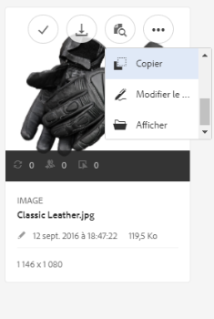

# Use [!DNL Experience Manager] desktop app v1.x {#use-aem-desktop-app-v1x}

Using the App, the assets within [!DNL Experience Manager] are easily accessible on your local desktop and can be used in any desktop applications. Assets can be easily revealed in Mac Finder or Windows Explorer, opened in desktop applications, and changed locally - the changes are saved back to [!DNL Experience Manager] with a new version created in the repository.

Cette intégration permet à différents rôles au sein de l’entreprise de gérer les ressources de manière centralisée dans  Assets, et d’y accéder dans Creative Cloud et d’autres applications, tout en facilitant la conformité avec les diverses normes, y compris le branding.

The key tasks you do using the [!DNL Experience Manager] desktop app v1 include:

1. [ [!DNL Experience Manager] Connexion à un serveur ](#installandconnect)
1. [Ouverture directe de ressources sur l’ordinateur de bureau](#openondesktop)
1. [Modification et extraction de ressources à partir de l’ordinateur de bureau](#workonassets)
1. [Chargement en masse de ressources et de dossiers](#bulkupload)

Pour les pratiques recommandées, voir les [Bonnes pratiques d’utilisation de l’application](best-practices-for-v1.md). If you face issues using the App, see how to [troubleshoot [!DNL Experience Manager] desktop](troubleshoot-app-v1.md).

>[!NOTE]
>
>[!DNL Experience Manager] application de bureau a été introduite dans la version [!DNL Experience Manager] 6.1 et a été appelée [!DNL Experience Manager Assets Companion App].

## [!DNL Experience Manager]Points de contact de l’appli de bureau dans le workflow de création {#aem-desktop-app-touch-points-in-the-creative-workflow}

[!DNL Experience Manager] l’application de bureau, ainsi que [!DNL Assets]les points de contact suivants, s’intègrent dans votre processus créatif et offre les points de contact suivants.

![[!DNL Experience Manager] application de bureau points de contact du processus créatif](assets/aem_desktopapp_workflow.png)

[!DNL Experience Manager] application de bureau points de contact du processus créatif

## Installation et connexion de l’application au [!DNL Experience Manager] serveur {#installandconnect}

Before you can begin creating or editing the creative assets, connect the desktop application with the [!DNL Assets] server to download and upload assets in the repository. Effectuez les tâches suivantes :

1. [Installez l’application](#installapp).
1. [Définissez vos préférences](#inapppref) et vos informations de connexion.
1. [ [!DNL Experience Manager] Connectez-vous au serveur ](#connect) et montez le référentiel de ressources comme lecteur local.
1. [Activez les actions de bureau](#desktopactions)[!DNL Experience Manager] sur le serveur 

[!DNL Experience Manager]L’appli de bureau établit une connexion HTTPS au serveur  afin de transférer vos ressources de manière sécurisée.[!DNL Experience Manager]

>[!NOTE]
>
>For part of or all of the installation and configuration steps, you may need help from your [!DNL Experience Manager] administrator or system administrator.

### Installation de l’application {#installapp}

To use [!DNL Experience Manager] desktop app, ensure that your [!DNL Experience Manager] server version is supported by the app. Téléchargez le fichier d’installation approprié (binaire) pour votre système d’exploitation (Mac ou Windows) et installez ensuite l’application.

Une configuration détaillée peut s’avérer nécessaire en fonction des préférences de votre système et de votre réseau. See [Install and configure [!DNL Experience Manager] desktop app](install-configure-app-v1.md) for more details.

1. Go to the [[!DNL Experience Manager] desktop app download page](https://helpx.adobe.com/fr/experience-manager/kb/download-companion-app.html) and download the appropriate binary for your operating system.
1. Exécutez le fichier d’installation téléchargé et suivez les instructions affichées à l’écran pour installer l’application.

   >[!NOTE]
   >
   >Only one instance of the [!DNL Experience Manager] desktop app can be installed and be active at a time.

### Présentation des options et des préférences dans l’application {#inapppref}

The application allows for settings to connect and disconnect from [!DNL Experience Manager] servers, view status of uploads, manage local cache, and so on. Les paramètres par défaut sont opérationnels pour un utilisateur ordinaire de l’application. You can tweak the settings to get more out of the application and out of the integration with [!DNL Experience Manager] server. Les différents paramètres sont décrits ci-dessous de manière détaillée.

**Explore Assets (Explorer les ressources)**[!DNL Assets] Ouvrez le lecteur local sur lequel est monté le référentiel En d’autres termes, explorez les ressources qui sont désormais disponibles sur votre ordinateur local.

**View asset status (Afficher le statut des ressources)**[!DNL Assets] Lorsque des ressources modifiées sont chargées ou que de nouvelles ressources sont ajoutées au référentiel , l’application procède à leur chargement en arrière-plan. Cela garantit la fluidité des opérations, sans qu’il faille patienter jusqu’à la fin du transfert, en particulier pour les ressources de grande taille. Vous pouvez enregistrer vos modifications en local et ne plus vous en soucier. En fonction de la bande passante disponible, l’application peut prendre un certain temps pour envoyer ces ressources au serveur. Vous pouvez vérifier l’état du transfert, avec d’autres informations de base.

**Options** Cliquez sur les options de la barre d&#39;état de l&#39;application de bureau pour accéder aux paramètres de lancement de l&#39;application lorsque votre système le début ; pour se connecter au [!DNL Experience Manager] serveur au lancement de l&#39;application ; et pour modifier la lettre de lecteur locale où [!DNL Assets] est disponible après le montage.

**Advanced > Manage cache (Avancé > Gérer le cache)** Vous pouvez contrôler la quantité d’espace disque disponible pour la mise en cache locale. The artifacts from the [!DNL Assets] server are cached locally for a smoother experience. Vous pouvez modifier les paramètres par défaut pour répondre à vos besoins. Vous pouvez effacer le cache pour récupérer à nouveau toutes les ressources. Lorsque vous effacez le cache, les modifications non enregistrées sont conservées. Any assets not checked into [!DNL Experience Manager] server are retained and not deleted.

### Connect to an [!DNL Experience Manager] server {#connect}

L’application prend en charge la configuration du proxy sous Mac et Windows. La configuration est lue au démarrage de l’application. Si vous modifiez les paramètres du proxy, redémarrez l’application pour que les modifications soient prises en compte.

>[!NOTE]
>
>Si vous modifiez les paramètres du proxy, redémarrez l’application pour que les modifications soient prises en compte. Sans cela, l’application continue à utiliser le serveur proxy précédemment configuré.

1. Launch [!DNL Experience Manager] desktop app. To map your [!DNL Experience Manager] instance with the app, specify your [!DNL Experience Manager] server in the format `https://[aem-server-url]:[port]`.

   ![[!DNL Experience Manager]Authentification sous Mac et spécification de l’URL du serveur ](assets/aem_desktop_app_server_url.png)

1. Dans l’écran de connexion, indiquez le nom d’utilisateur et le mot de passe de votre instance. To specify an alternate [!DNL Experience Manager] instance, select the **[!UICONTROL Alternate Login URL]** option.

   ![[!DNL Experience Manager][!DNL Experience Manager]Saisie des informations d’identification du serveur dans l’écran de connexion de l’appli de bureau ](assets/login_screen_v1.png)

### Enable desktop actions in [!DNL Experience Manager] web interface {#desktopactions}

À partir de l’interface utilisateur Assets, vous pouvez explorer l’emplacement des ressources ou extraire une ressource et l’ouvrir afin de la modifier dans votre appli de bureau. Ces options, appelées actions de bureau, ne sont pas activées par défaut. Procédez comme suit pour les activer.

1. Dans l’interface Assets, cliquez/appuyez sur l’icône Utilisateur dans le coin supérieur droit de la barre d’outils.
1. Cliquez sur **[!UICONTROL My Preferences]** pour afficher la boîte de dialogue **[!UICONTROL Preferences]**.

   ![[!DNL Experience Manager] interface avec préférences utilisateur](assets/aem_ui_user_preferences.png)

1. Dans la boîte de dialogue Préférences utilisateur, sélectionnez **[!UICONTROL Show Desktop Actions For Assets]**. Cliquez sur **[!UICONTROL Accept]**.

   ![Cocher la case [!UICONTROL Show Desktop Actions For Assets] pour activer les actions de bureau](assets/enable_desktop_actions.png)

   *Figure : Activation de la case à cocher Afficher les actions de bureau pour Assets afin d’activer les actions de bureau.*

## Accès aux ressources et ouverture de ces éléments sur votre bureau {#openondesktop}

Lorsque vous cliquez sur **Open** (Ouvrir) pour ouvrir une ressource sur l’ordinateur local, l’application la télécharge dans son cache interne. L’application lance l’appli de bureau native associée au type de fichier de la ressource téléchargée.

Sous Mac, sélectionnez **Open** (Ouvrir) dans le menu contextuel pour ouvrir une ressource via l’appli de bureau [!DNL Experience Manager] Sous Windows, sélectionnez Ouvrir sur le web dans le menu contextuel pour ouvrir la ressource. Dans la fenêtre Asset Status (Statut de la ressource), cliquez/appuyez sur  pour ouvrir la ressource.

Pour les fichiers Adobe InDesign (INDD), sélectionnez **[!UICONTROL Open]** dans le menu contextuel. Lorsque vous cliquez sur cette option, l’application télécharge les ressources liées sur votre système de fichiers local, puis ouvre le fichier INDD dans Adobe InDesign. Cette méthode garantit que les ressources requises sont disponibles en local lors de la modification du fichier INDD.

![Options du menu contextuel pour accéder aux ressources et les ouvrir à l’aide de l’application de [!DNL Experience Manager] bureau](assets/aem_desktopapp_mac_context_menu.png)

*[!DNL Experience Manager]Figure : Options de menu contextuel permettant d’accéder à des ressources et de les ouvrir à l’aide de l’appli de bureau .*

>[!NOTE]
>
>Sous Windows, le [paramètre par défaut de Windows 7](https://support.microsoft.com/fr-fr/kb/2668751) empêche l’appli de bureau de gérer les ressources de plus de 50 Mo.[!DNL Experience Manager]

>[!NOTE]
>
>Adobe recommande d’accéder aux options de présentation du Finder sous Mac et de désactiver les options **Afficher les informations**, **Utiliser un aperçu comme icône** et **Afficher la colonne d’aperçu** pour le dossier monté. [!DNL Assets] Cela améliore les performances.

### Additional options in [!DNL Experience Manager] interface {#additional-options-in-aem-assets}

After you map the [!DNL Assets] repository to your local drive, you can enable additional icons and the Folder Upload feature to appear for the mapped assets and folders.

1. Open the [!DNL Assets] interface and hover the pointer over a folder or an asset, to display the desktop actions as quick actions in the Card view.

   

   *Figure : Dans l’interface utilisateur Assets, ouvrez le menu des actions rapides pour afficher les actions de bureau.*

   Ces actions de bureau sont également disponibles lorsque vous cliquez sur l’option **Actions sur le Bureau** dans la barre d’outils après la sélection de la ressource ou dans la barre d’outils de la page de la ressource.

1. Pour ouvrir la ressource dans l’application de bureau associée à l’extension de fichier spécifique, cliquez sur l’action rapide **Ouvrir sur le bureau** .

   Vous pouvez également sélectionner **Ouvrir** dans le menu **Actions sur le Bureau** de la barre d’outils.

Pour localiser la ressource sur votre système de fichiers local, cliquez sur l’action rapide **Afficher** . Vous pouvez également sélectionner **Afficher** dans le menu **Actions sur le Bureau** de la barre d’outils.

## Explication des états de ressources {#understand-the-asset-statuses}

|  | L’application est connectée au serveur, et toutes les ressources sont synchronisées. |
--- |--- |
|  | L’application est lancée, mais n’est pas connectée au serveur. Certaines ressources peuvent être en attente de synchronisation. |
|  | La synchronisation des ressources est en cours. Les fichiers sont en cours de transfert ou de téléchargement. Vous pouvez afficher les statuts précis et suspendre les transferts dans la fenêtre Asset Status (Statut de la ressource). |
|  | L’application effectue une tentative de reconnexion. Les problèmes réseau peuvent entraîner sa déconnexion. |

## Utilisation de vos ressources {#workonassets}

### Check out assets from the [!DNL Experience Manager] web interface {#check-out-assets-from-the-aem-web-interface}

[!DNL Assets] permet d’extraire des ressources pour les modifier et de les ré-archiver après y avoir apporté les modifications. Après avoir extrait une ressource, vous seul pouvez la modifier, l’annoter, la publier, la déplacer ou la supprimer. Le fait d’extraire une ressource entraîne son verrouillage et empêche les autres utilisateurs d’effectuer l’une de ces opérations. Vous avez besoin d’un accès en écriture à ces ressources pour être en mesure de les extraire ou de les archiver.

There are two ways of checking out assets from the [!DNL Experience Manager] web interface. Pour obtenir des informations détaillées sur la première méthode, voir [Archivage et extraction de fichiers à partir de l’interface utilisateur Assets](https://experienceleague.adobe.com/docs/experience-manager-65/assets/managing/check-out-and-submit-assets.html?lang=fr). Follow these steps, for the second methods to check out and open the asset when [!DNL Experience Manager] desktop app is installed.

1. Open the [!DNL Assets] interface and hover the pointer over a folder or an asset, to display the desktop actions as quick actions in the Card view.

   

   Ces actions de bureau sont également disponibles lorsque vous cliquez/appuyez sur l’icône Desktop Actions (Actions sur le Bureau) dans la barre d’outils après la sélection de la ressource ou dans la barre d’outils de la page de la ressource.

1. Pour ouvrir la ressource, cliquez/appuyez sur l’action rapide Open on desktop (Ouvrir sur le Bureau) .

   Vous pouvez également sélectionner Open (Ouvrir) dans le menu Desktop Actions (Actions sur le Bureau) de la barre d’outils.

   >[!NOTE]
   >
   >Lorsque vous modifiez un fichier qui est simplement ouvert, mais pas extrait, les autres utilisateurs ne savent pas que vous êtes en train de mettre à jour une ressource.

1. Pour ouvrir une ressource en vue de la modifier dans une application Adobe Creative Cloud, cliquez/appuyez sur l’action rapide Edit desktop (Modifier le Bureau) . Cette option extrait également la ressource en vue de la modifier. Après avoir procédé aux modifications, archivez la ressource pour mettre à jour les modifications dans [!DNL Assets].

   Vous pouvez également sélectionner Edit (Modifier) dans le menu Desktop Actions (Actions sur le Bureau) de la barre d’outils.

1. Sélectionnez l’option de menu Open (Ouvrir). Les ressources sélectionnées sont ouvertes en mode d’aperçu.
1. Pour modifier les ressources, sélectionnez l’option Edit (Modifier). Les ressources sont ouvertes en mode d’édition.

### Extraction de ressources à partir du Finder sous Mac OS {#check-out-assets-on-mac}

L’application permet d’extraire des fichiers de ressource pour empêcher d’autres utilisateurs de modifier les fichiers sur lesquels vous travaillez.

1. Dans le menu contextuel Mac, sélectionnez l’option Ouvrir le dossier AEM Assets pour ouvrir le Finder.

   ![Options du menu contextuel pour accéder aux ressources et les ouvrir à l’aide de l’application de [!DNL Experience Manager] bureau](assets/aem_desktopapp_mac_context_menu.png)

   *[!DNL Experience Manager]Figure : Options de menu contextuel permettant d’accéder à des ressources et de les ouvrir à l’aide de l’appli de bureau .*

1. Accédez à la ressource à extraire.
1. Cliquez avec le bouton droit sur la ressource, puis choisissez More Assets Info (Plus d’infos sur la ressource) dans le menu contextuel.
1. Dans la boîte de dialogue Asset Info (Informations sur les ressources), cliquez/appuyez sur l’icône Checkout (Extraire) pour extraire la ressource. L’icône Checkout (Extraire) se change en icône Check-in (Archiver) une fois que vous cliquez/appuyez dessus.

   

1. Pour archiver la ressource afin qu’elle soit disponible pour les autres utilisateurs, cliquez/appuyez sur l’icône Check-in (Archiver) dans la boîte de dialogue Asset Info (Informations sur les ressources).

### Extraction de ressources sous Windows {#check-out-assets-on-windows}

L’application permet d’extraire des fichiers de ressource pour empêcher d’autres utilisateurs de modifier les fichiers sur lesquels vous travaillez.

1. Dans le menu contextuel, sélectionnez Explorer les ressources pour ouvrir l’Explorateur.
1. Dans l’Explorateur, accédez à l’emplacement de la ressource à extraire.
1. Cliquez avec le bouton droit sur la ressource, puis choisissez Ouvrir sur le web dans le menu contextuel.
1. Dans la boîte de dialogue Asset Info (Informations sur les ressources), cliquez/appuyez sur l’icône Extraire. L’icône Checkout (Extraire) se change en icône Check-in (Archiver).

   

1. Consultez la ressource dans l’Explorateur. L’icône de verrouillage sur la ressource  indique que vous avez extrait cette dernière.

   >[!NOTE]
   >
   >L’icône de verrouillage peut s’afficher après un certain délai. [!DNL Experience Manager]L’appli de bureau met en cache les ressources en vue d’un accès rapide. La mise à jour de l’état Verrouillé peut donc prendre un certain temps.

1. Pour archiver la ressource afin qu’elle soit disponible pour les autres utilisateurs, cliquez/appuyez sur l’icône Check-in (Archiver) dans la boîte de dialogue **Asset Info** (Informations sur les ressources).

### Archivage d’une ressource à l’aide du Finder ou de l’Explorateur et en utilisant l’interface web {#check-in-an-asset-using-finder-or-explorer-and-using-web-interface}

Une fois la modification des ressources effectuée, enregistrez ces dernières dans votre application de bureau. Dans le menu contextuel, sélectionnez **More Assets Info** (Autres infos sur les ressources) et cliquez ensuite sur Check-in (Archiver).

The assets are uploaded to [!DNL Experience Manager] server. Vous pouvez vérifier le statut du chargement en sélectionnant **View Asset Status** (Afficher le statut des ressources) à partir de l’icône de la barre d’état. Alternatively, you can check in an asset from the [!DNL Experience Manager] web interface. Cliquez sur les ressources extraites ou sélectionnez-les. Dans la barre d’outils, cliquez sur l’icône d’archivage .

An asset is uploaded to [!DNL Experience Manager] automatically after any changes are saved locally. The check-in makes the asset available to other [!DNL Experience Manager] users for editing.

### Bulk upload assets and folders to [!DNL Experience Manager] server {#bulkupload}

Using [!DNL Experience Manager] desktop app, you can upload an entire folder containing assets from your local file directory to [!DNL Assets]. Ainsi, toutes les ressources dans le dossier sont téléchargées en masse au lieu d’avoir à les télécharger une par une.

1. Depuis l’IU Assets, cliquez/appuyez sur **Créer** dans la barre d’outils, puis sélectionnez **Dossier de chargement** dans le menu.
1. Accédez au dossier à télécharger et sélectionnez-le.
1. Cliquez/appuyez sur OK. La boîte de dialogue Assets Status (Statut des ressources) affiche le statut du chargement.

   

   Consultation du statut du chargement dans la fenêtre Asset Status (Statut de la ressource)

   >[!NOTE]
   >
   >Vous pouvez suspendre ou annuler manuellement le chargement en cliquant/appuyant sur l’icône appropriée.

1. Une fois le dossier transféré, fermez la boîte de dialogue et accédez à l’interface utilisateur Assets. Le dossier transféré s’affiche dans l’interface web.

Adobe recommande de ne pas copier-coller ni faire glisser un grand nombre de fichiers, ou de dossiers imbriqués, du système de fichiers local vers la zone de partage réseau. L’application ne peut pas contrôler le processus de chargement en raison de limitations techniques et de faibles performances.

Alternatively, select files/folders you want to upload to [!DNL Experience Manager] in Finder or Explorer, copy them to system clipboard, navigate to the target folder in the network share area, and from the [!DNL Experience Manager] desktop app context menu select **Paste Assets**. This way, [!DNL Experience Manager] desktop app starts uploading the pasted assets similar to the **Upload Folder** option available in the [!DNL Experience Manager] web interface.

>[!MORELIKETHIS]
>
>* [ [!DNL Experience Manager] Résolution des problèmes liés à l’appli de bureau ](troubleshoot-app-v1.md)

