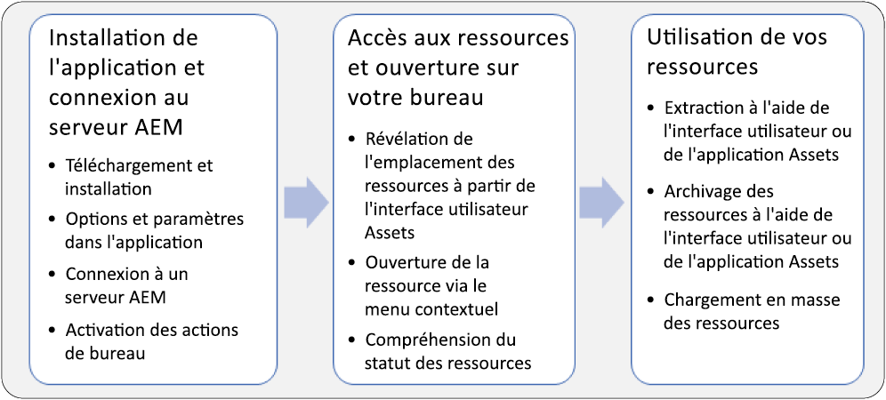
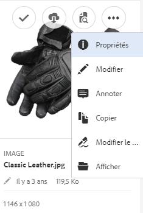
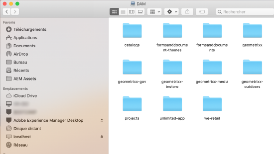
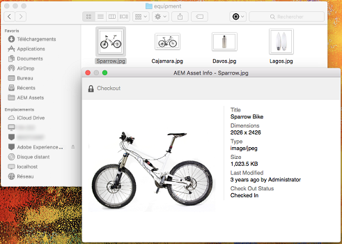
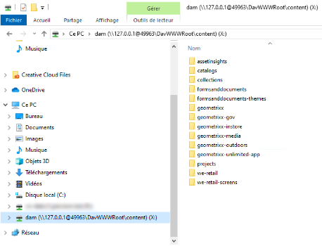

# Utiliser l'application de bureau AEM v1.x {#use-aem-desktop-app-v1x}

À l’aide de l’application, les ressources d’AEM sont facilement accessibles sur votre ordinateur local et peuvent être utilisées dans n’importe quelle application de bureau. Les ressources peuvent être facilement affichées dans le Finder Mac ou l’Explorateur Windows, ouvertes dans les applications de bureau et modifiées localement - les modifications sont enregistrées dans AEM avec une nouvelle version créée dans le référentiel.

Cette intégration permet à différents rôles au sein de l’entreprise de gérer les ressources de manière centralisée dans AEM Assets, et d’y accéder dans Creative Cloud et d’autres applications, tout en facilitant la conformité avec les diverses normes, y compris la valorisation de marque.

Les tâches clés que vous effectuez à l’aide de l’application de bureau AEM v1 sont les suivantes :

* [Connexion à un serveur AEM](#installandconnect)

* [Ouverture directe de ressources sur l’ordinateur de bureau](#openondesktop)
* [Modification et extraction de ressources à partir de l’ordinateur de bureau](#workonassets)

* [Chargement groupé de ressources et de dossiers](#bulkupload)

Pour les pratiques recommandées, voir les [Meilleures pratiques d’utilisation de l’application](best-practices-for-v1.md). Si vous rencontrez des problèmes lors de l’utilisation de l’application, consultez la page traitant du [dépannage d’AEM Desktop App](troubleshoot-app-v1.md).

>[!NOTE]
>L’application de bureau AEM a été introduite dans la version 6.1 d’AEM et s’appelle AEM Assets Companion App.

## Points de contact d’AEM Desktop App dans le processus de création {#aem-desktop-app-touch-points-in-the-creative-workflow}

AEM Desktop App, avec AEM Assets, s’intègre dans votre processus de création et propose les points de contact suivants.

Points de contact d’AEM Desktop App dans le processus de création

## Install and connect AEM desktop app to AEM server {#installandconnect}

Avant de pouvoir commencer à créer ou modifier les ressources de création, connectez l’application de bureau au serveur AEM Assets afin de télécharger et de transférer des ressources dans le référentiel. Effectuez les tâches suivantes :

1. [Installez l’application](#installapp).
1. [Définissez vos préférences et vos informations de connexion.](#inapppref)
1. [Connectez-vous au serveur AEM](#connect) et montez le référentiel de ressources comme lecteur local.
1. [Activez les « actions sur le Bureau »](#desktopactions) sur le serveur AEM.

L’application de bureau AEM utilise une connexion HTTPS pour se connecter au serveur AEM afin de transférer vos ressources de manière robuste et sécurisée.

>[!NOTE]
>Pour une partie ou l’ensemble de la procédure d’installation et de configuration, il se peut que vous deviez demander l’aide de votre administrateur AEM ou de votre administrateur système.

### Installation de l’application {#installapp}

Pour utiliser l’application de bureau AEM, assurez-vous que la version de votre serveur AEM est prise en charge par l’application de bureau AEM. Téléchargez le fichier d’installation approprié (binaire) pour votre système d’exploitation (Mac ou Windows) et installez ensuite l’application.

Une configuration détaillée peut être nécessaire en fonction de vos préférences réseau et système. Pour plus d’informations, voir [Installation et configuration d’AEM Desktop App](install-configure-app-v1.md).

1. Go to the [AEM Desktop app download page](https://helpx.adobe.com/experience-manager/kb/download-companion-app.html) and download the appropriate binary for your operating system.
1. Exécutez le fichier d’installation téléchargé et suivez les instructions affichées à l’écran pour installer l’application.

   >[!NOTE]
   >Une seule instance de l’application de bureau AEM peut être installée et être active à la fois.

### Présentation des options et des préférences dans l’application {#inapppref}

L’application accepte des paramètres pour se connecter aux serveurs AEM et s’en déconnecter, afficher l’état des transferts, gérer le cache local et ainsi de suite. Les paramètres par défaut sont opérationnels pour un utilisateur ordinaire de l’application. Vous pouvez les régler avec précision pour tirer pleinement parti de l’application et de l’intégration dans le serveur AEM. Les différents paramètres sont décrits ci-dessous de manière détaillée.

**Explorer les ressources** Ouvrez le lecteur local dans lequel le référentiel AEM Assets est monté. En d’autres termes, explorez les ressources qui sont désormais disponibles sur votre ordinateur local.

**Affichage de l’état** des ressources Lorsque des ressources modifiées sont téléchargées ou que de nouveaux actifs sont ajoutés au référentiel AEM Assets, l’application les télécharge en arrière-plan. Cela garantit la fluidité des opérations, sans qu’il faille patienter jusqu’à la fin du transfert, en particulier pour les ressources de grande taille. Vous pouvez enregistrer vos modifications en local et ne plus vous en soucier. En fonction de la bande passante disponible, l’application peut prendre un certain temps pour envoyer ces ressources au serveur. Vous pouvez vérifier l’état du transfert, avec d’autres informations de base.

**Options** Cliquez/appuyez sur Options dans la barre d'état de l'application AEM Desktop pour accéder aux paramètres de lancement de l'application au démarrage du système ; pour vous connecter au serveur AEM au lancement de l’application ; et de modifier la lettre du lecteur local dans laquelle AEM Assets est disponible après le montage.

**Avancé &gt; Gérer le cache** Vous pouvez contrôler la quantité d’espace disque disponible à des fins de mise en cache locale. Les artefacts du serveur AEM Assets sont mis en cache localement pour garantir une expérience plus fluide. Vous pouvez modifier les paramètres par défaut pour répondre à vos besoins. Vous pouvez effacer le cache pour récupérer à nouveau toutes les ressources. Lorsque vous effacez le cache, les modifications non enregistrées sont conservées. Toutes les ressources non archivées dans le serveur AEM sont conservées.

### Connexion à un serveur AEM {#connect}

L’application prend en charge la configuration du proxy sous Mac et Windows. La configuration est lue au démarrage de l’application. Si vous modifiez les paramètres du proxy, redémarrez l’application pour que les modifications soient prises en compte.

>[!NOTE]
>
>Si vous modifiez les paramètres du proxy, redémarrez l’application pour que les modifications prennent effet. Sinon, l’application continue à utiliser le serveur proxy précédemment configuré.

1. Lancez AEM Desktop App. To map your AEM instance with the app, specify your AEM server in the format `https://[aem-server-url]:[port]`.

   

1. Dans l’écran de connexion, indiquez le nom d’utilisateur et le mot de passe de votre instance. To specify an alternate AEM instance, select the **[!UICONTROL Alternate Login URL]** option.

   

### Activation des actions de bureau dans l’interface web AEM {#desktopactions}

À partir de l’interface utilisateur AEM Assets ouverte dans un navigateur, vous pouvez explorer l’emplacement des ressources ou extraire et en ouvrir une en vue de la modifier dans votre application de bureau. Ces options, qui sont appelées actions de bureau, ne sont pas activées par défaut. Procédez comme suit pour les activer.

1. Dans la console Assets, cliquez/appuyez sur l’icône **Utilisateur** dans la barre d’outils.
1. Cliquez/appuyez sur le **[!UICONTROL My Preferences]** pour afficher la **[!UICONTROL Preferences]** boîte de dialogue.
1. Dans la boîte de dialogue Préférences utilisateur, sélectionnez **[!UICONTROL Show Desktop Actions For Assets]**. Cliquez/appuyez sur **[!UICONTROL Accept]**.

   

   Activation de la case à cocher Afficher les actions de bureau pour les ressources afin d’activer les actions de bureau

## Accès aux ressources et ouverture de ces éléments sur votre ordinateur de bureau {#openondesktop}

>[!NOTE]
>On Windows, the [default Windows 7 setting](https://support.microsoft.com/en-us/kb/2668751) prevents AEM desktop app from handling assets that are larger than 50 MB.

### Affichage de l’emplacement des ressources mappées à partir de l’interface web AEM {#reveal-the-location-of-mapped-assets-from-aem-web-interface}

Après avoir mappé le référentiel AEM Assets sur votre disque dur local, vous pouvez activer des icônes supplémentaires, ainsi que la fonction de transfert de dossiers, afin qu’elles s’affichent pour les ressources et les dossiers mappés.

1. Ouvrez l’interface d’AEM Assets et placez le pointeur sur un dossier ou une ressource afin d’afficher les actions de bureau sous la forme d’actions rapides dans le mode Carte.

   

   Dans l’interface utilisateur Assets, ouvrez le menu des actions rapides pour afficher les actions de bureau

   Ces actions de bureau sont également disponibles lorsque vous cliquez/appuyez sur l’icône **Actions sur le Bureau** dans la barre d’outils après la sélection de la ressource ou dans la barre d’outils de la page de la ressource.

1. To open the asset in the desktop application that is associated with the specific file extension, click/tap the **Open on desktop** quick action .

   Vous pouvez également sélectionner **Ouvrir** dans le menu **Actions sur le Bureau** de la barre d’outils.

1. Click/tap the **Reveal** quick action  to locate the particular asset on your local file system.

   Alternatively, choose **Reveal** from the **Desktop Actions** menu in the toolbar.

### Ouverture d’AEM Assets à partir du Finder ou de l’Explorateur {#open-aem-assets-from-the-finder-or-the-explorer}

Sous Mac, sélectionnez Ouvrir dans le menu contextuel pour ouvrir une ressource via AEM Desktop.

For Adobe InDesign (INDD) files, select **[!UICONTROL Open]** from the context menu. Lorsque vous cliquez sur cette option, l’application télécharge les fichiers liés vers votre système de fichiers local, puis ouvre le fichier INDD dans Adobe InDesign. Cette méthode garantit que les ressources nécessaires sont disponibles localement lors de la modification du fichier INDD.

Sous Windows, sélectionnez Ouvrir sur le web dans le menu contextuel pour ouvrir la ressource. Dans la fenêtre État du fichier, cliquez/appuyez sur l’icône  Ouvrir sur le bureau pour ouvrir le fichier.

Options de menu contextuel permettant d’accéder à des ressources et de les ouvrir à l’aide d’AEM Desktop App

### Explication des états de ressources {#understand-the-asset-statuses}

|  | L’application est connectée au serveur, et toutes les ressources sont synchronisées. |
|------|-----------------------------------------------------------------------------------------------------------------------------------------------------------|
|  | L’application est lancée, mais n’est pas connectée au serveur. Certaines ressources peuvent être en attente de synchronisation. |
|  | La synchronisation des ressources est en cours. Les fichiers sont en cours de transfert ou de téléchargement. Vous pouvez afficher les états précis et suspendre les transferts dans la fenêtre Asset Status. |
|  | L’application effectue une tentative de reconnexion. Les problèmes réseau peuvent entraîner sa déconnexion. |

## Utilisation de vos ressources {#workonassets}

### Extraction de ressources à partir de l’interface web AEM {#check-out-assets-from-the-aem-web-interface}

AEM Assets permet d’extraire des ressources pour les modifier et de les réarchiver après y avoir apporté les modifications. Après avoir extrait une ressource, vous seul pouvez la modifier, l’annoter, la publier, la déplacer ou la supprimer. L’extraction d’un fichier verrouille le fichier et empêche d’autres utilisateurs d’effectuer l’une de ces opérations. Vous avez besoin d’un accès en écriture à ces ressources pour être en mesure de les extraire ou de les archiver.

Pour extraire des ressources à partir de l’interface web AEM, deux méthodes sont possibles. Pour obtenir des informations détaillées sur la première méthode, voir [Archivage et extraction de fichiers à partir de l’interface utilisateur Assets](https://helpx.adobe.com/in/experience-manager/6-4/assets/using/check-out-and-submit-assets.html). Pour la deuxième méthode, suivez la procédure ci-dessous pour extraire et ouvrir la ressource quand AEM Desktop App est installé.

1. Ouvrez l’interface d’AEM Assets et placez le pointeur sur un dossier ou une ressource afin d’afficher les actions de bureau sous la forme d’actions rapides dans le mode Carte.

   

   Ces actions de bureau sont également disponibles lorsque vous cliquez/appuyez sur l’icône Actions sur le Bureau dans la barre d’outils après la sélection de la ressource ou dans la barre d’outils de la page de la ressource.

1. To open the asset, click/tap the Open on desktop quick action .

   Vous pouvez également sélectionner Ouvrir dans le menu Actions sur le Bureau de la barre d’outils.

   >[!NOTE]
   >Lorsque vous modifiez un fichier qui est simplement ouvert, mais pas extrait, les autres utilisateurs ne savent pas que vous êtes en train de mettre à jour une ressource.

1. To open an asset for editing in an Adobe Creative Cloud application, click/tap the Edit desktop quick action . Cette opération extrait également la ressource pour modification. Après avoir procédé aux modifications, archivez la ressource pour mettre à jour les modifications dans AEM Assets.

   Vous pouvez également choisir Modifier dans le menu Actions du bureau de la barre d’outils.

1. Sélectionnez l’option de menu Ouvrir. Les ressources sélectionnées sont ouvertes en mode d’aperçu.
1. Pour modifier les fichiers, sélectionnez l’option Modifier. Les ressources sont ouvertes en mode d’édition.

### Extraction de ressources sous Mac {#check-out-assets-on-mac}

L’application vous permet d’extraire des fichiers afin d’empêcher d’autres utilisateurs de modifier les fichiers sur lesquels vous travaillez.

1. Dans le menu contextuel Mac, sélectionnez Ouvrir le dossier AEM Assets pour ouvrir le Finder.

   

   Options de menu contextuel permettant d’accéder à des ressources et de les ouvrir à l’aide d’AEM Desktop App

1. Accédez à la ressource à extraire.

   

1. Cliquez avec le bouton droit sur la ressource, puis choisissez More Assets Info (Plus d’infos sur la ressource) dans le menu contextuel.
1. Dans la boîte de dialogue Informations sur le fichier, cliquez/appuyez sur l’icône Passage en caisse pour extraire le fichier. L'icône Passage en caisse bascule vers l'icône Passage en caisse une fois que vous avez cliqué/appuyé dessus.

   

1. Pour archiver la ressource afin qu’elle soit disponible pour les autres utilisateurs, cliquez/appuyez sur l’icône Archiver dans la boîte de dialogue Asset Info (Informations sur les ressources).

### Extraction de ressources sous Windows {#check-out-assets-on-windows}

L’application vous permet d’extraire des fichiers afin d’empêcher d’autres utilisateurs de modifier les fichiers sur lesquels vous travaillez.

1. Dans le menu contextuel, sélectionnez Explorer les ressources pour ouvrir l’Explorateur.
1. Dans l’Explorateur, accédez à l’emplacement de la ressource à extraire.

   

1. Cliquez avec le bouton droit sur la ressource, puis choisissez Ouvrir sur le web dans le menu contextuel.
1. Dans la boîte de dialogue Asset Info (Informations sur les ressources), cliquez/appuyez sur l’icône Extraire. L'icône Passage en caisse bascule vers l'icône Passage en caisse.

   

1. Consultez la ressource dans l’Explorateur. The lock icon on the asset  indicates that you have checked out the asset.

   >[!NOTE]
   >Cette icône peut apparaître après quelques minutes. AEM Desktop App met en cache les ressources en vue d’un accès rapide. La mise à jour de l’état Verrouillé peut donc prendre un certain temps.

1. Pour archiver la ressource afin qu’elle soit disponible pour les autres utilisateurs, cliquez/appuyez sur l’icône Archiver dans la boîte de dialogue **Asset Info** (Informations sur les ressources).

### Archivage d’une ressource à l’aide du Finder ou de l’Explorateur et en utilisant l’interface web {#check-in-an-asset-using-finder-or-explorer-and-using-web-interface}

Une fois la modification des ressources effectuée, enregistrez ces dernières dans votre application de bureau. Dans le menu contextuel, sélectionnez More Assets Info (Autres infos sur les ressources) et cliquez/appuyez ensuite sur Checkin (Archiver).

Les ressources sont transférées vers le serveur AEM. Si vous le souhaitez, vous pouvez vérifier l’état du téléchargement en sélectionnant Afficher l’état du fichier sur l’icône de la barre d’état.

Vous pouvez également archiver une ressource à partir de l’interface web AEM. Cliquez/appuyez sur les ressources extraites ou sélectionnez-les. From the toolbar, click/tap the check in icon .

### Transfert groupé de ressources et de dossiers vers le serveur AEM {#bulkupload}

L’application de bureau AEM permet de télécharger un dossier entier de ressources à partir de votre répertoire de fichiers local vers AEM Assets. Ainsi, toutes les ressources dans le dossier sont téléchargées en masse au lieu d’avoir à les télécharger une par une.

1. Depuis l’IU Assets, cliquez/appuyez sur **Créer** dans la barre d’outils, puis sélectionnez **Dossier de chargement** dans le menu.
1. Accédez au dossier à télécharger et sélectionnez-le.
1. Cliquez/appuyez sur OK. La boîte de dialogue Assets Status (État des ressources) affiche l’état du transfert.

   

   Consultation de l’état du transfert dans la fenêtre Assets Status (État des ressources)

   >[!NOTE]
   >Vous pouvez suspendre ou annuler manuellement le transfert en cliquant/appuyant sur l’icône appropriée.

1. Une fois le dossier transféré, fermez la boîte de dialogue et accédez à l’interface utilisateur Assets. Le dossier transféré s’affiche dans l’interface web.

Please note that it is *not recommended* to copy &amp; paste or drag &amp; drop larger number of files / nested folders from your local disk in Finder or Explorer into the network share area that is mapped by AEM desktop app. Cette opération s’avère beaucoup moins fiable que la fonctionnalité Upload Folder (Dossier de chargement) décrite ci-dessus.

Si vous préférez travailler sur le bureau, vous pouvez également sélectionner les fichiers/dossiers à télécharger vers AEM dans le Finder ou l’Explorateur, les copier dans le presse-papiers système, puis accéder au dossier cible dans la zone de partage réseau et, dans le menu contextuel de l’application de bureau AEM, sélectionner Coller les fichiers. Ainsi, l’application de bureau AEM commence à télécharger les fichiers collés, comme le dossier de téléchargement décrit ci-dessus.

>[!MORELIKETHIS]
>
>* [Présentation de l’application de bureau AEM](https://helpx.adobe.com/experience-manager/kt/eseminars/ccoo-aem-desktop-app.html)
>* [Comprendre l'archivage et l'extraction avec l'application de bureau AEM](https://helpx.adobe.com/experience-manager/kt/assets/using/checkin-checkout-technical-video-understand.html)
>* [Résolution des problèmes relatifs à AEM Desktop App](troubleshoot-app-v1.md)

