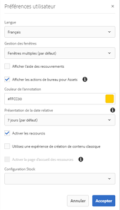
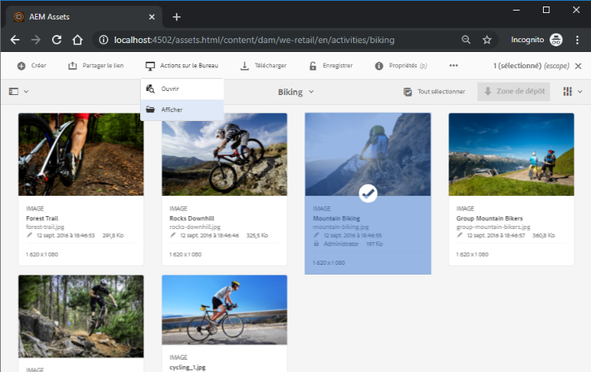

# Utiliser [!DNL Adobe Experience Manager] l&#39;application de bureau {#use-aem-desktop-app-v2}

Utilisez l&#39;application de bureau [!DNL Adobe Experience Manager] pour accéder facilement aux ressources Adobe Experience Manager DAM sur votre bureau local et les utiliser dans n&#39;importe quelle application de bureau. Vous pouvez ouvrir les ressources dans des applications de bureau et les modifier localement, puis charger les modifications dans Experience Manager avec contrôle de version pour partager les mises à jour avec d’autres utilisateurs. Vous pouvez également charger de nouveaux fichiers et des hiérarchies de dossiers vers Experience Manager, créer des dossiers et supprimer des ressources ou des dossiers de DAM Experience Manager.

L’intégration permet à différents rôles de l’organisation de gérer les ressources de manière centralisée dans Experience Manager Assets et d’accéder aux ressources sur un poste de travail local dans les applications natives sous Windows ou Mac OS.

Lorsque vous ouvrez l’application après vous être déconnecté ou lorsque vous vous connectez pour la première fois, fournissez l’URL de votre serveur Experience Manager au format `https://[aem-server-url]:[port]/`. Sélectionnez ensuite l’option [!UICONTROL Connect]. Indiquez vos informations d’identification pour connecter l’application au serveur.

L’appli de bureau Experience Manager vous permet d’effectuer les tâches clés suivantes :

![Workflows et tâches pouvant être effectués avec l’appli de bureau [!DNL Experience Manager] ](assets/aem_desktop_app_usecases_v2.png "Workflows et tâches pouvant être effectués avec l’appli de bureau Adobe Experience Manager")
Téléchargez [ce](assets/aem_desktop_app_usecases_print.pdf) fichier PDF prêt à être imprimé.

## Fonctionnement de l’appli de bureau {#how-app-works2}

Avant de commencer à utiliser l’application, vous devez comprendre le [Fonctionnement de l’application](release-notes.md#how-app-works). Familiarisez-vous également avec les termes suivants :

* **[!UICONTROL Desktop Actions]** : à partir de l’interface web Assets, dans un navigateur, vous pouvez explorer l’emplacement des ressources ou extraire et ouvrir une ressource en vue de la modifier dans votre application de bureau native. Ces actions sont disponibles à partir de l’interface web et utilisent les fonctionnalités des applications de bureau. Voir [Comment activer les actions de bureau](using.md#desktopactions-v2).

* Le statut du fichier est **[!UICONTROL Cloud Only]** : ces ressources ne sont pas téléchargées sur l’ordinateur local et ne sont disponibles que sur le serveur Experience Manager.

* Le statut du fichier est **[!UICONTROL Available locally]** : les ressources sont téléchargées et disponibles sur l’ordinateur local en l’état. Les ressources ne sont pas modifiées.

* Le statut du fichier est **[!UICONTROL Edited locally]** : ces ressources sont modifiées localement et les modifications restent à charger vers le serveur Experience Manager. Après le chargement, le statut passe à [!UICONTROL Available locally]. Voir [Modification de ressources](using.md#edit-assets-upload-updated-assets).

* Le statut du fichier est **[!UICONTROL Editing conflict]** : si vous et d’autres utilisateurs modifiez une ressource simultanément, l’application indique qu’un conflit de modification s’est produit. L’application propose également des options pour conserver ou ignorer vos modifications. Découvrez [comment éviter les conflits de modification](using.md#adv-workflow-collaborate-avoid-conflicts).

* Le statut du fichier est **[!UICONTROL Modified remotely]** : l’application indique si une ressource que vous avez téléchargée est modifiée sur le serveur Experience Manager. L’application permet également de télécharger la dernière version et de mettre à jour votre copie locale. Découvrez [comment éviter les conflits de modification](using.md#adv-workflow-collaborate-avoid-conflicts).

* **[!UICONTROL Check-out]** : si vous modifiez un fichier ou envisagez de le modifier, faites-le passer au statut d’extraction. Il ajoute une icône de verrouillage sur la ressource dans l’application et l’interface Web du Experience Manager. Cette icône indique aux autres utilisateurs d’éviter de modifier simultanément la même ressource, car cela entraînerait un conflit de modification.

* **[!UICONTROL Check-in]** : marquez la ressource comme étant sécurisée pour que d’autres utilisateurs puissent la modifier sans provoquer de conflit de modification. Lorsque vous chargez vos modifications, l’icône de verrouillage disparaît automatiquement. Activer le statut d’archivage supprime également l’icône de verrouillage, bien qu’il soit recommandé de ne pas effectuer d’archivage manuel sans charger les modifications. Si vous annulez vos modifications, activez manuellement le statut d’archivage.

* Action **[!UICONTROL Open]** : ouvrez simplement la ressource pour la prévisualiser dans l’application native. Il n’est pas recommandé de modifier la ressource à l’aide de cette action, car cette dernière n’extrait pas la ressource et d’autres utilisateurs peuvent apporter des modifications, ce qui provoque des conflits de modification.

* Action **[!UICONTROL Edit]** : utilisez l’action pour modifier l’image. Le fait de cliquer sur l’action [!UICONTROL Edit] extrait automatiquement la ressource et ajoute une icône de verrouillage à la ressource. Après avoir cliqué sur Edit (Modifier), si vous ne souhaitez pas modifier la ressource, cliquez sur [!UICONTROL Toggle check-in]. Pour supprimer, renommer ou déplacer des fichiers dans la hiérarchie de dossiers DAM Experience Manager, utilisez les actions de l’interface Web Experience Manager et non l’action de modification.

* Action **[!UICONTROL Download]** : téléchargez la ressource sur votre ordinateur local. Vous pouvez télécharger les ressources maintenant et les modifier ultérieurement et travailler hors ligne et charger les modifications ultérieurement. Les fichiers sont téléchargés dans un dossier de cache sur votre système de fichiers.

* Action **[!UICONTROL Reveal File]** ou **[!UICONTROL Reveal Folder]** : tandis que les ressources sont téléchargées vers un dossier de cache local, l’application imite un lecteur réseau local et fournit un chemin d’accès local pour chaque ressource. Pour découvrir ce chemin d’accès, utilisez l’option d’affichage appropriée dans l’application. Une action d’affichage est requise pour placer des ressources dans l’application Creative Cloud. Voir [Placement de ressources](using.md#place-assets-in-native-documents).

* **[!UICONTROL Open In Web]** action : Pour vue du fichier dans l’interface Web du Experience Manager, ouvrez-le dans le Web. Vous pouvez lancer plus de workflows à partir de l’interface du Experience Manager, comme la mise à jour des métadonnées ou la découverte de ressources.

* **[!UICONTROL Delete]** action : Supprimez la ressource du référentiel DAM Experience Manager. L’action supprime la copie d’origine de la ressource sur le serveur du Experience Manager. Si vous souhaitez uniquement ignorer les modifications apportées à la ressource locale, voir [Ignorer les modifications](using.md#edit-assets-upload-updated-assets).

* **[!UICONTROL Upload Changes]**: L’application de bureau télécharge la ressource mise à jour uniquement lorsque vous téléchargez explicitement vers le serveur Experience Manager. Lorsque vous enregistrez vos modifications, celles-ci ne sont enregistrées que sur votre ordinateur local. Lorsque vous chargez la ressource, elle est automatiquement archivée et l’icône de verrouillage disparaît. Voir [Modification de ressources](using.md#edit-assets-upload-updated-assets).

## Activer les actions de bureau dans l’interface Web Experience Manager {#desktopactions-v2}

À partir de l’interface utilisateur Assets ouverte dans un navigateur, vous pouvez explorer l’emplacement des ressources ou extraire et ouvrir une ressource pour la modifier dans votre application de bureau. Ces options, qui sont appelées [!UICONTROL Desktop Actions], ne sont pas activées par défaut. Pour les activer, procédez comme suit.

1. Dans la console Assets, cliquez/appuyez sur l’icône **[!UICONTROL User]** dans la barre d’outils.
1. Cliquez/appuyez sur **[!UICONTROL My Preferences]** pour afficher la boîte de dialogue **[!UICONTROL Preferences]**.
1. Dans la boîte de dialogue Préférences utilisateur, sélectionnez **[!UICONTROL Show Desktop Actions For Assets]**. Cliquez/appuyez sur **[!UICONTROL Accept]**.

   

   Cocher la case [!UICONTROL Show Desktop Actions For Assets] pour activer les actions de bureau

## Parcourir, rechercher et prévisualiser des ressources {#browse-search-preview-assets}

Vous pouvez parcourir, rechercher et prévisualisation les actifs disponibles dans le référentiel du Experience Manager, depuis l’application de bureau. Essayez les options suivantes dans l’application :

1. Accédez à un dossier et affichez des informations de base sur les ressources disponibles dans ce dossier, ainsi que de petites vignettes de toutes les ressources.

   

1. Pour afficher davantage d’informations et une vignette plus grande d’une ressource spécifique, cliquez sur le nom de fichier de la ressource.

   

1. Cliquez sur **[!UICONTROL Open]** ou **[!UICONTROL Edit]** pour télécharger le fichier localement et l’afficher uniquement ou pour le modifier dans l’application native, respectivement.
1. Recherchez à l’aide de mots-clés une ressource associée dans le référentiel du Experience Manager. Utilisez `?` et `*` comme caractères génériques. Ces caractères génériques remplacent un caractère unique ou plusieurs caractères, respectivement. Filtrez et triez les résultats selon vos besoins.

   

   

>[!NOTE]
>
>L’application affiche les ressources en faisant correspondre les critères de recherche dans plusieurs champs de métadonnées et pas uniquement le titre ou le nom de fichier de la ressource.

## Téléchargement de ressources {#download-assets}

Vous pouvez télécharger les ressources sur votre système de fichiers local. L’application récupère les ressources du serveur Experience Manager et enregistre la même copie sur votre système de fichiers local.

Cliquez sur  pour afficher les options, puis sur  pour télécharger.

>[!NOTE]
>
>Lors du téléchargement ou du chargement d’un fichier volumineux ou de plusieurs fichiers, l’application désactive les actions sur les ressources et les dossiers. Les actions sont disponibles lorsque le téléchargement ou le chargement est terminé.

Le téléchargement de plusieurs ressources peut entraîner des performances médiocres si la taille de la file d’attente est importante ou si vous rencontrez un problème réseau. En outre, vous pouvez sans le savoir placer en file d’attente de nombreuses ressources à télécharger lorsque vous téléchargez un dossier. Pour éviter les longs délais d’attente, l’application limite le nombre de ressources téléchargées en une seule fois. Pour savoir comment configurer cette fonctionnalité, voir [Définition des préférences](install-upgrade.md#set-preferences). Même en dessous de cette limite, l’application peut parfois rechercher une confirmation avant de télécharger un dossier apparemment volumineux.

Si des dossiers sont sélectionnés et téléchargés, l’application télécharge uniquement les fichiers stockés directement dans les dossiers du Experience Manager. Elle ne télécharge pas automatiquement les ressources des sous-dossiers.

## Ouvrir des ressources sur votre bureau {#openondesktop-v2}

Vous pouvez ouvrir les ressources distantes pour les afficher dans l’application native. Les ressources sont téléchargées dans un dossier local et lancées dans l’application native associée au format de fichier. Vous pouvez changer l’application native pour ouvrir des types de fichiers (extensions) spécifiques sous Mac ou Windows.

Cliquez sur **[!UICONTROL Open]** dans le menu de ressource. La ressource est téléchargée localement et ouverte dans l’application native. Vérifiez la progression du téléchargement et la vitesse de transfert des ressources volumineuses dans la barre d’état.

<!-- 
-->

>[!NOTE]
>
>Si les modifications attendues ne sont pas reflétées dans l’application, cliquez sur l’icône Actualiser  ou cliquez avec le bouton droit de la souris sur l’interface de l’application, puis cliquez sur **[!UICONTROL Refresh]**. Les actions ne sont pas disponibles lorsque des téléchargements ou des chargements plus volumineux sont en cours.

Pour ouvrir le dossier de téléchargement local d’une ressource, cliquez sur , puis sur l’action  **[!UICONTROL Reveal File]**.

## Utiliser ou placez des ressources dans des documents natifs {#place-assets-in-native-documents}

Dans certains cas (par exemple, lorsque vous importez un fichier dans un document natif), vous accédez à un fichier dans l’Explorateur Windows ou le Finder Mac. Pour accéder à l’emplacement de système de fichiers du fichier téléchargé localement, utilisez l’option  **[!UICONTROL Reveal File]**.

Cliquez sur **[!UICONTROL Reveal File]**, ou sur **[!UICONTROL Reveal Folder]** sur un dossier, pour ouvrir l’Explorateur Windows ou le Finder Mac avec le fichier ou le dossier présélectionné sur votre ordinateur local. Cette option est utile pour, par exemple, placer les fichiers Experience Manager dans les applications natives qui prennent en charge le placement ou la liaison de fichiers locaux. Pour savoir comment placer des fichiers dans Adobe InDesign, voir [Placement de graphiques](https://helpx.adobe.com/fr/indesign/using/placing-graphics.html).

L’action **[!UICONTROL Reveal File]** ouvre un partage réseau local qui affiche uniquement les ressources disponibles localement (c’est-à-dire les ressources qui ont été affichées, téléchargées ou ouvertes/modifiées à l’aide de l’application). Le partage réseau local ne télécharge aucune modification au Experience Manager. Pour charger les modifications, utilisez explicitement les actions **[!UICONTROL Upload Changes]** ou **[!UICONTROL Upload]** dans l’application.

>[!NOTE]
>
>Pour une compatibilité ascendante avec l’application de bureau Experience Manager v1.x, les fichiers révélés sont diffusés à partir d’un partage réseau local, exposant uniquement les fichiers disponibles localement. Les chemins d’accès aux fichiers affichés sont identiques à ceux créés par l’application v1.x.

>[!CAUTION]
>
>N’utilisez pas l’option **[!UICONTROL Reveal File]** pour modifier des ressources dans des applications natives. Utilisez plutôt les actions **[!UICONTROL Edit]**. Pour en savoir plus, voir [Processus avancé : collaborer sur les mêmes fichiers et éviter les conflits de modification](#adv-workflow-collaborate-avoid-conflicts).

## Modifier les ressources et télécharger les ressources mises à jour vers le Experience Manager {#edit-assets-upload-updated-assets}

Ouvrez des fichiers pour les modifier lorsque vous souhaitez effectuer des modifications et téléchargez les fichiers mis à jour vers le serveur AExperience ManagerEM. Pour éviter tout conflit avec les modifications d’autres utilisateurs, utilisez l’application pour ouvrir une session de modification. Avant de commencer à effectuer des modifications, assurez-vous que la ressource ne comporte pas d’icône de verrouillage, c’est-à-dire qu’elle n’est pas en train d’être modifiée par un autre utilisateur.

Pour modifier une ressource, recherchez-la ou accédez à son emplacement. Cliquez sur  puis sur **[!UICONTROL Edit]**.

Utilisez **[!UICONTROL Toggle Check-out]** pour verrouiller la ressource afin d’éviter des conflits avec les modifications d’autres utilisateurs dans les deux cas suivants :

* Vous avez commencé à modifier une ressource sans d’abord l’extraire (vous l’avez simplement ouverte).
* Vous vous préparez à modifier une ressource et ne souhaitez pas que d’autres personnes le fassent.

Une fois les modifications effectuées, l’application affiche le statut **[!UICONTROL Edited Locally]** pour les ressources modifiées. Toutes les modifications enregistrées dans les ressources sont enregistrées en local uniquement jusqu’à ce que vous téléchargiez les modifications vers le Experience Manager. Pour charger une ressource spécifique ou quelques ressources une par une, cliquez sur **[!UICONTROL Upload Changes]** dans les options d’une ressource. Il crée une version de la ressource en Experience Manager. L&#39;interface Web de [!DNL Assets] permet d&#39;afficher l&#39;historique des ressources dans la [vue de chronologie](https://experienceleague.adobe.com/docs/experience-manager-65/assets/using/activity-stream.html?lang=fr).

Pour découvrir les bonnes pratiques en matière d’édition collaborative, voir [Processus avancé : collaborer sur les mêmes fichiers et éviter les conflits de modification](#adv-workflow-collaborate-avoid-conflicts).

Dans les cas suivants, vous souhaiterez peut-être ignorer vos modifications apportées à la ressource locale. Cliquez sur **[!UICONTROL Discard Changes]**.

* Si vous ne souhaitez pas enregistrer vos modifications locales dans le Experience Manager.
* Vous commencez à apporter des modifications à la ressource d’origine après avoir enregistré certaines modifications.
* Vous arrêtez de modifier la ressource car cela n’est plus nécessaire.

Si nécessaire, activez l’extraction. La ressource mise à jour est supprimée du dossier de cache local et téléchargée à nouveau lorsque vous la modifiez ou l’ouvrez.

## Télécharger et ajouter de nouveaux actifs au Experience Manager {#upload-and-add-new-assets-to-aem}

Les utilisateurs peuvent ajouter de nouvelles ressources au référentiel DAM. Par exemple, vous pouvez être un photographe d’agence ou un entrepreneur qui souhaite ajouter un grand nombre de photos d’une séance photographique au référentiel Experience Manager. Pour ajouter du contenu neuf au Experience Manager, cliquez sur  dans la barre supérieure de l’application. Accédez aux fichiers de ressources du système de fichiers local et cliquez sur **[!UICONTROL Select]**. L’application commence à charger la ressource et affiche une barre de progression au bas de l’écran si le chargement de la ressource prend plus de temps. N’utilisez pas d’espaces blancs ni de caractères non valides lors de la création ou du chargement de dossiers. Consultez la liste des caractères dans [Création de dossiers dans [!DNL Assets]](https://experienceleague.adobe.com/docs/experience-manager-65/assets/managing/manage-assets.html?lang=fr#creating-folders).

<!-- 
-->

Vous pouvez charger des dossiers ou des fichiers spécifiques depuis votre système de fichiers local. La hiérarchie d’un dossier est conservée lorsque ce dossier est chargé. Avant de charger des ressources en masse, reportez-vous à [Chargements en masse](#bulk-upload-assets).

Pour afficher la liste des ressources transférées au cours d’une session donnée, cliquez sur **[!UICONTROL View]** > **[!UICONTROL Assets transfers]**. La liste vous permet d’afficher et de vérifier rapidement les transferts de fichiers de la session en cours.

Vous pouvez contrôler la simultanéité du chargement (accélération) dans **[!UICONTROL Preferences]** > paramètre **[!UICONTROL Upload acceleration]**. Une plus grande simultanéité permet généralement des chargements plus rapides, mais elle peut être gourmande en ressources et consommer davantage de puissance de traitement de l’ordinateur local. Si votre système devient lent, effectuez une nouvelle tentative de chargement à l’aide d’une valeur de simultanéité inférieure.

>[!NOTE]
>
>La liste de transfert n’est pas persistante et n’est pas disponible si vous quittez l’application et la rouvrez.

>[!NOTE]
>
>Si le téléchargement des fichiers échoue et si vous vous connectez à un déploiement Experience Manager 6.5.1 ou ultérieur, consultez les [informations de dépannage](troubleshoot.md#upload-fails).

## Utiliser plusieurs ressources {#work-with-multiple-assets}

Les utilisateurs peuvent facilement utiliser et gérer plusieurs ressources à l’aide d’actions telles que le chargement de toutes les modifications en une seule fois ou le chargement de dossiers imbriqués en quelques clics.

### Parcourir les dossiers volumineux {#browse-large-folders}

Lorsque vous utilisez des dossiers contenant de nombreuses ressources, faites défiler l’écran pour afficher plus de ressources. Pour faire défiler l’écran à l’aide du clavier, appuyez plusieurs fois sur la touche de tabulation afin de sélectionner la ressource située en haut. La ressource sélectionnée est mise en surbrillance. Utilisez maintenant la touche fléchée Bas pour parcourir la liste des ressources.

### Actions rapides pour les ressources sélectionnées {#quick-actions-for-selected-assets}

Cliquez sur la vignette de quelques ressources pour sélectionner ces ressources. Pour sélectionner toutes les ressources, cochez la case située dans la barre supérieure de l’application. L’ensemble des actions applicables à l’ensemble des ressources sélectionnées s’affiche dans une barre d’outils au bas de l’application.

Les actions disponibles dans la barre d’outils située en bas dépendent du statut des fichiers sélectionnés. Par exemple, si vous ne sélectionnez que des fichiers **[!UICONTROL Edited Locally]**, une icône **[!UICONTROL Upload Changes]** s’affiche. Si vous sélectionnez une combinaison de fichiers **[!UICONTROL Edited locally]** et **[!UICONTROL Cloud only]**, l’action **[!UICONTROL Upload Changes]** n’est pas disponible.

### Rechercher toutes les images modifiées {#find-all-edited-images}

L’application fournit une vue, appelée **[!UICONTROL Edited locally]**, qui vous permet d’accéder rapidement à tous les fichiers que vous avez téléchargés localement (par le biais d’actions [!UICONTROL Open] ou [!UICONTROL Edit]) puis modifiés. L’application vous permet de sélectionner toutes les ressources modifiées localement et de charger les modifications en quelques clics. Cette vue affiche également les ressources modifiées localement qui présentent un conflit de modification.

### Chargement en masse de ressources {#bulk-upload-assets}

Les utilisateurs ou les organisations, tels que les photographes ou les agences de création, peuvent créer de nombreux fichiers locaux dans des scénarios tels que des prises de vue, des retouches ou une sélection à partir d’un plus grand ensemble fait en dehors du Experience Manager. Ils peuvent télécharger ces grands dossiers locaux vers [!DNL Assets] directement depuis l’application de bureau. Les hiérarchies de dossiers sont conservées et l’ensemble des sous-dossiers imbriqués et des ressources incluses est chargé. Les ressources chargées sont immédiatement disponibles pour être utilisées par d’autres utilisateurs du même serveur. Les ressources sont chargées à l’arrière-plan et, par conséquent, l’opération n’est pas associée à une session du navigateur web.

Après le chargement, si les modifications attendues ne sont pas reflétées dans l’application, cliquez sur l’icône Actualiser .

>[!NOTE]
>
>N’utilisez pas la fonctionnalité de transfert pour migrer des ressources entre deux déploiements de Experience Manager. Consultez plutôt le [guide de migration](https://experienceleague.adobe.com/docs/experience-manager-65/assets/administer/assets-migration-guide.html?lang=fr).

### Liste des ressources transférées {#list-of-transferred-assets}

Pour vue de la liste des actifs transférés au cours d’une session donnée, voir [Téléchargement des actifs vers le Experience Manager](#upload-and-add-new-assets-to-aem).

## Processus avancé : début de l&#39;interface Web [!DNL Assets] {#adv-workflow-start-from-aem-ui}

Si nécessaire, lancez votre processus à partir de l’interface Web Ressources. L’application de bureau s’intègre au Experience Manager pour prendre le relais lorsque cela est demandé à l’aide des actions de bureau.

La découverte de ressources constitue un cas particulier de démarrage du processus à partir de l’interface web. La barre Omnisearch de l’interface utilisateur d’Assets offre une expérience de recherche riche et avancée. Vous voudrez peut-être commencer par localiser une ressource souhaitée sur le web, puis lancer le processus dans l’application, à l’aide des [!UICONTROL Desktop Actions]. Certains exemples incluent le filtrage des résultats de recherche à l’aide de facettes, la localisation d’une ressource spécifique sous licence Adobe Stock ou une personnalisation mise en œuvre par votre entreprise et autorisant une meilleure découverte à partir de l’interface web.

La fonctionnalité de l’appli de bureau est utilisée lorsque vous tentez les actions suivantes sur l’interface web d’Assets :

* Les [!UICONTROL Desktop Actions] qui autorisent les actions [!UICONTROL Open], [!UICONTROL Edit] et [!UICONTROL Reveal]
* [!UICONTROL Upload folder]
* [!UICONTROL Check-out] ou [!UICONTROL check-in]

Par exemple, les actions disponibles dans l’interface web pour une ressource extraite dans l’application sont [!UICONTROL Open], [!UICONTROL Reveal] et [!UICONTROL Check-in].

>[!NOTE]
>
>Le navigateur peut vous inviter à autoriser le lancement de l’appli de bureau Adobe Experience Manager. Pour bénéficier d’un transfert ininterrompu du navigateur vers l’application, cochez la case appropriée afin de toujours permettre à l’application de prendre le relais.

Les informations ou le processus suivants sont introuvables à l’aide de l’interface web. Utilisez l’appli de bureau car l’interface web ne surveille pas les modifications locales et n’est pas consciente des éléments suivants :

* Fichiers modifiés localement
* Fichiers présentant un conflit de modification et méthode de résolution de ce conflit
* Téléchargez les modifications locales dans le Experience Manager.
* Différents statuts des fichiers disponibles localement

Au contraire, vous pouvez ouvrir la ressource dans l’interface web à partir de l’appli de bureau à l’aide de l’action **[!UICONTROL Open In Web]**.

## Processus avancé : collaborer sur les mêmes fichiers et éviter les conflits de modification {#adv-workflow-collaborate-avoid-conflicts}

Dans les environnements de collaboration, plusieurs utilisateurs peuvent travailler sur le même ensemble de ressources, ce qui peut entraîner des conflits de version. Pour prévenir les conflits, observez les bonnes pratiques suivantes :

* Ne modifiez aucune ressource en cliquant sur [!UICONTROL Open]. Ne modifiez pas les ressources téléchargées localement en les ouvrant à partir du dossier de votre système de fichiers. Les autres utilisateurs ne savent pas que ces ressources sont en cours de modification.
* Pour modifier une ressource, cliquez toujours sur [!UICONTROL Edit]. Cela ouvre la ressource dans l’application native et lui ajoute une icône de verrouillage pour indiquer aux autres utilisateurs que la ressource est en cours de modification.
* Cliquez sur [!UICONTROL Toggle Check-in] si vous avez accidentellement commencé à effectuer des modifications sans cliquer sur [!UICONTROL Edit]. Vous ajoutez ainsi une icône de verrouillage à la ressource. Si vous prévoyez de modifier une ressource ultérieurement et que vous souhaitez éviter que d’autres utilisateurs la modifient, cliquez sur [!UICONTROL Toggle Check-in] pour la verrouiller.
* Avant de modifier une ressource, vérifiez qu’elle n’est pas en train d’être modifiée par d’autres utilisateurs. Recherchez l’icône de verrouillage sur la ressource.
* Une fois les modifications terminées, téléchargez-les toutes, puis archivez la ressource.

Si une ressource téléchargée localement est mise à jour sur le serveur du Experience Manager, l’application affiche l’état **[!UICONTROL Modified remotely]**. Vous pouvez supprimer votre copie locale ou l’actualiser en cliquant sur [!UICONTROL Remove] ou [!UICONTROL Update], respectivement. Les liens de la boîte de dialogue vous permettent d’afficher les deux versions de la ressource.

Si une ressource que vous modifiez localement est également mise à jour sur le serveur à votre insu, l’application affiche le statut **[!UICONTROL Editing Conflict]**. Vous pouvez conserver un jeu de modifications : conserver vos modifications (cliquez sur **[!UICONTROL Keep Mine]**) et supprimer celles de l’autre utilisateur, ou conserver les modifications de l’autre utilisateur et supprimer les vôtres (cliquez sur **[!UICONTROL Overwrite Mine]**).

## Processus avancé : placer et lier des ressources dans un fichier InDesign {#adv-workflow-place-assets-indesign}

Lorsque vous utilisez une application de bureau Experience Manager pour ouvrir des fichiers avec des ressources liées, les ressources sont pré-téléchargées et apparaissent placées dans les applications natives. Pour que ce processus fonctionne, votre application native doit prendre en charge le placement de liens vers des ressources locales et le Experience Manager doit prendre en charge la résolution de ces liens dans les fichiers binaires vers les références côté serveur.

L’application de bureau Experience Manager prend en charge ce flux de travail avec quelques applications de bureau Adobe Creative Cloud sélectionnées et des formats de fichier - Adobe InDesign, Adobe Illustrator et Adobe Photoshop. Le processus vous permet d’utiliser efficacement les fichiers Creative Cloud pris en charge. Ainsi, si l’utilisateur A place quelques fichiers dans un fichier d’InDesign et les vérifie dans le Experience Manager, l’utilisateur B voit les fichiers dans le fichier d’InDesign même si les fichiers ne font pas partie du fichier. Les ressources sont téléchargées localement sur l’ordinateur de l’utilisateur B.

>[!NOTE]
>
>L’appli de bureau peut mapper sur n’importe quel lecteur sous Windows. Toutefois, pour un fonctionnement harmonieux, ne changez pas la lettre de lecteur par défaut. Si les utilisateurs d’une même organisation utilisent des lettres de lecteur différentes, ils ne peuvent pas voir les ressources placées par d’autres utilisateurs. Les ressources placées ne sont pas récupérées lorsque le chemin d’accès change. Les ressources placées demeurent placées dans le fichier binaire (par exemple, INDD) et ne sont pas supprimées.

Pour connaître les limites de ce processus, voir la [configuration requise et les versions prises en charge](release-notes.md#system-requirements-and-prerequisites-v2).

Pour tester ce processus avec une ressource d’image et InDesign, procédez comme suit :

1. Conservez à portée de main un fichier INDD contenant des ressources placées en Experience Manager. Pour savoir comment créer un tel fichier INDD, voir [Placement de graphiques](https://helpx.adobe.com/indesign/using/placing-graphics.html).
1. Depuis l’application de bureau, **[!UICONTROL Edit]** le fichier INDD contenant les ressources placées dans le Experience Manager.
1. L’application télécharge à la fois le fichier InDesign et les ressources liées. Lorsque InDesign ouvre le document, les liens sont résolus et les ressources sont téléchargées et s’affichent dans le document InDesign.
1. Pour placer un nouveau graphique dans le fichier InDesign, exécutez l’action **[!UICONTROL Reveal File]** sur la ressource. L’action télécharge la ressource localement et ouvre l’emplacement du partage réseau local dans l’Explorateur Windows ou le Finder Mac.
1. Placez la ressource affichée dans le document InDesign. Un lien est alors créé dans le document.
1. Une fois que vous avez terminé vos modifications dans le document de l’InDesign, enregistrez-les et téléchargez-les vers le Experience Manager à l’aide de l’application de bureau.

## Processus avancé : télécharger les ressources localement {#adv-workflow-download-assets-locally}

Dans de nombreux cas, l’application télécharge localement les ressources du serveur de Experience Manager sur votre système de fichiers. Les téléchargements consomment de la bande passante et de l’espace disque. Connaître ces scénarios vous permet de réduire la durée des téléchargements.

Vous téléchargez les ressources dans l’application à la demande. Voir [Téléchargement de ressources](#download-assets).

Lorsque vous utilisez l’action [!UICONTROL Open] pour ouvrir une ressource dans une application de bureau native, la ressource est téléchargée localement si elle n’est pas déjà disponible localement. Voir [Ouverture de ressources](#openondesktop-v2).

Lorsque vous affichez l’emplacement d’une ressource ou d’un dossier depuis l’application, la ressource ou le dossier est d’abord téléchargé localement, puis ouvert sur votre ordinateur dans le partage réseau local. Voir [Ouverture de ressources](#openondesktop-v2).

Lorsque vous utilisez l’action [!UICONTROL Edit] pour modifier une ressource dans une application de bureau native, la ressource est téléchargée localement si elle n’est pas déjà disponible localement. Voir [Modification des ressources et transfert des ressources mises à jour vers le Experience Manager](#edit-assets-upload-updated-assets).

Si l’application est installée et autorisée, elle effectue les actions lorsque vous utilisez [!UICONTROL Desktop Actions] à partir de l’interface Web du Experience Manager. L’application télécharge d’abord la ressource, puis termine l’action.
