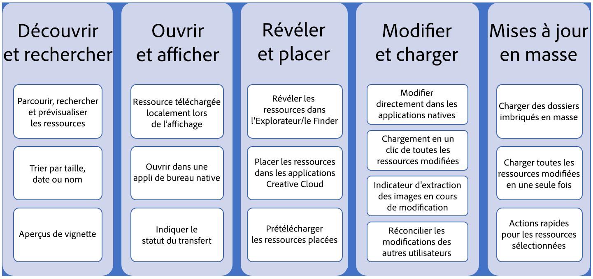
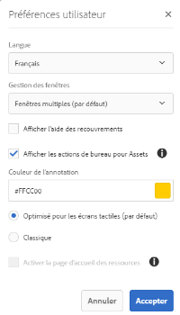

# Use AEM desktop app {#use-aem-desktop-app-v2}

Utilisez l’application de bureau Adobe Experience Manager (AEM) pour accéder facilement aux ressources AEM sur votre bureau local et les utiliser dans n’importe quelle application de bureau. Vous pouvez ouvrir les ressources dans les applications de bureau et modifier les ressources localement - téléchargez les modifications dans AEM avec contrôle de version, pour partager les mises à jour avec d’autres utilisateurs. Vous pouvez également télécharger de nouveaux fichiers et hiérarchies de dossiers vers AEM, créer des dossiers et supprimer des fichiers ou des dossiers d’AEM.

L’intégration permet à différents rôles de l’organisation de gérer les ressources de manière centralisée dans les ressources AEM et d’accéder aux ressources sur un bureau local dans les applications natives sous Windows ou Mac OS.

Lorsque vous ouvrez l’application après la déconnexion ou pour la première fois, fournissez l’URL de votre serveur AEM. Cliquez sur Connecter. Indiquez vos informations d’identification pour connecter l’application au serveur.

Les tâches clés que vous effectuez à l’aide de l’application de bureau AEM sont les suivantes :

de bureau AEM Téléchargez [ce](assets/aem_desktop_app_usecases_print.pdf) fichier PDF prêt pour l’impression.

## Fonctionnement de l’application de bureau {#how-app-works2}

Avant de commencer à utiliser l’application, vous devez comprendre [son fonctionnement](release-notes.md#how-app-works). Familiarisez-vous également avec les termes suivants :

* **[!UICONTROL Desktop Actions]**: Dans l’interface Web Ressources, dans un navigateur, vous pouvez explorer les emplacements des fichiers ou les extraire et ouvrir le fichier pour le modifier dans votre application de bureau native. Ces actions sont disponibles à partir de l’interface Web et utilisent la fonctionnalité des applications de bureau. Voir [comment activer les actions](using.md#desktopactions-v2)de bureau.

* Le statut du fichier est **[!UICONTROL Cloud Only]**: Ces ressources ne sont pas téléchargées sur l’ordinateur local et ne sont disponibles que sur le serveur AEM.

* Le statut du fichier est **[!UICONTROL Available locally]**: Les ressources sont téléchargées et disponibles sur l’ordinateur local en l’état. Les ressources ne sont pas modifiées.

* Le statut du fichier est **[!UICONTROL Edited locally]**: Ces ressources sont modifiées localement et les modifications restent dans le serveur AEM téléchargé. Après le téléchargement, l’état devient [!UICONTROL Available locally]. Voir [Modification des fichiers](using.md#edit-assets-upload-updated-assets).

* Le statut du fichier est **[!UICONTROL Editing conflict]**: Si vous et d’autres utilisateurs modifiez un fichier simultanément, l’application indique qu’un conflit de modification s’est produit. L’application propose également des options pour conserver ou ignorer vos modifications. Découvrez [comment éviter les conflits](using.md#adv-workflow-collaborate-avoid-conflicts)de modification.

* Le statut du fichier est **[!UICONTROL Modified remotely]**: L’application indique si une ressource que vous avez téléchargée est modifiée sur le serveur AEM. L’application permet également de télécharger la dernière version et de mettre à jour votre copie locale. Découvrez [comment éviter les conflits](using.md#adv-workflow-collaborate-avoid-conflicts)de modification.

* **Départ**: Si vous modifiez un fichier ou envisagez de le modifier, vous devez activer/désactiver l’état d’extraction. Il ajoute une icône de verrouillage sur la ressource dans l’application et l’interface Web d’AEM. L’icône de verrouillage indique à d’autres utilisateurs d’éviter de modifier simultanément la même ressource car elle entraîne un conflit de modification.

* **Arrivée**: Marquez le fichier comme étant sécurisé pour que d’autres utilisateurs puissent le modifier sans provoquer de conflit de modification. Lorsque vous téléchargez vos modifications, l’icône de verrouillage est automatiquement supprimée. Si vous basculez sur l’état d’archivage, l’icône de verrouillage est également supprimée. Il est toutefois recommandé de ne pas effectuer d’archivage manuel sans télécharger les modifications. Si vous ignorez vos modifications, basculez manuellement l'archivage.

* **[!UICONTROL Open]** action : Ouvrez simplement le fichier pour le prévisualiser dans l’application native. Il n’est pas recommandé de modifier la ressource à l’aide de cette action, car elle n’extrait pas la ressource et d’autres utilisateurs peuvent apporter des modifications conduisant à des conflits de modification.

* **[!UICONTROL Edit]** action : Utilisez l’action pour modifier l’image. Le fait de cliquer sur [!UICONTROL Edit] l’action extrait automatiquement la ressource et ajoute une icône de verrouillage à la ressource. Après avoir cliqué sur Modifier, si vous ne souhaitez pas modifier le fichier, cliquez sur [!UICONTROL Toggle check-in]. Pour supprimer, renommer ou déplacer des ressources dans la hiérarchie de dossiers AEM DAM, utilisez les actions de l’interface Web AEM et non l’action de modification.

* **[!UICONTROL Download]** action : Téléchargez le fichier sur votre ordinateur local. Vous pouvez télécharger les ressources maintenant et les modifier ultérieurement ; travailler hors connexion et télécharger les modifications ultérieurement. Les fichiers sont téléchargés dans un dossier cache de votre système de fichiers.

* **[!UICONTROL Reveal File]** ou **[!UICONTROL Reveal Folder]** action : Tandis que les ressources sont téléchargées dans un dossier cache local, l’application imite un lecteur réseau local et fournit un chemin d’accès local pour chaque ressource. Pour connaître ce chemin, utilisez l’option de révélation appropriée dans l’application. Une action d’affichage est requise pour placer des ressources dans l’application Creative Cloud. Voir [Importation de fichiers](using.md#place-assets-in-native-documents).

* **[!UICONTROL Open In Web]** action : Pour afficher le fichier dans l’interface Web d’AEM, ouvrez-le dans Web. Vous pouvez initier d’autres processus à partir de l’interface AEM, comme la mise à jour des métadonnées ou la découverte de ressources.

* **[!UICONTROL Delete]** action : Supprimez le fichier du référentiel DAM AEM. L’action supprime la copie d’origine de la ressource sur le serveur AEM. Si vous souhaitez uniquement ignorer les modifications apportées à la ressource locale, voir [Ignorer les modifications](using.md#edit-assets-upload-updated-assets).

* **[!UICONTROL Upload Changes]**: L’application de bureau télécharge la ressource mise à jour uniquement lorsque vous la téléchargez explicitement sur le serveur AEM. Lorsque vous enregistrez vos modifications, celles-ci sont enregistrées uniquement sur votre ordinateur local. Lorsque vous transférez le fichier, il est automatiquement archivé et l’icône de verrouillage est supprimée. Voir [Modification des fichiers](using.md#edit-assets-upload-updated-assets).

## Activation des actions de bureau dans l’interface web AEM {#desktopactions-v2}

Dans l’interface utilisateur Ressources d’un navigateur, vous pouvez explorer les emplacements des fichiers ou les extraire et ouvrir le fichier pour le modifier dans votre application de bureau. These options are called [!UICONTROL Desktop Actions] and are not enabled by default. Pour l’activer, procédez comme suit.

1. In the Assets console, click/tap the **[!UICONTROL User]** icon from the toolbar.
1. Cliquez/appuyez sur le **[!UICONTROL My Preferences]** pour afficher la **[!UICONTROL Preferences]** boîte de dialogue.
1. Dans la boîte de dialogue Préférences utilisateur, sélectionnez **[!UICONTROL Show Desktop Actions For Assets]**. Cliquez/appuyez sur **[!UICONTROL Accept]**.

   

   Cochez [!UICONTROL Show Desktop Actions For Assets] la case d’activation des actions sur le bureau.

## Parcourir, rechercher et prévisualiser des fichiers {#browse-search-preview-assets}

Vous pouvez parcourir, rechercher et prévisualiser les ressources disponibles dans le référentiel AEM, depuis l’application de bureau. Essayez les éléments suivants dans l’application :

1. Accédez à un dossier et affichez des informations de base sur les ressources disponibles dans le dossier, ainsi que de petites vignettes de tous les fichiers.

   

1. Pour afficher davantage d’informations et une vignette plus grande d’un fichier individuel, cliquez sur le nom du fichier.

   

1. Cliquez sur **[!UICONTROL Open]** ou **[!UICONTROL Edit]** pour télécharger le fichier localement et affichez-le ou modifiez-le dans l’application native, respectivement.
1. Recherchez à l’aide de mots-clés une ressource associée dans le référentiel AEM. Utilisez `?` et `*` comme caractères génériques. Ces caractères génériques remplacent un caractère unique ou plusieurs caractères, respectivement. Filtrez et triez les résultats selon vos besoins.

   

   

>[!NOTE]
>
>L’application affiche les ressources en faisant correspondre les critères de recherche à plusieurs champs de métadonnées et pas seulement le titre ou le nom de fichier de la ressource.

## Téléchargement de ressources {#download-assets}

Vous pouvez télécharger les fichiers sur votre système de fichiers local. L’application récupère les ressources du serveur AEM et enregistre la même copie sur votre système de fichiers local.

Cliquez sur l’icône  Plus pour les options et cliquez sur l’icône  téléchargement pour télécharger.

>[!NOTE]
>
>Lors du téléchargement ou du téléchargement d’un ou de plusieurs fichiers volumineux, l’application désactive les actions sur les fichiers et les dossiers. Les actions sont disponibles lorsque le téléchargement ou le transfert est terminé.

Le téléchargement de plusieurs fichiers peut entraîner des performances médiocres si la taille de la file d’attente est importante ou si vous rencontrez un problème réseau. En outre, vous pouvez placer inconsciemment de nombreux fichiers en file d’attente pour téléchargement lorsque vous téléchargez un dossier. Pour éviter de longs délais d’attente, l’application limite le nombre de fichiers téléchargés en une seule fois. Pour savoir comment le configurer, voir [Définition des préférences](install-upgrade.md#set-preferences). Même en dessous de cette limite, l’application peut parfois rechercher une confirmation avant de télécharger un dossier apparemment volumineux.

Si des dossiers sont sélectionnés et téléchargés, l’application télécharge uniquement les fichiers stockés directement dans les dossiers d’AEM. Il ne télécharge pas automatiquement les fichiers des sous-dossiers.

## Ouverture de fichiers sur votre bureau {#openondesktop-v2}

Vous pouvez ouvrir les fichiers distants pour les afficher dans l’application native. Les fichiers sont téléchargés dans un dossier local et lancés dans l’application native associée au format de fichier. Vous pouvez modifier l’application native pour ouvrir des types de fichiers (extensions) spécifiques sous Mac ou Windows.

Cliquez sur **[!UICONTROL Open]** dans le menu Fichier. Le fichier est téléchargé localement et ouvert dans l’application native. Vérifiez la progression du téléchargement et la vitesse de transfert des fichiers volumineux dans la barre d’état.
<!-- 

-->

>[!NOTE]
>
>Si les modifications attendues ne sont pas répercutées dans l’application, cliquez sur l’icône Actualiser  ou cliquez avec le bouton droit de la souris dans l’interface de l’application, puis cliquez sur **[!UICONTROL Refresh]**. Les actions ne sont pas disponibles lorsque des téléchargements ou des téléchargements plus volumineux sont en cours.

Pour ouvrir le dossier de téléchargement local d’un fichier, cliquez sur l’icône  supplémentaires, puis sur l’icône  **[!UICONTROL Reveal File]** Afficher.

## Utilisation ou placement de fichiers dans des documents natifs {#place-assets-in-native-documents}

Dans certains cas, par exemple, lorsque vous importez un fichier dans un document natif, vous accédez à un fichier dans l’Explorateur Windows ou le Finder Mac. Pour accéder à l’emplacement du système de fichiers du fichier téléchargé localement, utilisez l’icône  **[!UICONTROL Reveal File]** .

Cliquez sur **[!UICONTROL Reveal File]**, ou **[!UICONTROL Reveal Folder]** sur un dossier, pour ouvrir l’Explorateur Windows ou le Finder Mac avec le fichier ou le dossier présélectionné sur votre ordinateur local. Cette option est utile, par exemple, pour placer les fichiers AEM dans les applications natives qui prennent en charge le placement ou la liaison de fichiers locaux. Pour savoir comment placer des fichiers dans Adobe InDesign, voir [Importation de graphiques](https://helpx.adobe.com/indesign/using/placing-graphics.html).

L’ **[!UICONTROL Reveal File]** action ouvre un partage réseau local qui affiche uniquement les ressources disponibles localement, c’est-à-dire les ressources qui ont été affichées, téléchargées ou ouvertes/modifiées à l’aide de l’application. Le partage réseau local ne télécharge aucune modification dans AEM. Pour télécharger les modifications, utilisez explicitement **[!UICONTROL Upload Changes]** ou **[!UICONTROL Upload]** des actions dans l’application.

>[!NOTE]
>
>Pour une compatibilité descendante avec l’application de bureau AEM v1.x, les fichiers révélés sont diffusés à partir d’un partage réseau local, exposant uniquement les fichiers disponibles localement. Les chemins d’accès aux fichiers révélés sont identiques à ceux créés par l’application v1.x.

>[!CAUTION]
>
>N’utilisez pas **[!UICONTROL Reveal File]** cette option pour modifier des fichiers dans des applications natives. Utilisez plutôt les **[!UICONTROL Edit]** actions. Pour en savoir plus, voir Flux de travaux [avancés : collaborez sur les mêmes fichiers et évitez les conflits](#adv-workflow-collaborate-avoid-conflicts)de modification.

## Modification des ressources et transfert des ressources mises à jour vers AEM {#edit-assets-upload-updated-assets}

Ouvrez les fichiers à modifier lorsque vous souhaitez effectuer des modifications et téléchargez les fichiers mis à jour vers le serveur AEM. Pour éviter tout conflit avec les modifications d’autres utilisateurs, utilisez l’application pour lancer une session de modification. Avant de commencer la modification, assurez-vous que le fichier ne comporte pas d’icône de verrouillage, c’est-à-dire qu’un autre utilisateur ne modifie pas le fichier.

Pour modifier un fichier, recherchez-le ou accédez à son emplacement. Cliquez sur l’icône  , puis sur **[!UICONTROL Edit]**.

Utilisez **[!UICONTROL Toggle Check-out]** pour verrouiller la ressource afin d’éviter les conflits avec les modifications d’autres utilisateurs dans les deux cas suivants :

* Vous avez commencé à modifier un fichier sans le vérifier au préalable (par exemple en l’ouvrant simplement).
* Vous avez l’intention de commencer bientôt à modifier un fichier et ne souhaitez pas que d’autres personnes le fassent.

Une fois les modifications effectuées, l’application affiche l’ **[!UICONTROL Edited Locally]** état des ressources modifiées. Toutes les modifications enregistrées dans les ressources sont en local uniquement jusqu’à ce que vous téléchargiez les modifications dans AEM. Pour télécharger un ou plusieurs fichiers individuellement, cliquez sur **[!UICONTROL Upload Changes]** les options d’un fichier. Il crée une version de la ressource dans AEM. L’interface Web des ressources AEM vous permet d’afficher l’historique des ressources dans la vue [Chronologie](https://helpx.adobe.com/experience-manager/6-5/assets/using/activity-stream.html).

Pour connaître les meilleures pratiques en matière d’édition collaborative, voir Flux de travaux [avancés : collaborez sur les mêmes fichiers et évitez les conflits](#adv-workflow-collaborate-avoid-conflicts)de modification.

Dans les cas suivants, vous pouvez ignorer vos modifications et modifications dans la ressource locale. Click **[!UICONTROL Discard Changes]**.

* Si vous ne souhaitez pas enregistrer vos modifications locales dans AEM.
* Commencez à apporter des modifications à la ressource d’origine après avoir enregistré certaines modifications.
* Arrêtez de modifier le fichier, car il n’est plus nécessaire.

Si nécessaire, basculez l'extraction. La ressource mise à jour est supprimée du dossier cache local et téléchargée à nouveau lorsque vous la modifiez ou l’ouvrez.

## Téléchargement et ajout de nouveaux actifs dans AEM {#upload-and-add-new-assets-to-aem}

Les utilisateurs peuvent ajouter de nouveaux actifs au référentiel DAM. Par exemple, vous pouvez être un photographe d’agence ou un entrepreneur qui souhaite ajouter un grand nombre de photos d’une séance photo au référentiel AEM. Pour ajouter du contenu neuf à AEM, cliquez sur l’icône  Télécharger vers le cloud dans la barre supérieure de l’application. Accédez aux fichiers du système de fichiers local et cliquez sur **[!UICONTROL Select]**. L’application commence à télécharger la ressource et affiche une barre de progression en bas si le téléchargement de la ressource prend plus de temps.  N’utilisez pas d’espaces et de caractères non valides lors de la création ou du téléchargement de dossiers. Consultez la liste des caractères dans [Création de dossiers dans AEM Assets](https://helpx.adobe.com/experience-manager/6-5/assets/using/managing-assets-touch-ui.html#Creatingfolders).

<!-- 
-->

Vous pouvez télécharger des dossiers ou des fichiers individuels depuis votre système de fichiers local. La hiérarchie d’un dossier est conservée lors du téléchargement. Avant de télécharger des fichiers en bloc, reportez-vous à la page Téléchargements [en masse](#bulk-upload-assets).

Pour afficher la liste des fichiers transférés au cours d’une session donnée, cliquez sur **[!UICONTROL View]** &gt; **[!UICONTROL Assets transfers]**. La liste vous permet d’afficher et de vérifier rapidement les transferts de fichiers de la session en cours.

>[!NOTE]
>
>La liste de transfert n’est pas persistante et n’est pas disponible si vous quittez l’application et la rouvrez.

>[!NOTE]
>
>Si le téléchargement des fichiers échoue et si vous vous connectez au déploiement d’AEM 6.5.1 ou version ultérieure, reportez-vous aux informations [de](troubleshoot.md#upload-fails)dépannage.

## Utilisation de plusieurs ressources {#work-with-multiple-assets}

Les utilisateurs peuvent facilement manipuler et gérer plusieurs fichiers à l’aide d’actions telles que le téléchargement de toutes les modifications en une seule fois ou le téléchargement de dossiers imbriqués en quelques clics.

### Parcourir les dossiers volumineux {#browse-large-folders}

Lorsque vous travaillez avec des dossiers contenant de nombreux fichiers, faites défiler l’écran pour afficher d’autres fichiers. Pour faire défiler l’écran à l’aide du clavier, appuyez plusieurs fois sur la touche de tabulation pour sélectionner le fichier en haut. Notez que la ressource mise en surbrillance doit savoir quand elle est sélectionnée. Utilisez maintenant la touche fléchée Bas pour parcourir la liste des ressources.

### Actions rapides pour les ressources sélectionnées {#quick-actions-for-selected-assets}

Cliquez sur la miniature de quelques fichiers pour les sélectionner. Pour sélectionner tous les fichiers, cochez la case dans la barre supérieure de l’application. L’ensemble des actions applicables à l’ensemble des ressources sélectionnées s’affiche dans une barre d’outils au bas de l’application.

Les actions disponibles dans la barre d’outils en bas dépendent de l’état des fichiers sélectionnés. Par exemple, si vous sélectionnez uniquement **[!UICONTROL Edited Locally]** des fichiers, une **[!UICONTROL Upload Changes]** icône s’affiche. Si vous sélectionnez un mélange de **[!UICONTROL Edited locally]** et **[!UICONTROL Cloud only]**, l’ **[!UICONTROL Upload Changes]** action n’est pas disponible.

### Rechercher toutes les images modifiées {#find-all-edited-images}

L’application fournit une vue, appelée **[!UICONTROL Edited locally]**, qui vous permet d’accéder rapidement à tous les fichiers que vous avez téléchargés localement (par le biais [!UICONTROL Open] ou [!UICONTROL Edit] des actions), puis modifiés. L’application vous permet de sélectionner toutes les ressources modifiées localement et de télécharger les modifications en quelques clics. Cette vue affiche également les ressources modifiées localement qui présentent un conflit de modification.

### Fichiers de transfert en masse {#bulk-upload-assets}

Les utilisateurs ou les organisations, tels que les photographes ou les agences de création, peuvent créer de nombreuses ressources locales dans des scénarios, tels que des photos, des retouches ou une sélection à partir d’un ensemble plus grand effectué en dehors d’AEM. Ils peuvent télécharger ces grands dossiers locaux vers AEM Assets directement depuis l’application de bureau. Les hiérarchies de dossiers sont conservées et tous les sous-dossiers imbriqués et les fichiers inclus sont téléchargés. Les fichiers téléchargés sont immédiatement disponibles pour d’autres utilisateurs du même serveur pour consommation. Les fichiers sont téléchargés en arrière-plan, de sorte que l’opération n’est pas liée à une session de navigateur Web.

Après le téléchargement, si les modifications attendues ne sont pas répercutées dans l’application, cliquez sur l’icône Actualiser .

>[!NOTE]
>
>N’utilisez pas la fonctionnalité de transfert pour migrer des ressources sur deux déploiements AEM. Consultez plutôt le guide [de](https://helpx.adobe.com/experience-manager/6-5/assets/using/assets-migration-guide.html)migration.

### Liste des actifs transférés {#list-of-transferred-assets}

Pour afficher la liste des fichiers transférés au cours d’une session donnée, voir [Téléchargement de fichiers vers AEM](#upload-and-add-new-assets-to-aem).

## Processus avancé : à partir de l’interface Web d’AEM Assets {#adv-workflow-start-from-aem-ui}

Si nécessaire, lancez votre processus à partir de l’interface Web d’AEM Assets. L’application de bureau s’intègre à AEM pour prendre le relais lorsqu’elle est demandée à l’aide des actions de bureau.

La découverte de ressources constitue un cas particulier de démarrage du processus à partir de l’interface Web. La barre de recherche Omniture de l’interface utilisateur Ressources offre une expérience de recherche riche et avancée. Vous pouvez d’abord localiser un fichier souhaité sur le Web, puis lancer le processus dans l’application, à l’aide de [!UICONTROL Desktop Actions]. Certains exemples incluent le filtrage des résultats de recherche à l’aide de facettes, la localisation d’un fichier spécifique sous licence d’Adobe Stock ou une personnalisation implémentée par votre entreprise qui vous permet de mieux le découvrir à partir de l’interface Web.

La fonctionnalité de l’application de bureau est utilisée lorsque vous tentez les actions suivantes sur l’interface Web Ressources :

* Le [!UICONTROL Desktop Actions] qui permet [!UICONTROL Open], [!UICONTROL Edit]et [!UICONTROL Reveal]
* [!UICONTROL Upload folder]
* [!UICONTROL Check-out] ou [!UICONTROL check-in]

Par exemple, les actions disponibles dans l’interface Web pour un fichier extrait dans l’application sont [!UICONTROL Open], [!UICONTROL Reveal]et [!UICONTROL Check-in].

>[!NOTE]
>
>Le navigateur peut vous inviter à autoriser le lancement d’Adobe Experience Manager Desktop. Pour bénéficier d’un transfert ininterrompu du navigateur vers l’application, cochez la case appropriée afin de toujours permettre à l’application de prendre le relais.

Vous ne pouvez pas trouver les informations ou le flux de travail suivants à l’aide de l’interface Web. Utilisez l’application de bureau car l’interface Web ne suit pas les modifications locales et n’est pas consciente des éléments suivants :

* Fichiers modifiés localement.
* Fichiers présentant un conflit d’édition et permettant de le résoudre.
* Téléchargez les modifications locales dans AEM.
* Différents états des fichiers disponibles localement.

Au contraire, vous pouvez ouvrir le fichier dans l’interface Web à partir de l’application de bureau à l’aide de l’ **[!UICONTROL Open In Web]** action.

## Processus avancé : collaborer sur les mêmes fichiers et éviter les conflits de modification {#adv-workflow-collaborate-avoid-conflicts}

Dans les environnements de collaboration, plusieurs utilisateurs peuvent travailler sur le même ensemble de ressources qui peut entraîner des conflits de version. Pour prévenir les conflits, suivez les bonnes pratiques suivantes :

* Ne modifiez aucun fichier en cliquant sur [!UICONTROL Open]. Ne modifiez pas les fichiers téléchargés localement en ouvrant à partir du dossier du système de fichiers. Les autres utilisateurs ne savent pas que la ressource est en cours de modification.
* Pour modifier un fichier, cliquez toujours sur [!UICONTROL Edit]. Il ouvre la ressource dans l’application native et ajoute une icône de verrouillage à la ressource. Les autres utilisateurs savent donc que la ressource est en cours de modification.
* Cliquez sur [!UICONTROL Toggle Check-in] si vous commencez accidentellement à modifier sans cliquer [!UICONTROL Edit]. Vous ajoutez ainsi une icône de verrouillage à la ressource. Même si vous prévoyez de modifier un fichier ultérieurement mais que vous souhaitez éviter que d’autres utilisateurs le modifient, cliquez sur [!UICONTROL Toggle Check-in] pour verrouiller le fichier.
* Avant de modifier une ressource, assurez-vous que les autres utilisateurs ne la modifient pas. Recherchez l’icône de verrouillage sur la ressource.
* Une fois les modifications terminées, téléchargez toutes les modifications, puis archivez la ressource.

Si une ressource téléchargée localement est mise à jour sur le serveur AEM, l’application affiche un **[!UICONTROL Modified remotely]** état. Vous pouvez soit supprimer votre copie locale, soit actualiser votre copie locale en cliquant sur [!UICONTROL Remove] ou [!UICONTROL Update] , respectivement. Les liens de la boîte de dialogue vous permettent d’afficher les deux versions du fichier.

Si une ressource que vous modifiez localement est également mise à jour sur le serveur à votre insu, l’application affiche un **[!UICONTROL Editing Conflict]** état. Vous pouvez conserver un jeu de modifications : conserver vos mises à jour (cliquer **[!UICONTROL Keep Mine]**) et supprimer la modification de l’autre utilisateur ou respecter les mises à jour de l’autre utilisateur et supprimer la vôtre (**[!UICONTROL Overwrite Mine]**).

## Processus avancé : placement et liaison de fichiers dans un fichier InDesign {#adv-workflow-place-assets-indesign}

Lorsque vous utilisez l’application de bureau AEM pour ouvrir des fichiers avec des ressources liées, les ressources sont pré-téléchargées et apparaissent placées dans les applications natives. Pour que ce processus fonctionne, votre application native doit prendre en charge le placement de liens vers des ressources locales et AEM doit prendre en charge la résolution de ces liens dans les fichiers binaires vers des références côté serveur.

L’application de bureau AEM prend en charge ce flux de travaux avec quelques applications de bureau Adobe Creative Cloud et formats de fichier sélectionnés - Adobe InDesign, Adobe Illustrator et Adobe Photoshop. Le flux de travaux vous permet de travailler efficacement avec les fichiers Creative Cloud pris en charge. Ainsi, si l’utilisateur A place quelques fichiers dans un fichier InDesign et les vérifie dans AEM, l’utilisateur B voit les fichiers dans le fichier InDesign même si les fichiers ne font pas partie du fichier. Les ressources sont téléchargées localement sur l’ordinateur de l’utilisateur B.

>[!NOTE]
>
>L’application de bureau peut mapper sur n’importe quel lecteur sous Windows. Toutefois, pour des opérations fluides, ne modifiez pas la lettre du lecteur par défaut. Si les utilisateurs d’une même organisation utilisent des lettres de lecteur différentes, ils ne peuvent pas voir les ressources placées par d’autres personnes. Les fichiers placés ne sont pas récupérés lorsque le chemin change. Les fichiers placés restent placés dans le fichier binaire (par exemple, INDD) et ne sont pas supprimés.

Pour connaître les limites de ce flux de travail, voir la configuration requise pour le [système et les versions](release-notes.md#system-requirements-and-prerequisites-v2)prises en charge.

Pour tester ce flux de travaux avec un fichier d’image et InDesign, procédez comme suit :

1. Conservez à portée de main un fichier INDD avec des ressources importées dans AEM. Pour savoir comment créer un tel fichier INDD, voir [Importation de graphiques](https://helpx.adobe.com/indesign/using/placing-graphics.html).
1. Depuis l’application de bureau, **[!UICONTROL Edit]** le fichier INDD avec les ressources importées dans AEM.
1. L’application télécharge à la fois le fichier InDesign et les ressources liées. Lorsqu’InDesign ouvre le document, les liens sont résolus, les fichiers sont téléchargés et les fichiers s’affichent dans le document InDesign.
1. Pour placer un nouveau graphique dans le fichier InDesign, utilisez **[!UICONTROL Reveal File]** l’action sur le fichier. L’action télécharge le fichier localement et ouvre l’emplacement du partage réseau local dans l’Explorateur Windows ou le Finder Mac.
1. Placez le fichier révélé dans le document InDesign. Vous créez ainsi un lien dans le document.
1. Une fois les modifications effectuées dans le document InDesign, enregistrez-les et téléchargez-les vers AEM à l’aide de l’application de bureau.

## Processus avancé : télécharger les ressources localement {#adv-workflow-download-assets-locally}

L’application télécharge localement les ressources du serveur AEM sur votre système de fichiers dans de nombreux cas. Les téléchargements consomment de la bande passante et de l’espace disque. En connaissant les scénarios, vous optimisez le temps d’attente pour que les téléchargements se terminent.

Vous téléchargez les ressources à la demande dans l’application. Voir [Téléchargement de fichiers](#download-assets).

Lorsque vous utilisez l’ [!UICONTROL Open] action pour ouvrir un fichier dans une application de bureau native, le fichier est téléchargé localement s’il n’est pas déjà disponible localement. Voir [Ouverture de fichiers](#openondesktop-v2).

Lorsque vous affichez l’emplacement d’un fichier ou d’un dossier depuis l’application, le fichier ou le dossier est d’abord téléchargé localement, puis ouvert sur votre ordinateur dans le partage réseau local. Voir [Ouverture de fichiers](#openondesktop-v2).

Lorsque vous utilisez l’ [!UICONTROL Edit] action pour modifier un fichier dans une application de bureau native, le fichier est téléchargé localement s’il n’est pas déjà disponible localement. Reportez-vous à la page [Modification des fichiers et transfert des fichiers mis à jour vers AEM](#edit-assets-upload-updated-assets).

Si l’application est installée et autorisée à le faire, elle effectue les actions lorsque vous utilisez [!UICONTROL Desktop Actions] l’interface Web d’AEM. L’application télécharge d’abord le fichier, puis termine l’action.