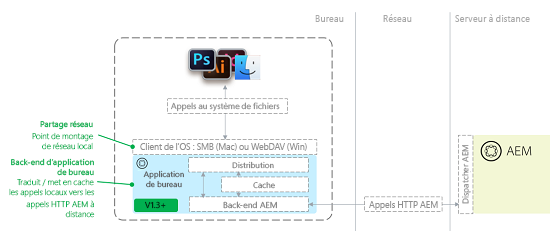

# Résolution des problèmes liés à l’appli de bureau [!DNL Adobe Experience Manager] v1.x {#troubleshoot-aem-desktop-app}

Cette section vous explique comment résoudre les problèmes occasionnels pouvant affecter, notamment, l’installation, la mise à niveau et la configuration de l’appli de bureau AEM.

L’appli de bureau [!DNL Adobe Experience Manager] s’accompagne d’utilitaires qui vous aident à mapper le référentiel AEM Assets en tant que partage réseau sur le poste de travail (partage SMB sous Mac OS). Le partage réseau est une technologie du système d’exploitation qui permet aux sources distantes d’être traitées comme si elles faisaient partie du système de fichiers local d’un ordinateur. Dans le cas de l’appli de bureau AEM, la structure du référentiel de Gestion des actifs numériques (DAM) d’une instance AEM distante est ciblée comme source de fichier distante. Le schéma suivant décrit la topologie de l’appli de bureau AEM :



Avec cette architecture, l’application intercepte les appels du système de fichiers (ouvrir, fermer, lire, écrire, etc.) vers le partage réseau monté et les convertit en appels HTTP AEM natifs vers le serveur AEM. Les fichiers sont mis en cache localement. Pour plus d’informations, voir [Utilisation de l’appli de bureau AEM v1.x](use-app-v1.md).

## Vue d’ensemble des composants de l’appli de bureau AEM {#desktop-app-component-overview}

L’appli de bureau AEM comprend les composants suivants :

* **Appli de bureau** : monte/démonte DAM en tant que système de fichiers distant, et convertit les appels du système de fichiers entre le partage réseau monté en local et l’instance AEM distante à laquelle l’appli de bureau AEM se connecte.
* **Client WebDAV/SMB du système d’exploitation** : gère les communications entre l’Explorateur Windows/le Finder et l’appli de bureau AEM. Si un fichier est récupéré, créé, modifié, supprimé, déplacé ou copié, le client WebDAV/SMB du système d’exploitation communique cette opération à l’appli de bureau AEM. Après réception de la communication, l’appli de bureau AEM la convertit en appels d’API distants AEM natifs. Par exemple, si un utilisateur crée un fichier dans le répertoire monté, le client WebDAV/SMB lance une requête que l’appli de bureau AEM convertit en requête HTTP qui crée le fichier dans DAM. Le client WebDAV/SMB est un composant intégré du système d’exploitation. Il n’est affilié, en aucune manière, à l’appli de bureau AEM, à AEM ou à Adobe.
* **Instance Adobe Experience Manager** : permet d’accéder aux ressources stockées dans le référentiel DAM d’AEM Assets. Elle exécute, en outre, les actions demandées par l’appli de bureau AEM pour le compte des applications de bureau locales qui interagissent avec le partage réseau monté. L’instance AEM cible doit exécuter AEM version 6.1 ou ultérieure. AEM instances exécutant les versions précédentes d’AEM peuvent nécessiter l’installation de Feature Packs et de correctifs logiciels supplémentaires pour devenir entièrement fonctionnelles.

## Cas d’utilisation prévus pour l’appli de bureau AEM {#intended-use-cases-for-aem-desktop-app}

L’appli de bureau AEM utilise la technologie de partage réseau pour mapper un référentiel AEM distant sur un ordinateur local. Toutefois, il n’est pas conçu comme un remplacement d’un partage réseau contenant des ressources, où les utilisateurs effectuent des opérations de gestion des ressources numériques directement depuis leur bureau local. Il s’agit notamment du déplacement ou de la copie de plusieurs fichiers, ou du déplacement de structures de dossiers volumineuses vers le partage réseau AEM Assets directement dans le Finder/l’Explorateur.

L’appli de bureau AEM fournit une méthode pratique pour accéder à des ressources DAM (ouverture) et les modifier (enregistrement) entre l’interface utilisateur tactile d’AEM Assets et le poste de travail local. L’application lie les ressources stockées sur le serveur AEM Assets à vos workflows de bureau.

Le scénario suivant illustre l’utilisation de l’appli de bureau AEM :

* Un utilisateur se connecte à AEM et utilise l’interface utilisateur web pour localiser une ressource.
* Grâce aux fonctionnalités d’action de bureau de l’interface utilisateur web d’AEM, l’utilisateur ouvre, affiche ou modifie la ressource sur le bureau, selon les besoins.
* L’appli de bureau AEM ouvre la ressource dans l’éditeur par défaut en fonction du type de fichier.
* L’utilisateur apporte les modifications souhaitées à la ressource.
* Une fois qu’un fichier a été modifié, l’utilisateur peut afficher son état de synchronisation à l’aide de la fenêtre d’état de synchronisation en arrière-plan de l’appli de bureau AEM.
* Il peut utiliser le menu contextuel de l’appli de bureau AEM pour archiver/extraire la ressource ou revenir à l’interface utilisateur de la gestion des actifs numériques (DAM).
* Une fois les modifications apportées au fichier, l’utilisateur revient à l’interface utilisateur web AEM

Ce n’est pas le seul cas d’utilisation. Toutefois, il illustre à quel point l’appli de bureau AEM constitue un mécanisme pratique pour modifier des ressources et y accéder en local. Nous vous recommandons d’utiliser autant que possible l’interface utilisateur web de la gestion des actifs numériques, car elle offre une meilleure expérience. Il offre une plus grande flexibilité Adobe pour répondre aux besoins des clients.

## Restrictions {#limitations}

Le partage réseau WebDAV/SMB1 offre la possibilité de traiter des fichiers dans une fenêtre de l’Explorateur ou du Finder. Cependant, l’Explorateur/le Finder et AEM communiquent sur une connexion réseau qui présente certaines limites. Par exemple, le temps nécessaire pour copier un fichier de 1 Go sur le répertoire WebDAV/SMB monté est approximativement le même que celui qui est nécessaire pour charger un fichier de 1 Go vers un site web à l’aide d’un navigateur web. En fait, dans le premier cas, cette opération peut s’avérer plus longue en raison du manque d’efficacité du protocole WebDAV/SMB et des clients WebDAV/SMB du système d’exploitation (en particulier sous Mac OS X).

Il existe certaines restrictions quant aux types de tâches qui peuvent être effectuées à partir d’un répertoire monté. En règle générale, utiliser des fichiers volumineux, en particulier sur une connexion réseau de mauvaise qualité/à latence élevée/à faible bande passante, peut se révéler difficile, surtout si vous effectuez des opérations de modification.

Adobe vous conseille d’effectuer quelques tests avant de confirmer au client que certains types de fichiers peuvent être modifiés efficacement de manière statique à partir du répertoire monté.

L’appli de bureau AEM n’est pas adaptée aux manipulations intensives sur le système de fichiers, notamment :

* Déplacement ou copie de fichiers et de répertoires
* Ajout de nombreuses ressources à AEM
* Recherche et ouverture de fichiers via le système de fichiers, à l’exception de la navigation dans des dossiers
* Compression ou décompression d’archives de fichier

En raison de restrictions au niveau du système d’exploitation, la taille de fichier est limitée à 4 294 967 295 octets (environ 4,29 Go) sous Windows. Cela est dû à un paramètre du Registre qui définit la taille maximale d’un fichier sur un partage réseau. La valeur du paramètre de Registre est un DWORD avec une taille maximale équivalant au nombre référencé.

L’appli de bureau [!DNL Experience Manager] ne dispose pas d’une valeur de délai d’expiration configurable qui déconnecte l’appli de bureau du serveur [!DNL Experience Manager] après un intervalle de temps fixe. Lors du chargement de ressources volumineuses, si la connexion expire au bout d’un certain temps, l’application tente à nouveau de charger la ressource plusieurs fois en augmentant le délai d’expiration du chargement. Il n’existe aucun moyen recommandé de modifier les paramètres de délai d’expiration par défaut.

## Mise en cache et communication avec AEM {#caching-and-communication-with-aem}

L’appli de bureau AEM fournit des fonctions de chargement en arrière-plan et de mise en cache interne afin d’améliorer l’expérience de l’utilisateur final. Lorsque vous enregistrez un fichier volumineux, il est d’abord enregistré localement pour vous permettre de continuer à travailler. Au bout d’un certain temps (actuellement 30 secondes), le fichier est alors envoyé au serveur AEM en arrière-plan.

Contrairement à Creative Cloud Desktop ou à d’autres solutions de synchronisation de fichiers, telles que Microsoft One Drive, l’appli de bureau AEM n’est pas un client de synchronisation de bureau complet. En effet, cette application permet d’accéder au référentiel AEM Assets dans son intégralité, lequel peut être extrêmement volumineux (de l’ordre de plusieurs centaines de gigaoctets ou de téraoctets) pour une synchronisation complète.

La mise en cache offre la possibilité de limiter la surcharge de stockage/réseau à un sous-ensemble de ressources pertinentes pour l’utilisateur.

>[!CAUTION]
>
>Adobe recommande de désactiver la génération de miniatures pour accélérer la navigation. Si vous activez les aperçus d’icônes, l’application met en cache les ressources numériques lorsque vous parcourez le dossier monté. L’application télécharge également des ressources dont l’utilisateur n’a peut-être pas l’utilité, ce qui augmente la charge sur le serveur, et consomme la bande passante ainsi que l’espace disque de l’utilisateur.

Pour effectuer la mise en cache, l’appli de bureau AEM procède comme suit :

* Lorsque vous ouvrez un dossier dans le Finder et que des vignettes/aperçus de fichiers sont affichés, ou lorsque vous ouvrez un fichier dans une application, l’appli de bureau AEM met en cache le binaire du fichier.
* Lorsque vous stockez des fichiers via le Finder ou d’autres applications de bureau, ils sont d’abord stockés en local (mis en cache) et le système d’exploitation en est informé. Le fichier est ensuite mis en file d’attente pour être téléchargé sur le serveur en arrière-plan, puis téléchargé sur le réseau. En cas d’erreur réseau, l’appli de bureau AEM effectue, au maximum, trois nouvelles tentatives de chargement de l’intégralité du fichier. Si le chargement s’avère toujours impossible après ces trois tentatives, le fichier est marqué comme étant en conflit et le statut est affiché dans la fenêtre Background Upload Queue Status (Statut de la file d’attente de chargement en arrière-plan). L’appli de bureau AEM n’essaie plus de mettre à jour le fichier. L’utilisateur doit mettre à jour le fichier et le charger à nouveau une fois la connectivité restaurée.

Chaque opération n’est pas mise en cache localement. Les éléments suivants sont transmis immédiatement au serveur AEM sans mise en cache locale :

* Toutes les opérations sur des dossiers, par exemple créer, supprimer, etc.
* La fonctionnalité de transfert de dossiers introduite dans la version 1.4 télécharge une hiérarchie de dossiers locale sans mettre en cache les fichiers localement

## Opérations distinctes {#individual-operations}

Pour résoudre des problèmes de performances affectant les utilisateurs individuels, consultez d’abord la section [Restrictions de l’appli](#limitations). Les sections suivantes contiennent des suggestions visant à améliorer les performances pour les utilisateurs individuels.

## Recommandations en termes de bande passante {#bandwidth-recommendations}

La bande passante disponible pour un utilisateur individuel joue un rôle essentiel dans les performances du client WebDAV/SMB.

Adobe recommande que la vitesse de chargement d’un utilisateur individuel soit proche de 10 Mbit/s. Pour les connexions sans fil, la bande passante est souvent partagée entre plusieurs utilisateurs. Si plusieurs utilisateurs effectuent simultanément des tâches qui consomment de la bande passante du réseau, les performances peuvent se dégrader encore plus. Pour éviter de tels problèmes, utilisez une connexion câblée.

<!-- AG, 8/18: The Windows KB article is removed by MS now. Giving 404. Also, Win 7 support is gone and the desktop app is also not supported on Win 7. Hiding this content for now.

## Windows-specific configurations {#windows-specific-configurations}

If you use Experience Manager on Windows, you can configure Windows to enhance the performance of the WebDAV client. For more information, go to [https://support.microsoft.com/en-us/kb/2445570](https://support.microsoft.com/en-us/kb/2445570).

On Windows 7, modifying IE settings can improve the performance of WebDAV. For details, see how to [fix slow WebDAV performance in Windows 7](https://oddballupdate.com/2009/12/fix-slow-webdav-performance-in-windows-7/).
-->

## Opérations simultanées {#concurrent-operations}

Lorsque vous interagissez avec un fichier en local, l’appli de bureau AEM vérifie si une version plus récente du fichier est disponible dans AEM. Si une nouvelle version est disponible, l’application télécharge une nouvelle copie du fichier dans le cache local. Toutefois, l’appli de bureau AEM n’écrase pas un fichier mis en cache localement s’il a été modifié. Cette fonctionnalité empêche tout écrasement accidentel de votre travail.

Lorsque le même fichier est modifié localement et en AEM, la version modifiée localement remplace la version dans AEM. Dans ce cas, la version précédente est disponible dans la chronologie de la ressource. Vous pouvez vérifier les deux versions et résoudre les conflits.

Si un fichier local n’est pas cohérent avec la version disponible sur le serveur, la boîte de dialogue d’état du téléchargement en arrière-plan vous informe du conflit. Pour résoudre le problème, ouvrez le fichier en conflit et enregistrez-le. L’enregistrement du fichier force l’appli de bureau AEM à synchroniser vos dernières modifications locales avec AEM. Vous pouvez afficher les versions précédentes de la ressource dans la chronologie et résoudre les conflits.

Vous devez tenir compte de facteurs supplémentaires lorsque plusieurs utilisateurs tentent de travailler dans des répertoires montés distincts ciblant la même instance AEM. En particulier, les facteurs suivants sont importants :

* La quantité de bande passante disponible sur le réseau d’origine des utilisateurs
* Configuration réseau, telle que les pare-feu ou les proxies, du réseau d’origine
* Quantité de bande passante disponible dans le réseau de l’instance AEM cible
* Si un dispatcher est présent avant l’instance AEM cible
* Charge actuelle sur l’instance AEM cible

## Configurations AEM supplémentaires {#additional-aem-configurations}

En cas de dégradation significative des performances WebDAV/SMB lorsque plusieurs utilisateurs travaillent simultanément, vous pouvez configurer quelques éléments dans AEM, ce qui permet d’optimiser les performances.

## Mise à jour des workflows transitoires de ressources {#update-asset-transient-workflows}

Vous pouvez améliorer les performances du côté AEM en activant les workflows transitoires pour le workflow Ressources de mise à jour de gestion des actifs numériques (DAM). L’activation de workflows transitoires réduit la puissance de traitement requise pour mettre à jour des ressources lors de leur création ou de leur modification dans AEM.

1. Accédez à `/miscadmin` dans l’instance Experience Manager (`https://[aem_server]:[port]/miscadmin`).
1. Dans l’arborescence de navigation, développez **Outils** > **Workflow** > **Modèles** > **dam**.
1. Double-cliquez sur **Ressources de mise à jour de gestion des actifs numériques** (DAM).
1. Dans le panneau des outils flottants, passez à la **Page** puis cliquez sur **Propriétés de la page**.
1. Sélectionnez la **Processus transitoire** puis cliquez sur **OK**.

### Ajuster la file d’attente des workflows transitoires Granite {#adjust-granite-transient-workflow-queue}

Pour améliorer les performances d’AEM, une autre méthode consiste à configurer le nombre maximum de tâches en parallèle pour la file d’attente des workflows transitoires Granite. La valeur recommandée équivaut approximativement à la moitié du nombre de processeurs disponibles avec le serveur. Pour régler la valeur, procédez comme suit :

1. Accédez à `/system/console/configMgr` dans l’instance AEM à configurer (par exemple, `https://[aem_server]:[port]/system/console/configMgr`).
1. Recherchez `QueueConfiguration`, puis cliquez pour ouvrir chaque tâche jusqu’à ce que vous ayez trouvé la tâche **Granite Transient Workflow Queue** et cliquez sur **Modifier**.
1. Modifiez la valeur `Maximum Parallel Jobs` (Nombre maximum de tâches en parallèle), puis cliquez sur **Enregistrer**.

## Configuration AWS {#aws-configuration}

En raison des limitations de bande passante du réseau, les performances de WebDAV/SMB peuvent se dégrader lorsque plusieurs utilisateurs travaillent simultanément. Adobe recommande d’augmenter la taille de l’instance AWS pour une instance AEM cible qui s’exécute sur AWS afin d’améliorer les performances de WebDAV/SMB.

Cette mesure augmente spécifiquement la bande passante du réseau disponible pour le serveur. Voici quelques détails :

* La quantité de bande passante réseau dédiée à une instance AWS augmente à mesure que la taille de l’instance augmente. Pour plus d’informations sur la bande passante disponible pour chaque taille d’instance, voir [Documentation AWS](https://aws.amazon.com/ec2/instance-types/).
* Lors de la résolution des problèmes pour un client de grande taille, Adobe a configuré la taille de son instance AEM sur c4.8xlarge, principalement pour la bande passante dédiée de 4 000 Mbit/s qu’il fournit.
* S’il existe un dispatcher en amont de l’instance AEM, assurez-vous qu’il a la taille appropriée. Si l’instance d’AEM fournit 4 000 Mbit/s, mais que le Dispatcher ne fournit que 500 Mbit/s, la bande passante effective est seulement de 500 Mbit/s. En effet, le Dispatcher crée un goulot d’étranglement réseau.

## Restrictions liées aux fichiers extraits {#checked-out-file-limitations}

Il existe quelques limites connues dans la manière dont vous pouvez interagir avec les fichiers extraits via l’Explorateur/le Finder. Si un fichier est extrait, il doit être en lecture seule pour toute personne, à l’exception de l’utilisateur qui l’a extrait. La mise en oeuvre du protocole WebDAV/SMB1 dans AEM applique cette règle. Toutefois, les clients WebDAV/SMB du système d’exploitation n’interagissent souvent pas avec les fichiers extraits. Certaines bizarreries sont décrites ci-dessous.

### Général {#general}

Si vous écrivez dans un fichier extrait, le verrouillage n’est appliqué que dans l’implémentation WebDAV d’AEM. Par conséquent, le verrouillage n’est appliqué que par les clients qui utilisent WebDAV, comme l’appli de bureau. Le verrouillage n’est pas appliqué par le biais de l’interface web AEM. L’interface AEM affiche simplement une icône de verrouillage dans le mode Carte pour les ressources extraites. L’icône est cosmétique et n’a aucun effet sur le comportement de l’AEM.

En général, les clients WebDAV ne se comportent pas toujours comme prévu. Il peut y avoir d’autres problèmes. Toutefois, l’actualisation ou la vérification de la ressource dans AEM est un bon moyen de vérifier qu’une ressource n’est pas en cours de modification. Ce comportement est typique des clients WebDAV du système d’exploitation, qui ne sont pas contrôlés par l’Adobe.

### Windows {#windows}

La suppression d’un fichier semble réussir car le fichier disparaît de l’explorateur de fichiers sous Windows. Toutefois, l’actualisation du répertoire et l’archivage AEM ressources indique que le fichier est toujours présent. En outre, la modification des fichiers semble réussir (aucune boîte de dialogue d’avertissement ou message d’erreur ne s’affiche). Toutefois, la réouverture du fichier ou l’archivage de AEM ressources révèle que le fichier reste inchangé.

#### Mac OS X {#mac-os-x}

Le remplacement d’un fichier n’affiche pas d’avertissement ou d’erreur, mais la vérification de la ressource dans AEM révèle qu’elle reste inchangée. Actualisez ou vérifiez la ressource dans AEM pour vérifier qu’elle n’est pas en cours de modification.

## Résolution des problèmes d’icône de l’appli de bureau AEM (Mac OS X) {#troubleshooting-desktop-app-icon-issues-mac-os-x}

Une fois que vous avez installé l’appli de bureau AEM, l’icône de menu de l’application s’affiche dans la barre de menus. Si l’icône n’apparaît pas, procédez comme suit pour résoudre le problème :

1. Ouvrez la fenêtre du terminal du système d’exploitation.
1. Saisissez la commande suivante à l’invite de commande, puis appuyez sur Entrée :

   ```shell
    cd ../Library/Caches.
   ```

1. Saisissez la commande suivante, puis appuyez sur Entrée :

   ```shell
   rm -r com.adobe.aem.assetscompanion
   ```

1. Saisissez la commande suivante, puis appuyez sur Entrée :

   ```shell
   cd ~/Library/Preferences
   ```

1. Saisissez la commande suivante, puis appuyez sur Entrée :

   ```shell
   rm com.adobe.aem.assetscompanion.plist
   ```

1. Saisissez la commande suivante, puis appuyez sur Entrée :

   ```shell
   rm ~/Library/Group\ Containers/group.com.adobe.aem.desktop/*
   ```

1. Redémarrez le système.

L’appli de bureau AEM tente de synchroniser un fichier donné à trois reprises. Si la troisième tentative de synchronisation du fichier échoue, l’appli de bureau AEM considère que le fichier est en conflit et vous en informe par le biais de la fenêtre de statut des chargements en arrière-plan. Un statut de conflit indique que vos dernières modifications sont toujours disponibles en local, mais qu’elles ne sont plus resynchronisées avec AEM. L’appli de bureau AEM ne tente plus de se synchroniser.

Pour remédier à ce problème, la méthode la plus simple consiste à ouvrir le fichier à l’origine du conflit et à le réenregistrer. De cette manière, l’appli de bureau AEM est forcée d’effectuer trois tentatives de synchronisation supplémentaires. Si la synchronisation du fichier échoue encore, consultez les sections ci-dessous pour obtenir une aide supplémentaire.

## Effacement du cache de l’appli de bureau AEM {#clearing-aem-desktop-cache}

L’effacement du cache de l’appli de bureau AEM est une tâche de dépannage préliminaire qui permet de résoudre plusieurs problèmes liés à l’application.

Vous pouvez effacer le cache en supprimant le répertoire de cache de l’application aux emplacements suivants.
Sous Windows, `%LocalAppData%\Adobe\AssetsCompanion\Cache\`

Sous Mac, `~/Library/Group/Containers/group.com.adobe.aem.desktop/cache/`

Toutefois, l’emplacement peut varier en fonction du point d’entrée AEM configuré de l’appli de bureau AEM. La valeur est une version codée de l’URL ciblée. Par exemple, si l’application cible est `http://localhost:4502`, le nom du répertoire est `http%3A%2F%2Flocalhost%3A4502%2F`.

Pour effacer le cache, supprimez la variable &lt;encoded aem=&quot;&quot; endpoint=&quot;&quot;> répertoire .

>[!NOTE]
>
>Si vous effacez le cache de l’appli de bureau AEM, les modifications de fichier locales qui ne sont pas synchronisées avec AEM seront perdues.

>[!NOTE]
>
>À compter de la version 1.5 de l’appli de bureau AEM, une option disponible dans l’interface utilisateur de l’application permet d’effacer le cache.

## Recherche de la version de l’appli de bureau AEM {#finding-the-aem-desktop-version}

La procédure de vérification de la version de l’appli de bureau AEM est la même sous Windows et macOS.

Cliquez sur l’icône de l’appli de bureau AEM, puis sélectionnez **About** (À propos). Le numéro de version s’affiche à l’écran.

## Mise à niveau de l’appli de bureau AEM sous macOS {#upgrading-aem-desktop-app-on-macos}

Des problèmes peuvent parfois survenir lors de la mise à niveau de l’appli de bureau AEM sous macOS. Cela est dû au dossier système hérité de l’appli de bureau AEM qui empêche le chargement correct des nouvelles versions de l’application. Pour y remédier, les dossiers et fichiers suivants peuvent être supprimés manuellement.

Avant d’exécuter les étapes ci-dessous, faites glisser « Appli de bureau Adobe Experience Manager » du dossier Applications de macOS vers la Corbeille. Ouvrez ensuite le terminal et exécutez la commande suivante en saisissant votre mot de passe lorsque vous y êtes invité.

```shell
sudo rm -rf ~/Library/Application\ Support/com.adobe.aem.desktop
sudo rm -rf ~/Library/Preferences/com.adobe.aem.desktop.plist
sudo rm -rf ~/Library/Logs/Adobe\ Experience\ Manager\ Desktop

sudo find /var/folders -type d -name "com.adobe.aem.desktop" | xargs rm -rf
sudo find /var/folders -type d -name "com.adobe.aem.desktop.finderintegration-plugin" | xargs rm -rf
```

## Enregistrement d’un fichier extrait par d’autres utilisateurs {#saving-a-file-checked-out-by-others}

Les limitations techniques du système d’exploitation empêchent les utilisateurs d’avoir une expérience cohérente lorsqu’ils tentent de remplacer un fichier extrait par d’autres utilisateurs. L’expérience varie en fonction de l’application utilisée pour modifier le fichier extrait. Parfois, l’application affiche un message d’erreur indiquant une erreur d’écriture de disque ou affiche une erreur apparemment sans rapport ou générique. Dans d’autres cas, aucun message d’erreur ne s’affiche et l’opération semble réussir.

Dans ce cas, la fermeture et la réouverture du fichier peut indiquer que le contenu n’a pas été modifié. Cependant, certaines applications peuvent stocker une sauvegarde du fichier afin que vos modifications puissent être appliquées.

Quel que soit le comportement, le fichier reste inchangé lorsque vous l’archivez. Même si une autre version du fichier s’affiche, les modifications ne sont pas synchronisées avec AEM.

## Résolution des problèmes liés au déplacement de fichiers {#troubleshooting-problems-around-moving-files}

L’API du serveur requiert la transmission d’en-têtes supplémentaires, X-Destination, X-Depth et X-Overwrite, pour que les opérations de déplacement et de copie fonctionnent. Le Dispatcher ne transmet pas ces en-têtes par défaut, ce qui entraîne l’échec de ces opérations. Pour plus d’informations, voir [Connexion à AEM derrière un Dispatcher](install-configure-app-v1.md#connect-to-an-aem-instance-behind-a-dispatcher).

## Résolution des problèmes de connexion de l’appli de bureau AEM {#troubleshooting-aem-desktop-connection-issues}

### Problème de redirection SAML {#saml-redirect-issue}

Dans la majorité des cas, les problèmes de connexion de l’appli de bureau AEM à votre instance AEM compatible SSO (SAML) sont dus au fait que le processus SAML n’effectue pas de redirection vers le chemin demandé initialement. Sinon, la connexion peut être redirigée vers un hôte qui n’est pas configuré dans l’appli de bureau AEM. Effectuez les étapes suivantes pour vérifier le processus de connexion :

1. Ouvrez un navigateur web.
1. Dans la barre d’adresse, indiquez l’URL `/content/dam.json`.
1. Remplacez l’URL par l’instance AEM cible ; par exemple, `https://localhost:4502/content/dam.json`.
1. Connectez-vous à AEM.
1. Une fois connecté, vérifiez l’adresse actuelle du navigateur dans la barre d’adresse. Il doit correspondre à l’URL que vous avez saisie initialement.
1. Vérifiez que tous les éléments qui précèdent `/content/dam.json` correspondent à la valeur AEM configurée dans l’appli de bureau AEM.

### Problème de configuration SSL {#ssl-configuration-issue}

Les bibliothèques utilisées par l’appli de bureau AEM pour les communications HTTP appliquent le protocole SSL de manière stricte. Parfois, une connexion peut réussir en utilisant un navigateur, mais échouer avec l’appli de bureau AEM. Pour configurer SSL de manière appropriée, installez le certificat intermédiaire manquant dans Apache. Voir [Comment installer un certificat d’autorité de certification intermédiaire dans Apache](https://access.redhat.com/solutions/43575).

## Utilisation de l’appli de bureau AEM avec le Dispatcher {#using-aem-desktop-with-dispatcher}

L’appli de bureau AEM fonctionne avec des déploiements situés derrière un Dispatcher ; il s’agit de la configuration par défaut, recommandée pour les serveurs AEM. AEM dispatchers situés en face d’AEM environnements de création sont généralement configurés pour ignorer la mise en cache des ressources DAM. Par conséquent, ils ne fournissent pas de mise en cache supplémentaire du point de vue de l’appli de bureau AEM. Assurez-vous que la configuration du Dispatcher a été adaptée pour fonctionner avec l’appli de bureau AEM. Pour plus d’informations, voir [Connexion à AEM derrière un Dispatcher](install-configure-app-v1.md#connect-to-an-aem-instance-behind-a-dispatcher).

## Recherche des fichiers journaux {#checking-for-log-files}

En fonction de votre système d’exploitation, les fichiers journaux de l’appli de bureau AEM se situent aux emplacements suivants :

* Windows : `%LocalAppData%\Adobe\AssetsCompanion\Logs`
* Mac : `~/Library/Logs/Adobe\ Experience\ Manager\ Desktop`
