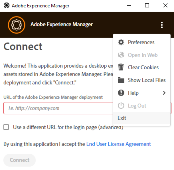

# Résolution des problèmes liés à l’appli de bureau [!DNL Adobe Experience Manager] {#troubleshoot-v2}

L’appli de bureau [!DNL Adobe Experience Manager] se connecte au référentiel de gestion des actifs numériques (DAM) d’un déploiement [!DNL Experience Manager]. L’appli récupère les informations du référentiel et les résultats de la recherche sur votre ordinateur, télécharge et charge les fichiers et les dossiers, et inclut des fonctionnalités de gestion des conflits avec l’interface utilisateur d’Assets.

Lisez la suite de cette section pour résoudre les problèmes de l’application, découvrir les bonnes pratiques et connaître les limites.

## Bonnes pratiques {#best-practices-to-prevent-troubles}

Observez les bonnes pratiques suivantes pour éviter certains problèmes courants et relatifs au dépannage.

* **Comprendre le fonctionnement de l’appli de bureau** : avant de commencer à utiliser l’application, consacrez quelques minutes à en découvrir le fonctionnement. Découvrez comment fonctionne la liaison entre l’interface utilisateur Web et de bureau [!DNL Experience Manager], le mappage de référentiel, la mise en cache de ressources, l’enregistrement en local ainsi que le chargement en arrière-plan. Voir [Fonctionnement](release-notes.md#how-app-works).

* **Éviter les caractères non pris en charge dans les noms de dossier** : n’utilisez pas d’espaces ni de caractères non valides lors de la création ou du chargement de dossiers. Consultez la liste des caractères dans [Création de dossiers dans [!DNL Experience Manager Assets]](https://experienceleague.adobe.com/docs/experience-manager-65/assets/managing/manage-assets.html?lang=fr#creating-folders). Certains cas d’utilisation d’[!DNL Experience Manager] peuvent être affectés par la présence de caractères non pris en charge dans le nom du dossier.

* **Bonnes pratiques pour éviter les conflits** : pour éviter les éventuels conflits lors de la collaboration sur plusieurs ressources, voir [Éviter les conflits de modification](using.md#adv-workflow-collaborate-avoid-conflicts).

* **Utiliser le chargement de dossiers pour les dossiers hiérarchiques volumineux** : au lieu d’utiliser l’interface Web d’Assets ou d’autres méthodes, utilisez l’appli de bureau [!DNL Experience Manager] pour charger les dossiers volumineux. L’appli charge les ressources en arrière-plan avec journalisation et surveillance. Voir [Chargement en masse de ressources](using.md#bulk-upload-assets).

* **Utiliser la dernière version** : utilisez la dernière version de l’application et vérifiez toujours la compatibilité avant d’installer une nouvelle version de l’application ou de procéder à une mise à niveau vers une nouvelle version de [!DNL Experience Manager]. Voir les [notes de mise à jour](release-notes.md).

* **Utiliser la même lettre de lecteur** : utilisez la même lettre de lecteur dans toute l’entreprise pour procéder à un mappage sur le DAM d’[!DNL Experience Manager]. Pour l’affichage des ressources placées par d’autres utilisateurs, les chemins d’accès doivent être identiques. L’utilisation de la même lettre de lecteur garantit un chemin constant vers les ressources DAM. Les ressources demeurent placées et ne sont pas supprimées même si des lettres de lecteur différentes sont utilisées par des utilisateurs différents.

* **Penser au réseau** : les performances réseau sont essentielles aux performances de l’appli de bureau [!DNL Experience Manager]. Si vous obtenez une réponse ralentie aux transferts de fichiers ou aux opérations en masse, désactivez les fonctionnalités ou les applications susceptibles d’entraîner un trafic réseau important.

* **Cas d’utilisation non pris en charge pour l’appli de bureau** : n’utilisez pas l’application pour la migration des ressources (celle-ci nécessite une planification et d’autres outils) ; pour les opérations de gestion des ressources numériques (DAM) lourdes (par exemple, déplacement de dossiers volumineux, chargements volumineux, recherche de fichiers à l’aide d’une recherche de métadonnées avancée) ; et en tant que client de synchronisation (les principes de conception et les modèles d’utilisation sont différents des clients synchronisés tels que Microsoft OneDrive ou Adobe Creative Cloud Desktop Sync).

* **Délai d’expiration** : actuellement, l’appli de bureau ne dispose pas d’une valeur de délai d’expiration configurable qui déconnecte l’appli de bureau du serveur [!DNL Experience Manager] après un temps donné. Lors du chargement de ressources volumineuses, si la connexion expire au bout d’un certain temps, l’application tente à nouveau de charger la ressource plusieurs fois en augmentant le délai d’expiration du chargement. Il n’existe aucun moyen recommandé de modifier les paramètres de délai d’expiration par défaut.

## Comment résoudre les problèmes {#troubleshooting-prep}

Pour résoudre les problèmes liés à l’appli de bureau, tenez compte des informations suivantes. Celles-ci vous aideront également à expliquer les problèmes au Service clientèle d’Adobe si vous préférez demander de l’aide.

### Emplacement des fichiers journaux {#check-log-files-v2}

L’appli de bureau [!DNL Experience Manager] stocke ses fichiers journaux aux emplacements suivants en fonction du système d’exploitation :

Sous Windows : `%LocalAppData%\Adobe\AssetsCompanion\Logs`

Sous Mac : `~/Library/Logs/Adobe\ Experience\ Manager\ Desktop`

Lorsque de nombreuses ressources sont chargées, si le chargement de certains fichiers échoue, reportez-vous au fichier `backend.log` pour identifier ceux qui ont échoué.

>[!NOTE]
>
>Lorsque vous travaillez avec le Service clientèle d’Adobe sur une requête ou un ticket d’assistance, vous serez peut-être invité à fournir les fichiers journaux pour l’aider à comprendre le problème. Archivez l’ensemble du dossier `Logs` et transmettez-le à votre contact du Service clientèle.

### Modifier le niveau de détails dans les fichiers journaux {#level-of-details-in-log}

Pour modifier le niveau de détails dans les fichiers journaux :

1. Assurez-vous que l’application n’est pas en cours d’exécution.

1. Sous le système Windows :

   1. Ouvrez une fenêtre de commande.

   1. Lancez l’appli de bureau [!DNL Adobe Experience Manager] en exécutant la commande :

   ```shell
   set AEM_DESKTOP_LOG_LEVEL=DEBUG&"C:\Program Files\Adobe\Adobe Experience Manager Desktop.exe
   ```

   Sous le système Mac :

   1. Ouvrez une fenêtre de terminal.

   1. Lancez l’appli de bureau [!DNL Adobe Experience Manager] en exécutant la commande :

   ```shell
   AEM_DESKTOP_LOG_LEVEL=DEBUG open /Applications/Adobe\ Experience\ Manager\ Desktop.app
   ```

Les niveaux de journal valides sont DEBUG, INFO, WARN ou ERROR. La prolixité des journaux est maximale pour le niveau DEBUG et minimale pour le niveau ERROR.

### Activation du mode de débogage {#enable-debug-mode}

Pour résoudre les problèmes, vous pouvez activer le mode de débogage et obtenir plus d’informations dans les journaux.

>[!NOTE]
>
>Les niveaux de journal valides sont DEBUG, INFO, WARN ou ERROR. La prolixité des journaux est maximale pour le niveau DEBUG et minimale pour le niveau ERROR.

Pour utiliser l’appli en mode de débogage sous Mac :

1. Ouvrez une fenêtre de terminal ou une invite de commande.

1. Lancez l’appli de bureau [!DNL Experience Manager] en exécutant la commande suivante :

   `AEM_DESKTOP_LOG_LEVEL=DEBUG open /Applications/Adobe\ Experience\ Manager\ Desktop.app`.

Pour activer le mode de débogage sous Windows :

1. Ouvrez une fenêtre de commande.

1. Lancez l’appli de bureau [!DNL Experience Manager] en exécutant la commande suivante :

`AEM_DESKTOP_LOG_LEVEL=DEBUG&"C:\Program Files\Adobe\Adobe Experience Manager Desktop.exe`.

### Connaître la version de l’appli de bureau [!DNL Adobe Experience Manager] {#know-app-version-v2}

Pour afficher le numéro de version :

1. Démarrez l’application.

1. Cliquez sur les ellipses dans l’angle supérieur droit, placez le pointeur sur [!UICONTROL Help], puis cliquez sur [!UICONTROL About].

   Le numéro de version est affiché sur cet écran.

### Effacer le cache {#clear-cache-v2}

Exécutez les étapes suivantes :

1. Lancez l’application et connectez-vous à l’instance [!DNL Experience Manager].

1. Ouvrez les préférences de l’application en cliquant sur les ellipses situées dans le coin supérieur droit et en sélectionnant [!UICONTROL Preferences].

1. Localisez l’entrée affichant la [!UICONTROL Current Cache Size]. Cliquez sur l’icône représentant une corbeille en regard de cet élément.

Pour effacer manuellement le cache, procédez comme suit.

>[!CAUTION]
>
>Il s’agit d’une opération potentiellement destructive. Si les modifications de fichiers locaux ne sont pas téléchargées vers [!DNL Adobe Experience Manager], ces modifications seront perdues.

Le cache est effacé lors de la suppression du répertoire de cache de l’application, qui peut être trouvé dans les préférences de celle-ci.

1. Démarrez l’application.

1. Ouvrez les préférences de l’application en sélectionnant les ellipses situées dans le coin supérieur droit, puis l’option [!UICONTROL Preferences].

1. Notez la valeur [!UICONTROL Cache Directory].

   Dans ce répertoire, il existe des sous-répertoires nommés d’après les points d’entrée [!DNL Adobe Experience Manager] codés. Les noms sont constitués d’une version codée de l’URL [!DNL Adobe Experience Manager] ciblée. Par exemple, si l’application cible `localhost:4502`, le nom du répertoire est `localhost_4502`.

Pour effacer le cache, supprimez le répertoire Point d’entrée [!DNL Adobe Experience Manager] codé. Sinon, la suppression de l’ensemble du répertoire spécifié dans les préférences effacera le cache de toutes les instances utilisées par l’application.

L’effacement du cache de l’appli de bureau [!DNL Adobe Experience Manager] est une tâche préliminaire de résolution de problème qui permet de résoudre plusieurs problèmes. Effacez le cache des préférences de l’application. Voir [Définition des préférences](install-upgrade.md#set-preferences). L’emplacement par défaut du dossier de cache est :

## Impossible de voir les ressources importées {#placed-assets-missing}

Si vous ne pouvez pas voir les ressources que vous ou d’autres professionnels de la création avez placées dans les fichiers de support (fichiers INDD, par exemple), vérifiez les éléments suivants :

* Connexion au serveur. Une connectivité réseau défaillante peut bloquer les téléchargements de ressources.

* Taille de fichier. Le téléchargement et l’affichage des ressources volumineuses prennent plus de temps.

* Cohérence des lettres de lecteur. Si vous ou un autre collaborateur avez placé les ressources tout en mappant le DAM d’[!DNL Experience Manager] sur une autre lettre de lecteur, les ressources placées ne s’affichent pas.

* Autorisations. Pour vérifier que vous êtes autorisé à récupérer les ressources placées, contactez votre administrateur [!DNL Experience Manager].

### Les modifications apportées aux fichiers de l’interface utilisateur de l’appli de bureau ne sont pas répercutées immédiatement dans [!DNL Adobe Experience Manager] {#changes-on-da-not-visible-on-aem}

L’appli de bureau [!DNL Adobe Experience Manager] laisse à l’utilisateur le soin de décider le moment où toutes les modifications apportées à un fichier sont terminées. Selon la taille et la complexité d’un fichier, le transfert de la nouvelle version d’un fichier vers [!DNL Adobe Experience Manager] prend beaucoup de temps. La conception de l’application prévoit de réduire au minimum le nombre de transferts d’un fichier dans un sens et dans l’autre, plutôt que de deviner à quel moment les modifications du fichier sont terminées et téléchargées automatiquement. Il est conseillé à l’utilisateur de déclencher le transfert de retour du fichier vers [!DNL Adobe Experience Manager] en choisissant de télécharger les modifications d’un fichier.

### Problèmes lors de la mise à niveau sous MacOS {#issues-when-upgrading-on-macos}

Des problèmes peuvent parfois survenir lors de la mise à niveau de l’appli de bureau [!DNL Experience Manager] sous macOS. Cela est dû au dossier système hérité de l’appli de bureau [!DNL Experience Manager], qui empêche le chargement correct des nouvelles versions de l’application [!DNL Experience Manager]. Pour y remédier, les dossiers et fichiers suivants peuvent être supprimés manuellement.

Avant d’exécuter les étapes suivantes, faites glisser l’application `Adobe Experience Manager Desktop` du dossier des applications MacOS vers la corbeille. Ouvrez ensuite le terminal, exécutez la commande suivante et saisissez votre mot de passe lorsque vous y êtes invité.

```shell
sudo rm -rf ~/Library/Application\ Support/com.adobe.aem.desktop
sudo rm -rf ~/Library/Preferences/com.adobe.aem.desktop.plist
sudo rm -rf ~/Library/Logs/Adobe\ Experience\ Manager\ Desktop

sudo find /var/folders -type d -name "com.adobe.aem.desktop" | xargs rm -rf
sudo find /var/folders -type d -name "com.adobe.aem.desktop.finderintegration-plugin" | xargs rm -rf
```

## Chargement des fichiers impossible {#upload-fails}

Si vous utilisez l’appli de bureau [!DNL Experience Manager] en version 6.5.1 ou ultérieure, mettez à niveau le connecteur Azure ou S3 vers la version 1.10.4 ou ultérieure. Cela aura pour effet de résoudre le problème d’échec de chargement de fichier lié à [OAK-8599](https://issues.apache.org/jira/browse/OAK-8599). Voir [Instructions d’installation](install-upgrade.md#install-v2).

## Problèmes de connexion à l’appli de bureau [!DNL Experience Manager] {#connection-issues}

Si vous rencontrez des problèmes généraux de connectivité, il existe un certain nombre de méthodes pour obtenir davantage d’informations sur ce que fait l’appli de bureau [!DNL Experience Manager].

**Vérification du journal des requêtes**

L’appli de bureau [!DNL Experience Manager] consigne dans un fichier journal dédié toutes les requêtes qu’elle envoie, ainsi que le code de réponse de chacune d’elles.

1. Ouvrez le répertoire des journaux de l’application `request.log` pour afficher ces requêtes.

1. Chaque ligne du journal représente une requête ou une réponse. Les requêtes contiennent un caractère `>`, suivi de l’URL demandée. Les réponses contiennent un caractère `<`, suivi du code de réponse et de l’URL demandée. Les demandes et les réponses peuvent être corrélées à l’aide de l’identifiant unique (GUID) de chaque ligne.

**Vérifier les requêtes chargées par le navigateur intégré de l’application**

La majorité des requêtes de l’application se trouvent dans le journal des requêtes. Toutefois, s’il n’existe aucune information pertinente à ce sujet, il peut être utile de consulter les requêtes envoyées par le navigateur intégré de l’application.
Consultez la [section SAML](#da-connection-issue-with-saml-aem) pour savoir comment afficher ces requêtes.

### L’authentification de la connexion SAML ne fonctionne pas {#da-connection-issue-with-saml-aem}

L’appli de bureau [!DNL Experience Manager] peut ne pas se connecter à votre déploiement [!DNL Adobe Experience Manager] compatible SSO (SAML). La conception de l’application s’efforce de tenir compte des variations et des complexités des connexions et des processus d’authentification unique. Cependant, sa configuration peut nécessiter certaines mesures de dépannage supplémentaires.

Il arrive que le processus SAML ne revienne pas vers le chemin d’accès initialement demandé ou que la redirection finale concerne un hôte différent de celui configuré dans l’appli de bureau [!DNL Adobe Experience Manager]. Pour vérifier que ce n’est pas le cas :

1. Ouvrez un navigateur web. Accédez à l’URL `https://[aem_server]:[port]/content/dam.json`.

1. Connectez-vous au déploiement [!DNL Adobe Experience Manager].

1. Une fois la connexion terminée, examinez l’adresse actuelle du navigateur dans la barre d’adresse. Elle doit correspondre exactement à l’URL que vous avez saisie initialement.

1. Vérifiez également que tout ce qui précède `/content/dam.json` correspond à la valeur [!DNL Adobe Experience Manager] cible configurée dans les paramètres de l’appli de bureau [!DNL Adobe Experience Manager].

**Le processus SAML de connexion fonctionne correctement, conformément à la procédure ci-dessus, mais les utilisateurs ne peuvent toujours pas se connecter.**

La fenêtre de l’appli de bureau [!DNL Adobe Experience Manager] dans laquelle s’affiche le processus de connexion est simplement un navigateur web qui présente l’interface utilisateur web de l’instance [!DNL Adobe Experience Manager] cible :

* La version Mac utilise un composant [WebView](https://developer.apple.com/documentation/webkit/webview).

* La version Windows utilise [CefSharp](https://cefsharp.github.io/), basé sur le navigateur Chromium.

Vérifiez que le processus SAML prend en charge ces navigateurs.

Pour résoudre d’autres problèmes, il est possible d’afficher les URL exactes que le navigateur tente de charger. Pour afficher ces informations :

1. Suivez la procédure pour lancer l’application en [mode débogage](#enable-debug-mode).

1. Reproduisez la tentative de connexion.

1. Accédez au répertoire des [journaux de l’application](#check-log-files-v2).

1. Pour Windows :

   1. Ouvrez le fichier « aemcompanionlog.txt ».

   1. Recherchez les messages commençant par « L’adresse du navigateur de connexion a été remplacée par ». Ces entrées contiennent également l’URL chargée par l’application.

   Pour Mac :

   1. `com.adobe.aem.desktop-nnnnnnnn-nnnnnn.log`, où les valeurs **n** sont remplacées par les nombres figurant dans le nom de fichier le plus récent.

   1. Recherchez les messages commençant par « cadre chargé ». Ces entrées contiennent également l’URL chargée par l’application.

L’examen de la séquence d’URL en cours de chargement peut aider à résoudre les problèmes du côté SAML afin de déterminer ce qui ne va pas.

### Problème de configuration SSL {#ssl-config-v2}

Les bibliothèques utilisées par l’appli de bureau [!DNL Experience Manager] pour les communications HTTP appliquent le protocole SSL de manière stricte. Parfois, une connexion peut réussir en utilisant un navigateur, mais échouer avec l’appli de bureau [!DNL Experience Manager]. Pour configurer SSL de manière appropriée, installez le certificat intermédiaire manquant dans Apache. Voir [Comment installer un certificat d’autorité de certification intermédiaire dans Apache](https://access.redhat.com/solutions/43575).

Les bibliothèques utilisées par l’appli de bureau [!DNL Experience Manager] pour les communications HTTP appliquent le protocole SSL de manière stricte. Il peut donc y avoir des cas où les connexions SSL réalisées par le biais d’un navigateur échouent avec l’appli de bureau [!DNL Adobe Experience Manager]. C’est un point positif car cela incite à configurer correctement le certificat SSL et à accroître la sécurité, même si la situation peut être frustrante si l’application ne parvient pas à se connecter.

Dans ce cas, l’approche recommandée consiste à utiliser un outil pour analyser le certificat SSL d’un serveur et identifier les problèmes afin de les corriger. Certains sites web inspectent le certificat d’un serveur pour fournir son URL.

À titre de mesure temporaire, il est possible de désactiver la mise en œuvre stricte du protocole SSL dans l’appli de bureau [!DNL Adobe Experience Manager]. À long terme, cette solution n’est pas recommandée, car elle réduit la sécurité en masquant la cause principale d’une configuration incorrecte du protocole SSL. Pour désactiver la mise en œuvre stricte :

1. Utilisez l’éditeur de votre choix pour modifier le fichier de configuration JavaScript de l’application, qui se trouve (par défaut) aux emplacements suivants (selon le système d’exploitation) :

   Sous Mac : `/Applications/Adobe Experience Manager Desktop.app/Contents/Resources/javascript/lib-smb/config.json`

   Sous Windows : `C:\Program Files (x86)\Adobe\Adobe Experience Manager Desktop\javascript\config.json`

1. Recherchez la section suivante dans le fichier :

   ```shell
   ...
   "assetRepository": {
       "options": {
   ...
   ```

1. Modifiez la section en ajoutant `"strictSSL": false` comme suit :

   ```shell
   ...
   "assetRepository": {
       "options": {
           "strictSSL": false,
   ...
   ```

1. Enregistrez le fichier et redémarrez l’appli de bureau [!DNL Adobe Experience Manager].

### Problèmes de connexion lors du passage à un autre serveur {#cannot-login-cookies-issue}

Après avoir utilisé un serveur [!DNL Experience Manager], lorsque vous tentez de modifier la connexion à un autre serveur, vous pouvez rencontrer des problèmes de connexion. Ils résultent d’une interférence des anciens cookies avec la nouvelle authentification. Une option du menu principal de [!UICONTROL Clear Cookies] aide à résoudre le problème. Déconnectez-vous de la session active dans l’appli et sélectionnez [!UICONTROL Clear Cookies] avant de vous connecter.



## L’application ne répond pas {#unresponsive}

L’application risque rarement de ne plus répondre, d’afficher uniquement un écran blanc ou d’afficher une erreur au bas de l’interface sans aucune option. Procédez comme suit dans l’ordre :

* Cliquez avec le bouton droit sur l’interface de l’application et cliquez sur **[!UICONTROL Refresh]**.
* Quittez l’application et redémarrez-la.

Dans les deux méthodes, l’application démarre au dossier DAM racine.

## Masquer les actifs parvenus à expiration {#hide-expired-assets}

Lors de la navigation dans des ressources de l’interface utilisateur [!DNL Experience Manager], les ressources parvenues à expiration ne s’affichent pas. Pour empêcher l’affichage, la recherche et la récupération de fichiers parvenus à expiration lors de la navigation dans des fichiers à partir d’une application de bureau et d’un lien d’actif, les administrateurs peuvent appliquer la configuration suivante. La configuration fonctionne pour tous les utilisateurs, quel que soit le privilège d’administrateur.

* [Configuration dans Experience Manager 6.5 pour masquer les ressources parvenues à expiration](https://experienceleague.adobe.com/docs/experience-manager-65/assets/managing/manage-assets.html?lang=fr#hide-expired-assets-via-acp-api).
* [Configuration dans Experience Manager as a Cloud Service pour masquer les ressources parvenues à expiration](https://experienceleague.adobe.com/docs/experience-manager-cloud-service/assets/manage/manage-digital-assets.html?lang=fr#hide-expired-assets-via-acp-api).

<!--
### Need additional help with [!DNL Experience Manager] desktop app {#additional-help}

Create Jira ticket with the following information:

* Use `DAM - Companion App` as the [!UICONTROL Component].

* Detailed steps to reproduce the issue in [!UICONTROL Description].

* DEBUG level logs that were captured while reproducing the issue.

* Target Experience Manager version.

* Operating system version.

* [!DNL Adobe Experience Manager] desktop app version. To know your app version, see [finding the desktop app version](#know-app-version-v2).
-->

>[!MORELIKETHIS]
>
>* [Problèmes connus](release-notes.md#known-issues-v2)
>* [Éviter les conflits de modification](using.md#adv-workflow-collaborate-avoid-conflicts)
